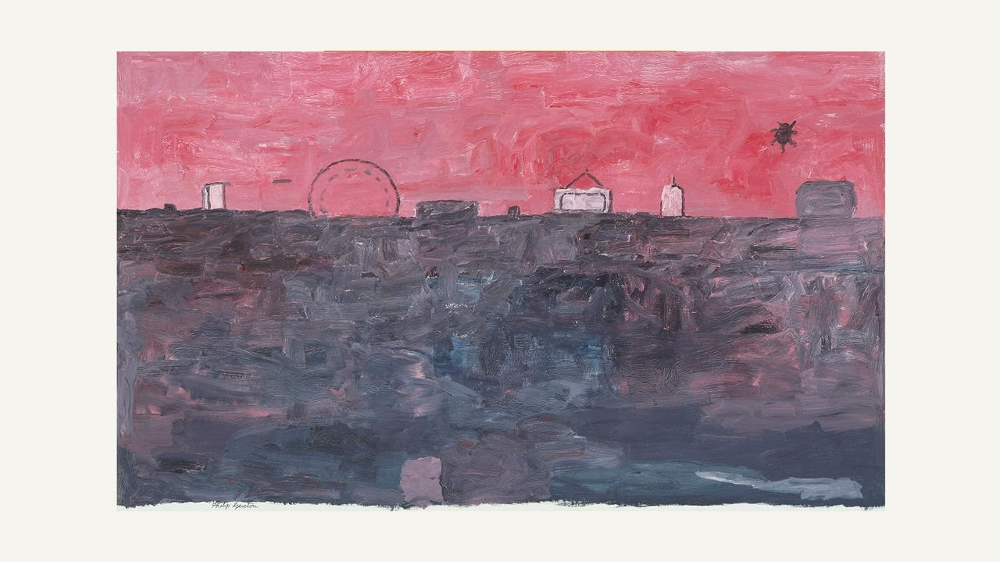

# D802 Philip Guston’s paintings are controversial. But here they are

1 “Probably the only thing one can really learn”, Philip Guston eventually concluded, “is the capacity to be able to change.” The modern artist’s fate, he said, was “constant change”. As a painter he embraced that fate—and in **posterity** his work has proved both an index of change and a challenge to it. A new show in Boston charts his restless genius; it is also the canvas for a struggle over art’s freedom and obligations, and the **contested** balance between them.

> **posterity**：后代
 > 
> **contested**：具有争议的
 > 

2 Twice Guston, who died in 1980, made a reputation and gave it up—first as a **figurative** artist and **muralist** in the 1930s and 1940s, next by plunging into abstraction with his friend Jackson Pollock and other mid-century American pioneers. Boldly he returned to figuration in the late 1960s, dwelling on **banal** yet somehow **uncanny** objects: light bulbs, bricks, boots. He painted heads, distorted or half-submerged. And he made a series of paintings of triangular hooded figures that recall the Ku Klux Klan.

> **figurative**：具象派
 > 
> **muralist**：壁画家
 > 
> **banal**：[bəˈnɑːlˌˈbeɪnl]平庸乏味的
 > 
> **uncanny**：出奇的
 > 

3 When first exhibited in 1970, these caused an art-world scandal—not because of the imagery, or Guston’s right to use it, but over the **brashly** cartoonish technique. A **retrospective** staged in 2003-04 passed without uproar. But in 2020, in the **ferment** after the murder of George Floyd, the organisers of the then-upcoming new show **quailed** at Guston’s motifs and themes. The director of the National Gallery of Art in Washington, where it was due to open first, said he had “appropriated images of black trauma”. The problem, implicitly, was both what Guston painted and who he was.

> **brashly**：无礼地、唐突
 > 
> **retrospective**：回顾展
 > 
> **ferment**：动荡、骚动
 > 
> **quail**：畏缩、胆怯
 > 

4 Well, who was he? The son of Jewish refugees from Odessa, he changed his name from Goldstein to evade anti-Semitism. The Klan was active in the Los Angeles of his youth and his early work also evoked its crimes, alongside other fascistic atrocities. He turned away from abstraction in part out of an enduring sense of political duty. “What kind of man am I”, he felt in the 1960s, “sitting at home, reading magazines, going into a fury about everything—and then going into my studio to adjust a red to a blue.”

5 As for the later hoods themselves: Guston delighted in telling stories with them, and in the expressions he could conjure in their almost blank **visages**. At bottom, though, they were—and are—a **reproach**. They are terrible in their ordinariness, surrounded with everyday **bric-a-brac**, glimpsed smoking or riding in a **boxy** car. In “The Studio” one sketches a self-portrait, blood on his hand and costume. The stitching in the hoods matches and merges with the window slits in the buildings Guston painted. His hoods are knitted into society. They are everywhere.

> **visages**：脸 [文学性]
 > 
> **bric-a-brac**：小装饰品; 小摆设
 > 
> **boxy**：四四方方的
 > 
> **reproach**：责备
 > 

6 These works are an indictment of racism, **glaring or insidious**, not a case of it. But it appeared today’s viewers might not get a chance to see that for themselves. In 2020 the exhibition (already hit by the pandemic) was postponed by the four museums involved in it, initially until 2024. Opponents of censorship protested, as did many artists. Some thought the delay smelled like a cancellation, and that “Philip Guston Now”, the show’s title, might become Philip Guston Never.

> **glaring**：显眼的
 > 
> **Insidious**：潜伏的; 暗中为害的
 > 

7 They were wrong. Ahead of the **mooted** schedule, it opens on May 1st at the Museum of Fine Arts (mfa) in Boston, and will be adapted in Houston, Washington and London. It is a magnificent exhibition and—at a **febrile**, polarised time—an important one. The mfa assembled a diverse group of curators and has carefully laid out the political context of Guston’s life and work. Visitors can avoid the hoods if they choose to: they can make up their own minds.

> **mooted**：有争议的; 悬而未决的
 > 
> **febrile**： 狂热的 [文学性]
 > 

8 But with a few forgivable exceptions, the intended artworks are there; Guston’s vision is honoured and explained. The format gives consideration to those who might be offended, but not a veto. It affirms and accommodates art’s power to provoke, and its right to. Lots of cultural **skirmish**es end in shouty hostility or shabby retreat. Here is a wiser sort of resolution, relying on a mix of principle, reflection and what you might call **tact**, or good manners.

> **skirmish**：小规模战斗; 小冲突
 > 
> **tact**：得体
 > 

9 Besides the hoods, other themes and motifs recur. Red was the main colour in Guston’s palette, bleeding into pink. He was always influenced by the Italian Renaissance masters, especially their gorgeous visions of the apocalypse and the damned. Heaven was dull, he noted, but “when they’re going to hell the painter really goes to town”. The same is true of him, and of the new show: they draw art from anguish and force you to think.

> "The Deluge", 1969. Museum of Fine Arts, Boston. Bequest of Musa Guston. © The Estate of Philip Guston, courtesy Hauser & Wirth
 > 
> "The Studio", 1969. Private Collection. © The Estate of Philip Guston, courtesy Hauser & Wirth
 > 

