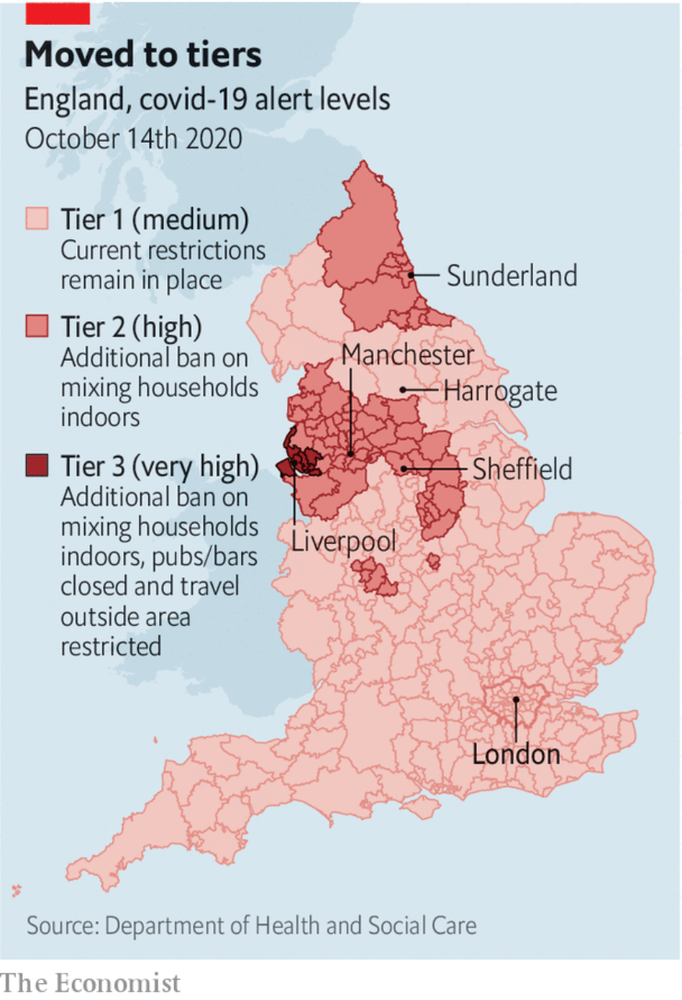

# D242 The second wave in Britain
1 ALTHOUGH BRITAIN’S covid-19 death numbers are nore near their spring peak, they are climbing dangerously. Daily **tolls** are similar to mid-March. Things are particularly bad in the north. **Field hospitals** in Harrogate, Manchester and Sunderland are **on standby**. Under a new regime of regional lockdowns which went into effect on October 14th (see map), gyms, bars and casinos in Liverpool will be closed, and non-essential travel in and out of the area discouraged. In much of northern England and part of the Midlands, members of different families will not be able to meet indoors, and the use of public transport will be discouraged; London is expected to be put under the same restrictions shortly.

2 Britain can probably **withstand** a second wave better than the first. It has the capacity to perform 13 times as many tests each day as in mid-April. Deaths and hospitalisations are rising more slowly than they were in the spring. Doctors now know to place patients on their stomachs, to delay ventilator use and what drugs to use. There is plenty of protective kit for health-care workers, and the nation has got used to wearing masks and working from home.

3 Yet resilience, the **buzzword** for governments in the face of the pandemic, covers not only supply chains but also the ability to forge a political consensus around a strategy. On this measure, Mr Johnson enters the crisis much weaker than in March, when ministers, scientists, the opposition parties and public opinion were in close agreement. Even the Conservative Party’s libertarian wing accepted the lockdown as a necessary evil. Mr Johnson’s approval ratings surged.

4 That consensus has now crumbled. The government’s policy of local lockdowns is being assailed from all sides.

5 In favour of greater caution are the government’s own scientists, the Labour Party and the public. At a meeting on September 21st the Scientific Advisory Group for Emergencies (SAGE) recommended that the government implement a package of measures to bring the R number below one, including a “circuit breaker” short-term lockdown, closing bars, restaurants and cafes, halting face-to-face university teaching and advising all those who could do so to work from home. Mr Johnson plumped only for the last of those. On October 12th Chris Whitty, the government’s chief medical officer, said that in his “professional view” the new tiered restrictions would be insufficient to contain the spread of the virus in the worst-affected areas.

6 Throughout the crisis, Sir Keir Starmer, Labour’s leader, has backed the government’s strategy and attacked its delivery. On October 13th he changed tack, calling for a “circuit breaker”. Mr Johnson accuses Sir Keir of opportunism, but the prime minister is vulnerable: if Conservative opposition to lockdown legislation strengthens, he will need Sir Keir’s support to pass any new measures.
The public is with Sir Keir: 42% think the current regime too lax, 34% think it is about right and 14% think it too strict. More than two-thirds of voters support the idea of a “circuit-breaker” over half-term, according to YouGov, a pollster.

7 On the other side, growing numbers of Conservative MPs are angry that the government has imposed new measures without debate in Parliament. They want it to outline a plan for living with the virus in the long run. On October 13th, 42 of them voted against a number of restrictions, including a 10pm curfew on pubs. Chris Green, MP for Bolton West and Atherton, resigned as a government aide, saying the “attempted cure is worse than the disease”. These MPs are supported by trio of right-wing newspapers—the Daily Telegraph, the Daily Mail and the Sun—that have the government’s scientists in their cross-hairs.

8 There is also a growing divide between London and the regions. Mr Johnson’s administration is good at combative campaigns, but lazy on the basic work of consensus-building. The new measures are opposed by a new generation of directly-elected mayors, who argue they have been imposed without consultation, don’t reflect the reality of where and how the virus is spreading, and come with too little aid to support shuttered businesses. Andy Burnham, the mayor of Greater Manchester, argues that the restrictions designed by people in London are misdirected and ineffective. “They can only see numbers and blobs on the map, whereas we see names, communities, the full picture of what happens on the ground.”

9 The mayors are also critical of the centralised test-and-trace system, run from Whitehall with the support of contractors. They argue local government public health teams would have done the job better for less money. The public is less likely to comply with a regime that their municipal leaders don’t support, says Dan Jarvis, the mayor of the Sheffield City Region.

10 Mr Johnson faces this rising opposition with diminished authority. His approval ratings rose after the initial lockdown to a net of 40%; they have since sunk to minus 22%. A reputation for incompetence dogs the government.

11 The prime minister’s election victory in December ought to have banished the memory of Theresa May’s hobbled premiership and rendered him dominant, but in Parliament on October 12th, wearily defending a small patch of ground against critics, estranged from both his expert advisers and his backbenchers, he bore more than a passing resemblance to his predecessor. Were he now still a newspaper columnist, he would doubtless be among those denouncing the flailing prime minister, the gloomster government scientists and loss of liberties, much as he put his name to all manner of eccentric fixes to the Brexit deadlock when it was opportune.

12 The first wave cost Mr Johnson a great deal of his political capital. If the government’s record does not improve, the second could exhaust it. ■

