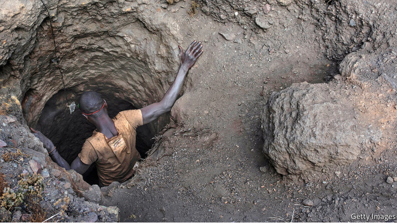

# D244 In Congo the little guys are jailed for stealing minerals

1 WHEN **COBALT** prices soared from 2016, young men from all over Congo flocked to the south of the country to dig the stuff up. Demand for the metal, used in smartphones and electric cars, was driven by carmakers needing around 10kg of it per vehicle. (Phone batteries, by contrast, require just a few grams each.) Some of these young men set up camp in the village of Kawama, **cobbling** together their **huts** with **planks** and sheets of **tarpaulin**.

2 The village feels less hopeful nowadays. Barefoot children in rags chase each other around piles of **smouldering** wood, which residents burn to make charcoal. Cobalt prices plummeted in 2018 after the market was flooded and companies **dawdled** over electric-car designs. About 60% of the world’s cobalt is found in Congo, scattered across the **copperbelt** that stretches east into Zambia. The people of Kawama grumble that too much land has been sold to mining firms. “We used to dig freely,” says Gerard Kaumba, a miner. “But now the government has sold all the hills.” There are still some sites where miners can turn up and dig, but they have to sell to whoever owns the concession. A sweltering day’s work might earn you $7. Many people have found they can make more at night, pilfering cobalt from industrial mines.

3 Glencore, a commodities giant with two mines in Congo, reckons that some 2,000 people sneak into its **pits** every day. Other companies have even more robbers to **contend with**. Last year Congolese soldiers chased thieves out of a mine owned by China Molybdenum where, it was reckoned, 10,000-**odd** people were then illegally digging. Sneaking into Glencore’s mines is hardest, says a Kawaman, as its guards do not collude with thieves—and often chase them away with dogs.

4 Elsewhere it is usually the guards who **egg the diggers on**, and then demand half their profits. On a recent **foray**, a team of five diggers managed to bag up enough copper and cobalt to make $150 each, even after paying the guards. “I spent Sunday to Thursday in a hole,” says one of the group, describing how they dug a tunnel and passed the minerals out. They also hid in the hole at moments during the day. The team sold its loot to Chinese buyers, some of whom work out of a tin hangar hidden down a dirt road in nearby bush. When your correspondent turned up, the men at the entrance demanded to know how she had found the place. Then they threatened to call armed guards if she did not leave.
**egg** someone on: to encourage, urge, or dare someone to continue doing something, usually something unwise.

5 Last year Glencore closed its biggest mine, cutting output in response to low prices. Today neither the thieves nor the mining giants are making as much as they used to. As the pandemic took off, copper prices tumbled to their lowest in three years, while cobalt costs barely a third as much as it did at its peak. Tesla, a big maker of electric cars, is trying to stop using cobalt, partly to avoid the reputational risks of **dealing with** Congolese minerals.

6 Children **toil on** many **artisanal** sites in Congo, where tunnels sometimes collapse and kill them. Even if carmakers decide to get cobalt only from industrial mines, where machines do the digging, the metal is often mixed up in **smelters** in China, so it is hard to be sure where it came from.

7 Congo’s industrial miners are not all angels, either. Gécamines, the state-owned company, has enriched crooked politicians for half a century. Global Witness, a watchdog based in London, says Congo’s treasury lost $750m of mining revenues to **graft** between 2013 and 2015. Eurasian Resources Group, with three mines in Congo, has faced allegations of corruption and an investigation by Britain’s Serious Fraud Office (it denies wrongdoing). So has Glencore, which has worked with Dan Gertler, an Israeli billionaire. Mr Gertler, a close friend of a former Congolese president, Joseph Kabila, is under American sanctions. Glencore has long denied being involved in any improper transactions and has said it is co-operating with investigators.

8 While big firms **rake** in millions, many of the little guys **languish** in jail. The prison in Kolwezi, the largest city in the mining region, is crammed with men caught stealing copper and cobalt. More than a hundred **inmates** occupy one **stinking** room, sitting in rows on the ground, each wedged between another’s legs. Prisoners are allowed to use the toilet only once a day, so they often **urinate** in their clothes. “I reasoned it was a stage of life and that all the suffering would pass,” recalls Cisco Ngoyi, who spent six months in jail last year after being caught on an industrial site.

9 In Kolwezi, shiny jeeps slide past beggars on roadsides. Dusty, makeshift settlements, similar to Kawama, **abut** the city, while Chinese casinos and **swanky** hotels occupy the centre. A **cynic** might see here a **microcosm** of Congo itself, where mineral wealth is **hogged by** a powerful few, while the many scrabble to **get by**, and pray to stay out of jail. ■

