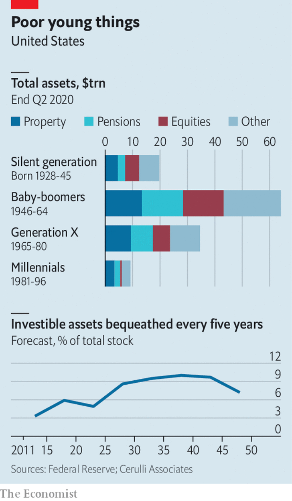

# D252 Wall Street will soon have to take millennial investors seriously
> Robinhood Markets，Inc.是一家美国金融服务公司，总部位于加利福尼亚州的门洛帕克（Menlo Park）。该公司提供了一个移动应用程序和网站，使人们能够通过Robinhood Financial投资股票，ETF和期权，并通过Robinhood Crypto进行加密交易。
 > 

1 THINK OF A millennial investor, and you might picture someone like Vincent Iantomasi, one of a legion of **amateur** traders **dishing out** investment advice on TikTok, a social-media app. With “Blueberry Faygo” by Lil Mosey, an 18-year-old rapper, playing softly in the background, Mr Iantomasi tells investors looking for racy returns to pile into SPXL, a leveraged exchange-traded fund. Or you might think of users of “r/wallstreetbets”, a forum on Reddit, another social-media site, who post “loss porn”: screenshots of their accounts on Robinhood, an investing app, after betting their life savings on short-dated derivative shares in Tesla, an electric-car maker.

2 Young investors have become infamous during the pandemic. As markets have rocketed, **budding** punters have engaged in a frenzy of day-trading on their phones. **Look past** the notoriety, though, and a profound shift in the ownership of investment assets looms. Millennials, typically defined as those born between 1981 and 1996, still hold a tiny share of total wealth (see chart). In America they own $9.1trn in assets, just 7% of the total, well below the 26% held by baby-boomers when they were of a similar age. But savings and inheritance **windfalls** mean that millennials’ share will rise rapidly. And shifts in technology and pension policies will allow them to **exert** more control over their assets than their parents did. The **implications for** investment firms and markets are already becoming apparent.

3 The young acquire wealth by inheriting or earning it. Already more than a third of America’s labour force is millennial and they have been the largest **cohort** since 2016 (even though some are still in education). Bank of America Merrill Lynch reckons that, worldwide, their earning power will rise by nearly three-quarters in 2015-30 as more start work and others gain **seniority**.

4 Inheritance flows are set to speed up. The population structure in most rich countries **bulges** outwards for the baby-boomer generation and then again for their children, many of whom are millennials. Every five years $1.3trn in investible assets, or 5% of the stock, passes down the generations in America. The pace of the wealth transfer will probably double by 2036-40 as boomers die. According to Cerulli Associates, a research firm, millennials will inherit $22trn by 2042.

5 It is a mistake to assume that millennials will invest as their parents did. Two forces will lead them to seek more control over their assets: changes to pensions, and advances in technology. Consider pensions first. In the 1970s most schemes were “defined-benefit” (DB). Beneficiaries were paid a fixed income based on their final salary and had no say in how their pots were invested. Then in 1978 the Revenue Act created the 401(k) plan in America—a “defined-contribution” scheme where savers have more control over where their cash goes. Assets held in such pensions have exceeded those in DB schemes since 1995. Where investment firms used to compete to win the mandate for a company’s pension pot, today they are likely to be one of many managers that staff can choose from.

> DB：养老金福利的; 指企业年金计划，通常是基于雇员的最后薪水和工作年限为雇员提供的明确金额养老金 ( abbr: DBAlso called final-salary)
>
> defined-contribution： 固定缴款计划
>

6 Even as they gain more control over workplace pensions, millennials are using technology to invest in shares and bonds directly. When most boomers began saving a handful of investment firms loomed large, offering high-fee **mutual funds**. But electronic trading makes it much easier and cheaper to buy and sell directly. The cost of investing $100 on a stock exchange has fallen from $6 in 1975 to less than a thousandth of a penny today. In 2019 the four big retail-trading platforms—Charles Schwab, E*Trade, Fidelity and TD Ameritrade—cut commissions to zero as Robinhood, a pioneer of the zero-commission model, gained popularity. A generation **reared on** smartphones is as likely to trust an app as a well-heeled broker.

7 Fintech firms are working to capitalise on the coming windfall. Robinhood may have attracted the headlines, but millennials are just as keen to use other digital services. One example is “robo-advisers”, which automatically allocate invested assets across low-cost index funds based on age and risk-preferences for a low fee. According to BlackRock, an asset manager, four in five millennials who are aware of these advisers are keen to use them. As much cash—perhaps $40bn combined—is parked in Betterment and Wealthfront, two robo-advisory startups, as in Robinhood. Though Betterment has some older clients, the average customer is 35, says Jon Stein, its founder. Robinhood does not disclose the amount of cash held on its platform, but JMP Securities, a research firm, estimates that the average account holds $1,000-5,000. This would put total assets across its 13m accounts at $13bn-65bn.

8 Some **incumbents** are trying to catch up. In 2019 Morgan Stanley bought Solium, which manages vesting stock options for tech workers, in the hope that they will one day be rich clients. Others are gloomier. Most wealth managers surveyed by Accenture, a consultancy, expect to lose a third of their customers’ wealth at the point of succession. When the **reaper** comes for their clients, their business will go with them.

9 What goals will millennials pursue? Some 87% of them believe corporate success should be measured by more than financial performance, according to Deloitte, another consultancy. They also seem to act on that impulse. Morgan Stanley finds that the under-35s are twice as likely as others to sell a holding if they consider a company’s behaviour to be environmentally or socially unsustainable. Of course, millennials may become more hard-nosed as children and mortgages come along. Then again, having lived through two economic crises in a decade or so, they may want to shake up shareholder capitalism. The butt of jokes in 2020, millennial investors will eventually change how asset management works—and perhaps the economy, too. ■

> You use **hard-nosed** to describe someone who is tough and realistic, and who makes decisions on practical grounds rather than emotional ones. 精明务实的; 不感情用事的
>

