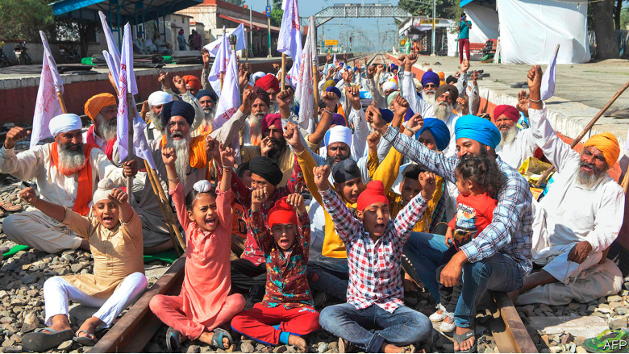

# D256 India’s states and the national government are at growing odds

1 FOR THREE weeks farmers in colourful turbans **pitched** camp atop the train tracks that **stitch** the paddies and wheat fields of Punjab. Brewing chai, roasting chapatis, playing cards or simply dozing, the protesters froze traffic across the state’s entire 2,000km rail network. Their rail roko ended on October 21st, after the state legislature voted to resist a barrage of controversial farm reforms that India’s national parliament had passed in September. Yet the trains still did not move. The central government’s rail ministry has held back goods traffic, blocking deliveries of coal to Punjab’s power plants, **sprockets** to its bicycle factories and fertiliser to its farms.

2 The centre, as Indians commonly call the federal government in Delhi, cites security as the reason for the stoppage, which began to ease on October 28th. But with tension on a range of issues mounting in recent months between the national capital and India’s 28 states and eight “union territories”, it is not just **prickly** Punjabis who suspect other forces are at play. Their state happens to be governed by the Indian National Congress, the **staunchest** foe of prime minister Narendra Modi’s Bharatiya Janata Party (BJP), which rules at the centre as well as in 17 states. Just as Mr Modi has brought a new style of **hardball** politics to Indian elections, complete with **sectarian** **incitement** and online **trolling**, his government has taken a tougher line with disobedient states. In case Punjabis were in doubt that they were being punished for rejecting the farming reforms, the centre announced it would no longer give the state an annual $135m earmarked for rural development.

3 In theory, responsibilities are neatly divided between the different levels of government, but in practice there are inevitable, contentious overlaps. Farming is **ostensibly** a state subject, for example, but in practice Punjab in particular has profited **mightily** from the centre’s investment in **irrigation** and subsidies for grain. Hence its farmers are less keen on reforms than others across India, a resentment Congress is happy to stoke.

4 When provoked by states in earlier decades, the centre frequently responded by **invoking** a constitutional clause that allows it to declare a state government unable to function properly, and so to **disband** it and impose direct rule from the centre temporarily. That sort of disruption, typically made following an **indecisive** election or internal unrest, has grown rarer with time. But with covid-19 deepening an economic slump, frictions have inevitably grown. On issues ranging from taxes to the increased **meddling** of state governors (who are appointed by the centre but whose role is meant to be largely **ceremonial**), relations between the two levels of government have soured.

5 “This is the lowest **ebb** of federal relations in this country,” asserts Haseeb Drabu, a former state finance minister who once worked closely with the BJP. “Never has the central government been so **repressive**, never so **brazen**.” Mr Drabu should know. His state, Jammu & Kashmir, no longer exists. In a series of moves that showed a breathtaking disregard for states’ rights, Mr Modi last year in swift succession imposed direct rule on the state, sliced it into two parts, **demoted** each half to the status of a union territory, and placed dozens of local politicians under **house arrest**. On October 27th the centre announced a stunning set of new measures for the **rump** territory of Jammu & Kashmir, unilaterally **revoking** a dozen local laws and modifying another 26.

6 For most states, money is the main bone of **contention**. The signal achievement of Mr Modi’s first term in office was the replacement of a hodgepodge of local sales taxes with a national goods and services tax (GST). In agreeing to it, states largely gave up their right to impose taxes in exchange for the promise of full compensation from the centre. But as GST revenue has plummeted—the economy shrank by an alarming 24% in the second quarter—the centre has grown reluctant to pay. Meanwhile, because public health and income support are largely state rather than federal responsibilities, it is the states that have had to boost spending the most.

7 It does not help that the centre has resorted to threats, bluster and parsimony, insisting, for instance, that for every small increase in the limit on what states may borrow from the central bank they must implement a new reform imposed from Delhi. At the same time the centre has pushed states to borrow commercially. The central bank projects that state borrowing is likely to surpass the centre’s this year, leaping from an expected 2.8% of GDP to over 4%.

8 Money **squabbles** are bad enough, but several states are also **bridling at overbearing** political interference from Delhi. After police in the state of Maharashtra launched a probe into the **alleged** manipulation of ratings by a pro-BJP television channel, the Central Bureau of Investigation, a federal agency, abruptly launched a similar probe in a different state. Fearing its probe would be **subsumed**, the government of
Maharashtra, where the BJP is in opposition, abruptly withdrew consent for the CBI to operate in the state. Four other states have already erected similar barriers, and more are threatening to. Several may also follow Punjab in blocking federal laws, such as the farm reforms, that they don’t like.
https://www.bloombergquint.com/law-and-policy/fake-trp-manipulation-racket-busted-4-held-mumbai-police-chief-republic-tv-arnab-goswami

9 Such **churn** and agitation is part of the normal political back-and-forth in a huge, wildly diverse country. But the BJP’s fondness for **subterfuge** and **coercion**, instead of persuasion and consensus-building, is making that process more turbulent than it has been in decades. ■
https://www.sohu.com/a/371606304_312708

