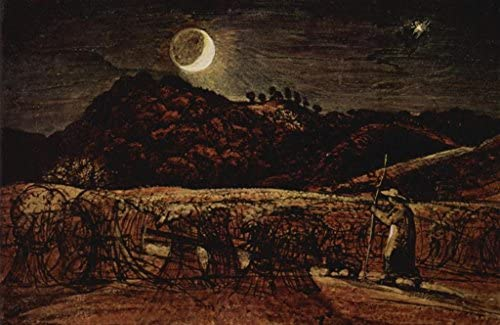
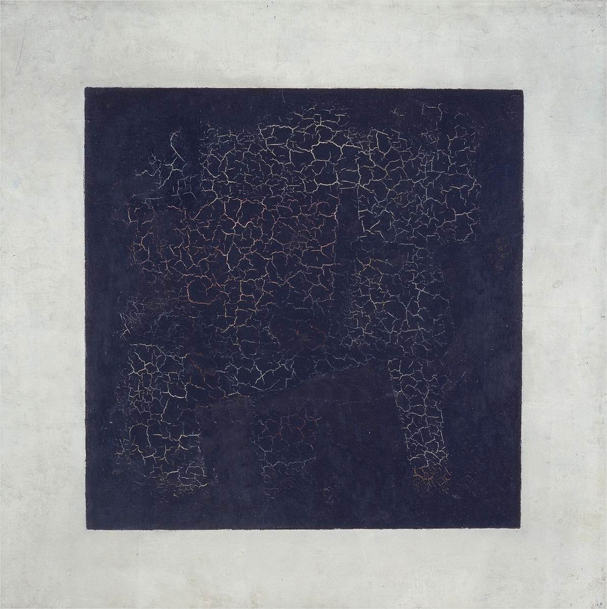
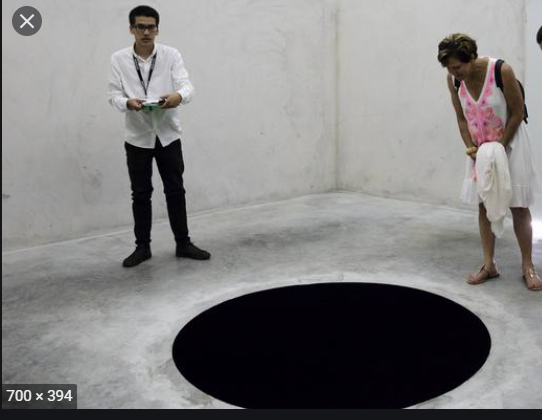
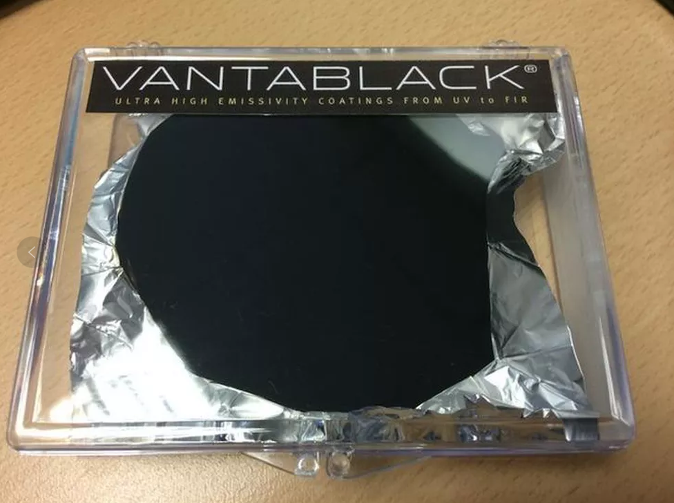

# D263 For centuries, the colour black has tested artists’ ingenuity
1 CLAUDE MONET died in darkest December in 1926 surrounded by the garden he had created at Giverny. When Georges Clémenceau, the former French prime minister, arrived three days later for the artist’s funeral and caught sight of the black-draped coffin, he exclaimed: “No! No black for Monet.” An old piece of **cretonne** was brought down from the house to replace the dark pall with the palette that the artist had made his own: nature’s many greens, **lavender**, **water lilies** and **forget-me-nots**.

2 Most colours represent different things for different people. The **hue** of death in India and in some Slavic cultures is white, yet white also means spiritual rebirth for Muslims participating in the haj. Green was for bankers in early modern Europe; in the Kenyan flag it represents the land. Red is the badge of loyalty and success in China and of power and devotion in Russia. In Nathaniel Hawthorne’s New England it was the sign of **adultery**. Black, however, has associations that are universal. It is bound up with **witchcraft**, the **underworld**, night-time and **the far side of the Moon**.

3 Physicists say it is not really a colour at all. Because black is the result of the absence of light, Sir Isaac Newton did not see it on the spectrum of colours in his experiments with prisms in the late 1660s. Many artists take a different view. For them black represents an intellectual and technical challenge; it is the high-jump of colour, a test of their skill, ingenuity and imagination. (Black skin has its own, entwined but distinct, artistic history, with vexed connotations of power, prejudice and eroticism.)
The latest attempt to **plumb** these depths comes from Anish Kapoor, a British-Indian artist whose work questions notions of perception.

4 The discovery in ancient Egypt, China and Rome that writing (and, later, printing) worked best when black was used on a white background gives black a special place in the **pantheon** of colours. But before the **concoction** in Europe of black ink from **gall nuts** (tumours that grow on trees where insects have laid eggs), real black was hard to **conjure up**. The early artists in France’s Lascaux caves drew crude animals and human figures with **charcoal**, which sometimes washed away. Most **confected** blacks, especially fabric dyes, produced a muddy purply-grey or brown at best.

> **5 No colours any more**
>
> It was only when black pigments—made from coal, **lampblack** or even burned **ivory**—were successfully mixed with **gum arabic** or **linseed oil** that it became possible to create the black gloss that many European artists came to love. Caravaggio revolutionised Baroque painting with his studies of darkness; yet it was the **Spaniards** of a generation later, when black was the colour of **high fashion**, who made black painting all their own, starting with the power portraits of Diego Velázquez and the **brooding** figures that **haunt** the tall works of Francisco de Zurbarán. “Black became the colour of distinction,” Philip Ball, the author of “Bright Earth: Art and the Invention of Colour”, has said. It wasn’t only a hue in its own right, artists realised, but an enlivener of other colours.
>
> 当且仅当由煤，炭黑甚至是燃烧的象牙制成的黑色颜料和阿拉伯树胶或者亚麻籽油成功混合之后， 才可能产生许多欧洲艺术家喜欢的那种具有光泽的黑色。
>
> Caravaggio： 米开朗基罗·梅里西·达·卡拉瓦乔，意大利画家，1593年到1610年间活跃于罗马、那不勒斯、马耳他和西西里。他通常被认为属于巴洛克画派，对巴洛克画派的形成有重要影响。 卡拉瓦乔的一生醉人、危险又充满了谜团。1600年，他突然出现在罗马的艺术圈，尽管并不怎么在乎自己的生计，但从来也不曾缺少佣金和资助
>
> 巴洛克艺术是欧洲17世纪时的一种艺术风格，运用夸张的运动性和清晰可辨的细节在雕塑、绘画、建筑、文学、舞蹈和音乐等领域来营造戏剧、紧张、繁琐、恢宏的效果。这种风格于1600年左右起源于意大利的罗马，随后便散布到欧洲的大部分地区。 巴洛克风格的流行与成功与罗马天主教会的鼓励有关
>
> high fashion: expensive, fashionable clothes produced by leading fashion houses.
>

6 The myth of Orpheus, who descends into the blackness of the underworld to bring his dead wife, Eurydice, back to the land of the living, has inspired musicians, poets and painters. None more so, perhaps, than Samuel Palmer. **Retreating** from the problems associated with the Industrial Revolution, in the 1820s Palmer went with a band of like-minded spirits to live in the Kent countryside where he witnessed nights that were blacker than anything he had ever seen. The series of works inspired by his **nocturnal** **ramblings** represented something of an **epiphany** for Palmer. He called them “my blacks” or “little moonshines”, for the intensity they project is due almost entirely to the blackness of his night sky, as can be seen, for example, in a tiny picture called “Cornfield by Moonlight, with the Evening Star”.

7 Unlike Palmer and other Romantics, Monet and some of his fellow Impressionists banished black entirely. Édouard Manet, however, took it on. When he painted his disciple and future sister-in-law, Berthe Morisot, in 1872, he dressed her all in black with a matching hat. With one side of her face lit up gloriously and the other darkly shaded, it is her eyes that capture the viewer’s attention; in life they were green, but Manet made them profound by painting them black. “Manet was the strongest of us all,” his friend, Camille Pissarro, once said. “He turned black into light.”

> **8 Until my darkness goes**
>
> In the 20th century, Pablo Picasso used black to ask how God could possibly exist amid so much suffering. “Guernica”, his visual poem in black-and-white about the Spanish civil war, recalls the use of black in Francisco Goya’s prints, “The Disasters of War”. Perhaps the shade’s most ambitious devotee was Kazimir Malevich, a Russian artist who enlisted black to invent a whole new painterly language that elevated feelings over representation. He called this movement “suprematism”.
>

9 “Trying desperately to free art from the dead weight of the real world,” he later wrote, “I took refuge in the form of the square.” Malevich painted many squares of different colours, but “Black Square” (see picture) is the one people remember. Unveiled against the backdrop of the first world war and turmoil in Russia, Malevich’s “Black Square” marked a turning-point in modern art.

10 Malevich was a huge influence on his successors, especially the American abstract expressionists, but time has not been kind to “Black Square”, at least not physically. These days it is shrunken, cracked and slightly miscoloured. All the same, the challenge that it represented to artists is as powerful as ever.

11 It was exactly a century after “Black Square”, in 2015, that Mr Kapoor secured the rights to make art using Vantablack, the blackest black ever created. It is not a paint so much as a dense coating of tiny “nanotubes”—“Vanta” stands for “vertically aligned nanotube array”—which, instead of reflecting light, traps it almost completely. (It was developed as a material that might be useful in hiding satellites.) In a recent display in his studio, Mr Kapoor’s artworks seemed to have no shape or **contours**. A circle of Vantablack on the floor could be a rug-like coating or a bottomless hole; a bowl shape could be convex or concave. There was no way of telling.
Not so much sth as sth:If you say that something is not so much one thing as something else, you mean it is more the second thing:

12 During the Renaissance, artists saw that paint could be used to portray objects in three dimensions. Vantablack seems to remove the object altogether. Speaking to Artforum, a magazine, Mr Kapoor once said: “Imagine walking into a room where you literally have no sense of the walls—where the walls are or that there are any walls at all. It’s not an empty dark room, but a space full of darkness.” For the viewer, as for the artist, these works are another step in the quest for the meaning of black. ■

