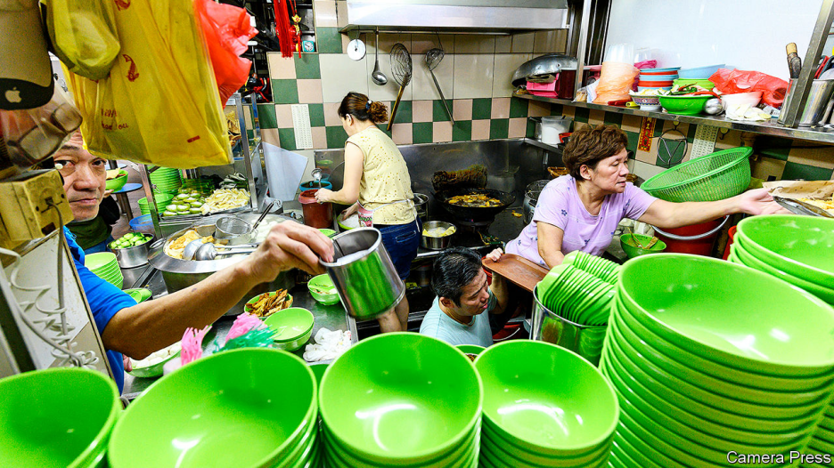
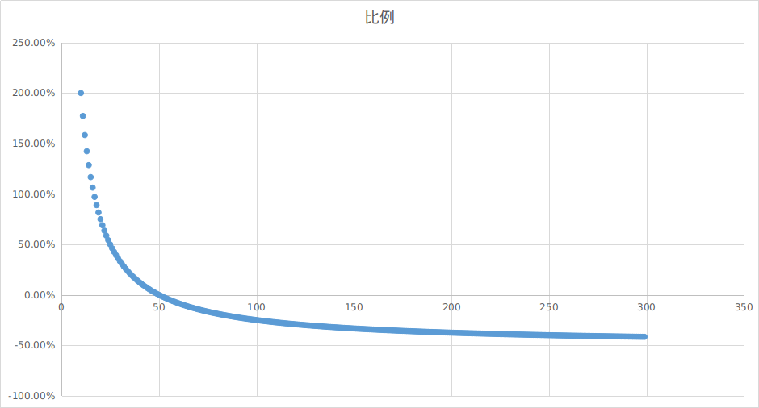
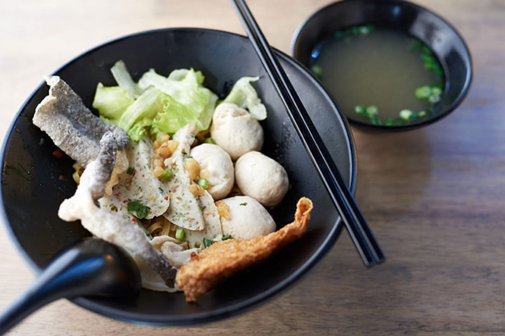
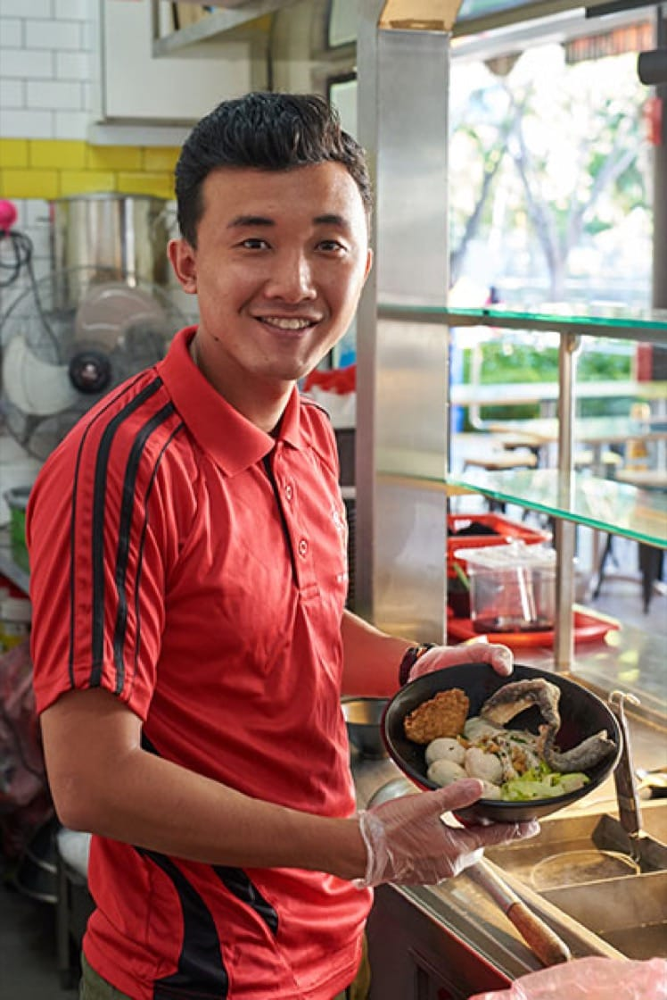
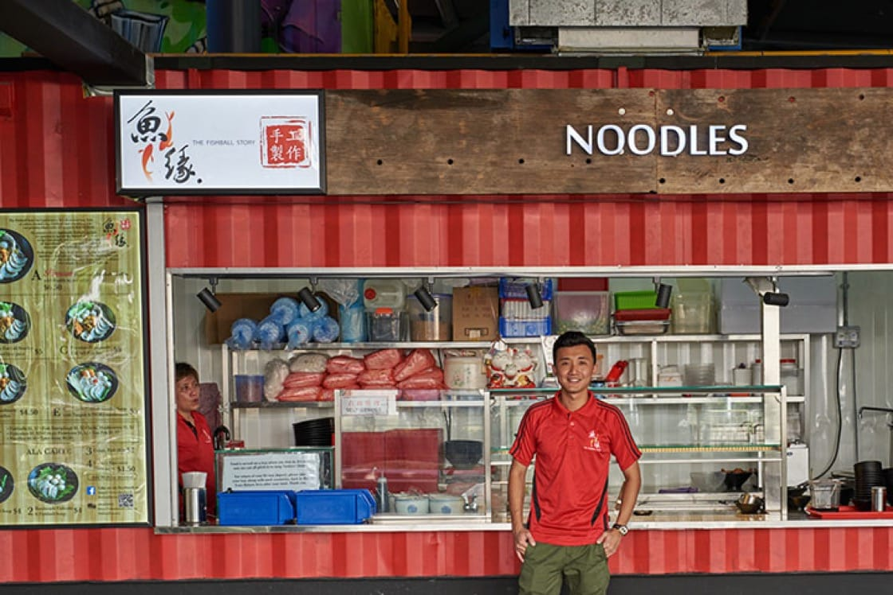

# D264 Singapore’s government helps old food hawkers but not young ones

1 SOME COUNTRIES build palaces or temples as monuments to their greatness. Singapore builds hawker centres. In these open-air food courts lined with stalls and formica tables it is possible to taste Singapore’s history. Dolloped unceremoniously on a plate or banana leaf or scooped steaming into a plastic bowl, dishes such as roti prata and Singapore laksa conjure up the Indian and Chinese migrants whose own cuisines, slowly over centuries, mingled with that of the indigenous Malays. And since one can **eat one’s fill** at a hawker centre for the price of a flat white, it is no surprise that eight in ten Singaporeans visit such establishments at least once a week, according to a survey conducted by the National Environment Agency in 2018. Singapore is so proud of its street food that it hopes UNESCO will include it in its **catalogue** of humanity’s most precious arts.
Dolloped:add (a large mass of something) casually and without measuring.

> flat white:馥芮白(,fu rui 白)
>

2 The UN’s heritage inspectors had better tuck in fast. The median age of the chefs is 60. A government report published in 2017 warned that there were “too few [aspiring hawkers] to be able to sustain the hawker trade in the long run”. When old masters die, many take their recipes with them, says K.F. Seetoh, a champion of hawker food. Only Singaporean citizens can work in hawker centres managed by the government, the vast majority. But young Singaporeans have little appetite for **toiling** in piping-hot stalls for long hours and little pay. “It’s near impossible to get manpower for this trade,” Mr Seetoh wrote in January.
tuck in: eat food heartily.

3 The few young Singaporeans willing to put up with such conditions often live hand-to-mouth. When Yu Ting Gay and Alex Ho opened their Italian-Japanese fusion stall in 2017, they hoped to earn S$2,000 ($1,474) a month each. Most of the time they made half that. “Our pockets were quite tight,” says Ms Yu. “For myself, it’s only going to work and going back home, so we meet up with our friends less than before.”
**live** (from) **hand to mouth**. to have just enough money to **live** on and nothing extra:.

4 Older hawkers have an unfair advantage. Many of those who started out in the 1970s and 1980s pay discounted rents: $200 a month on average. They still account for 40% of the 5,500 stalls leased by the government. Younger hawkers must pay market rates: $1,250 a month on average. But a report published by the Ministry of Trade in 2015 found that, even though younger hawkers pay more rent, and have on average 15% higher operating costs, they do not pass those costs on to their customers, probably because of stiff competition.

5 With classic dishes like Hainanese chicken rice costing just S$3, hawker food is cheaper than chips. The government wants to keep it that way. Singapore’s welfare state is parsimonious, and the authorities have long regarded hawker centres, with their “almost third-world prices”, as “one of our safety-nets”, as Ravi Menon of the central bank has said. The expectation that hawker food will be cheap is shared by consumers. Several months after Douglas Ng opened A Fishball Story in 2013, he decided to increase the price of his S$3 fish-ball soup by 50 cents because his margins were so thin. Sales fell by half, he says.

> = (margin+50)/(2*margin) - 100%
>

6 Many youngsters get noticed and thrive. Mr Ng won an **accolade** from Michelin in 2016 and received a flood of offers of investment. Others are not so lucky. Just over a year after Ms Yu’s stall opened, her hawker centre closed for renovations. She and Mr Ho had not managed to save enough to weather the three-month **hiatus**, so were forced to close for good. ■

> https://guide.michelin.com/sg/en/article/features/behind-the-bib-fishball-story
>

