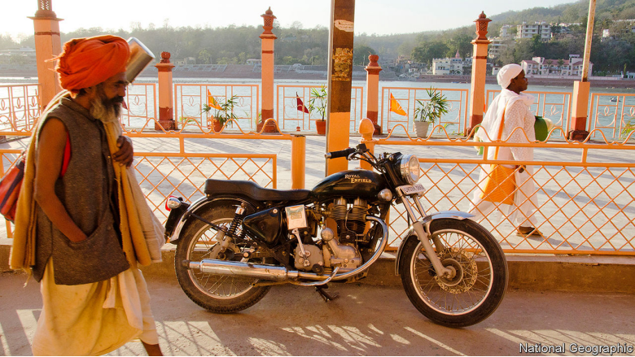

# D270-2 Royal Enfield’s Indian motorbikes are going global

1 DESPITE THE autumn chill, a group has gathered in front of the Iron Horse Royal Enfield dealership, a small stone building set in the Connecticut hills. A woman sits on a motorcycle, its single-cylinder engine thumping with a distinctive sound. In the window a striking **chrome**-and-black model looks much like what would have **rolled out** of Enfield’s original factory in Redditch in the British Midlands in the company’s heyday in the 1950s.

2 Enfield, dating back to 1901, boasts of the longest lifespan of any motorcycle manufacturer. But Iron Horse only began selling its bikes in 2018 and the name remains relatively unknown in America and other markets outside India. The company’s original British operations closed in 1970; the surviving Indian **remnant** was heading the same way before a stunning revival that saw annual sales grow from 31,000 units in 2006 to more than 800,000 in 2019, transforming the value of Enfield’s parent company, Eicher Motors, a tractor-maker, from just a few hundred million dollars to $8.5bn. Now the company is accelerating into the wider world.

3 Enfields are a **throwback**, devoid of modern **frills** and with the looks of a classic bike. Engines ranging from 350cc to 650cc are large for India but small compared with machines from firms such as of Triumph and BMW. Enfield declined to enter the largest part of the Indian market, which is for small and cheap bikes, and will not attempt to make the expensive, tech-laden machines that bikers generally **hanker after** in rich countries. Improvements have tackled mechanical shortcomings without undermining the existing sound, feel and look. They must, says Siddhartha Lal, Eicher’s boss, provide “everything you need and nothing you don’t”.

4 A consequence of this approach is that production is confined to a limited number of **straightforward** motorcycles produced at high volume **which** enhances economies of scale and enables profitability at low prices. The most expensive Enfield in America is $6,400, making the bikes accessible to a wider potential market. Machines from Harley-Davidson, which has suffered falling sales in recent years, often cost more than three times as much.

5 Enfield is aiming to sell 20% of its production abroad. Over the past five years, it has added 700 dealers worldwide to its 1,600 in India. Exports doubled to 39,000 units in the year to the end of March and in June, admittedly an odd month because of the covid-19 lockdown, an Enfield 650cc motorcycle topped the British sales chart.

6 A sign that it might succeed as an exporter is that the bikes are becoming part of popular culture outside India. A YouTube diary by a young Dutch woman, for example, begins with her purchase of an Enfield in Delhi and follows her journey back to the Netherlands. More than 100,000 people subscribe to her posts. The urge to cross borders is shared not only by Enfield but, apparently, its customers as well.

