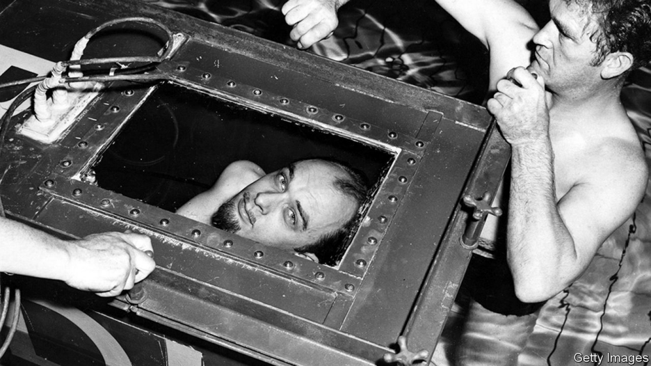

# D271 James Randi died on October 20th

1 AS A BOY he invented a pop-up toaster. He **blew** a hole in the floor of the breakfast room while conducting a chemistry experiment in the family basement in northern Toronto. And when, at Sunday school, he queried whether what the Bible claimed was actually true, he was promptly sent home. His parents never knew what he might do next. When they took him to Toronto **General Hospital** for psychological testing, all they learned was that he was terrifically bright—his IQ was 168, higher than Albert Einstein’s is thought to have been. At least his high school had the right idea. They let him **bunk off** class and teach himself, coming in only to do his exams.

2 Before he was able to graduate, though, he was hit by a car while out riding his bike. For 13 months he lay in a full-body **cast**, beating boredom by reading magic books, unpicking locks and turning card tricks. His doctors thought he would never walk again, but he showed them. And when he did he joined the **carnival**, where for two summers he called himself Prince Ibis and wore a black **turban**. He was a small **chap**, secretly gay and distant from his father. Doing magic made him feel bigger, especially when two policemen who recognised him showed him a pair of handcuffs. Could he get out of them? He could. They drove him to the local jail. Could he break out of there? He could—and did, 28 times over the years from different jails in Canada and America.

3 His ambition was to beat his hero, Harry Houdini. In 1956 he appeared on television, submerged for 104 minutes in a sealed metal box at the bottom of a hotel swimming pool, which earned him his first entry in the “Guinness Book of Records”. Houdini barely managed an hour and a half. A local newspaper in Quebec christened him “L’Étonnant Randi”—the Amazing Randi. He liked it enough to adopt it as his stage name. In 1973 he went on tour with Alice Cooper, the **ghoul**-eyed rock star; every night he **decapitated** him onstage using a fake **guillotine**. Later he **wriggled out** of a **straitjacket** while suspended, in deep midwinter, over the Niagara Falls.

4 For all the trickery and **sleight of hand**, he always insisted that magicians were the most honest people in the world. They did exactly what they said they were going to do. It was the **hucksters** that made him mad: the **hoodwinker**s and **bamboozler**s, the **card sharp**s, **cozeners** and **thimbleriggers**. **Pedlars** of woo-woo, he called them. Perhaps he felt a growing need to live by the truth. He was 81 when he finally came out publicly, but when he was almost 60 he fell in love with the man he would eventually marry and he gave up turning tricks of his own to focus on another line of work he’d been developing: looking, with his insider’s eye, at how other people worked their magic.

5 He could see through them, of course. He knew how. One of the first he had rumbled was an **evangelical** Christian healer called Peter Popoff who liked to **summon** forth individuals from his **congregation**, and tell them they should throw away their **crutches** and walk. God had told him they would be healed. On “The Tonight Show”, Mr Randi played Johnny Carson a clip in which Mr Popoff appeared to know what each congregant was called and what **ailed** them even though he’d never seen them before. And then he played the **clip** again, with the sound turned up, to show how an electrical scanner revealed Mr Popoff was wearing a secret earpiece and being fed the information by his wife who was backstage. “Popoff says God tells him these things,” he would later say. “Maybe he does. But I didn’t realise God used a frequency of 39.17 megahertz and had a voice exactly like Elizabeth Popoff’s.”

6 Time did not **mellow** him, as it does others. His ten books—on **psychics**, faith healers, extrasensory perception and the mask of Nostradamus—were **rambling**, **crotchety** and filled with diagrams and long-winded explanations. He did not set out to be a debunker; that presupposed that something deserved to be debunked even before it had been examined. He thought only that people should be open-minded and willing to question what they saw before them. What he wanted most was to inspect and test every claim that was presented to him. Over the years these numbered into the thousands. He offered a $1m reward to anyone who could produce evidence of paranormal powers under controlled conditions. Many tried, but none of them succeeded. He never paid out a cent. Nor did he lose a single **libel action** brought against him by the angry and the **thwarted**.

7 His most devoted adversary was a tall handsome Israeli, who arrived in America in the early 1970s, claiming to be able to bend spoons using **psychokinesis**, or mind power. With **consummate showmanship**, Uri Geller travelled across the United States, insisting that he could read minds, foretell events and, with nothing more than psychic energy, distort magnetic fields, streams of electrons and solid metallic objects. Even the venerable Stanford Research Institute **was taken in**. Shortly afterwards, Johnny Carson again asked Mr Randi for advice on how to test Mr Geller’s claims. Use only your own **prop**s, he said; nothing that Mr Geller could have had access to beforehand. As the cameras rolled and Mr Geller realised he was going to be put on the spot, any paranormal abilities he may have had simply vanished. “This scares me,” he said. “I don’t feel strong.”

> **8 The uses of** **enchantment**
>
> “The Truth about Uri Geller” was one of Mr Randi’s most popular books. Mr Geller never forgave his tormentor. At his death, he tweeted: “How sad that Randi died with hatred in his soul. Love to you all.” Such **pious** glee would have delighted the little magician with the twinkling eyes. As he had said himself many times over the years: “When I die I want to be **cremated** and I want my ashes blown into Uri Geller’s eyes.”■
>

