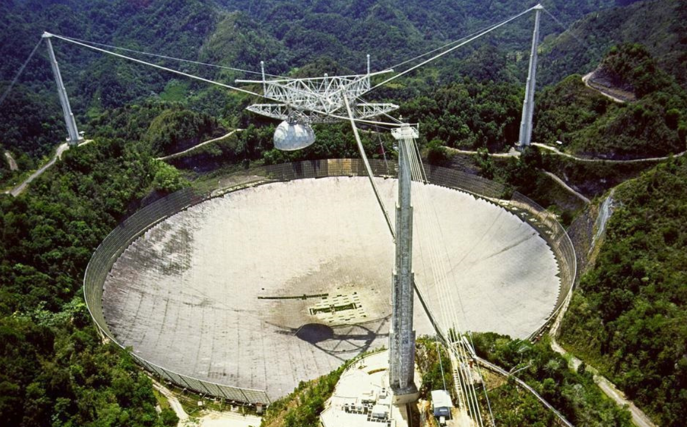

# D285 With the death of Arecibo, an era ends for radio astronomy
> 阿雷西博射电望远镜（英文：Arecibo Radio Telescope），正式名称是阿雷西博天文台（英文：Arecibo Observatory），由史丹佛国际研究中心、美国国家科学基金会与康奈尔大学管理。是世界上第二大的单面口径射电望远镜。
 > 
> 该望远镜位于波多黎各的阿雷西博（又名阿雷西沃），直径达305米。阿雷西博望远镜是固定望远镜，不能转动，只能通过改变天线馈源的位置扫描天空中的一个带状区域。
 > 
> 2016年7月，随着中国建成世界最大单口径射电望远镜FAST，位于波多黎各的美国阿雷西博天文台望远镜却面临可能要关闭的命运。由于年久失修，缺少维护经费，这座曾经世界第一的射电望远镜，如今锈迹斑斑，像个大垃圾场。
 > 
> 天文台是1995年詹姆斯·邦德电影中戏剧性打斗场景的背景黄金眼和皮尔斯·布鲁斯南一起。它还出现在1997年的朱迪·福斯特电影中接触。但是阿雷西博真正的遗产在于许多科学发现这使得。它探索了脉冲星，扩展了我们对水星的了解，发现了系外行星，并发现了快速射电爆发。
 > 
> N-UNCOUNT不可数名词**Radio astronomy** is a branch of science in which radio telescopes are used to receive and analyse radio waves from space. 射电天文学
 > 
> A snapped cable has **irreparably** damaged the dish
 > 

1 ARECIBO OBSERVATORY was conceived in an era of space-age **monumentalism**, an imposition of geometry onto geology as striking in its simplicity and scale as the greatest **brutalist** architecture. When the James Bond franchise, in its pomp a showcase for iconic 1960s design, eventually got around to using the 306-metre dish as a location in the 1990s, the only surprise was that it had taken so long.

2 The observatory was not new to spycraft. It was created as a tool for using radar to study the **ionosphere**, an electrically charged upper layer of the atmosphere. America’s defence department had an interest in such work, which might lead to new ways of characterising incoming **missiles** or of **snooping** on enemy transmissions, so it **stumped up** some cash.

3 A free-standing dish big enough for the job would have been impractical. The designers therefore looked for a hole in the ground to repurpose. They found it in north-western Puerto Rico, a sinkhole where the **limestone** landscape had collapsed in just the right way. They built three towers on the sinkhole’s **rim** and **hoisted** the electronic heart of the instrument—the bit which emits and receives radio waves—into the empty space between them. Signals travelling to or from this equipment would bounce off eight hectares of wire mesh stretched out beneath it.

4 As a radar, Arecibo used the world’s biggest dish to study not just the ionosphere but also the surfaces of nearby planets and passing asteroids. But it was as a radio telescope that it truly excelled, making some crucial discoveries during the 1960s and 1970s, radio astronomy’s golden age. The most famous was a pair of **pulsars**—spinning neutron stars—orbiting each other in a way which was shown to prove Einstein’s general theory of relativity. Later data revealed planets around another pulsar. This was the first definitive detection of planets beyond the solar system.

5 Arecibo was also used for radio astronomy’s **wayward** **offshoot**, the search for **extraterrestrial** intelligence. Since 1960 radio astronomers have occasionally employed their instruments to look for artificial signals from the stars. In 1974, after an upgrade that saw the original mesh replaced by a dish made up of 38,778 aluminium panels, Arecibo was used to go a step further. It transmitted a 1,679-bit message towards a star cluster 25,000 light-years away. Encoded in this message were graphical representations of basic biochemistry and astronomy, and of the technology with which it had been sent.

6 Over time, technological advance **eroded** the advantages of Arecibo’s sheer size, and its funding **dwindled**. The engineering began to show its age. In August one of the cables supporting the instrument platform snapped, damaging the dish. The snapping of a second, in early November, seemed to **presage** **imminent** collapse. And so it is to be closed.

7 But as the vegetation beneath the dish rises through its remains, and the site falls into **picturesque** ruin, the sketch of its cross-section encoded in that message from the 1970s will continue on its way. It is already 46 light-years from Earth. Its pixels now constitute the farthest-**flung** memorial to a human achievement anywhere in the universe. And they always will.■

