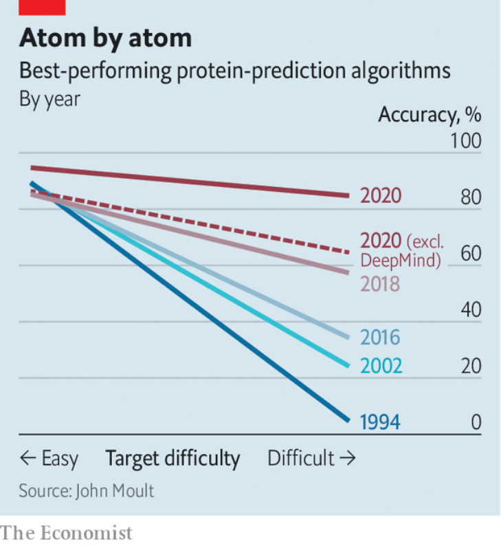

# D299 How do proteins fold?
1 TO UNDERSTAND LIFE, you must understand proteins. These molecular chains, each assembled from a menu of 20 types of chemical links called amino acids, do biology’s heavy lifting. In the guise of enzymes they catalyse the chemistry that keeps bodies running. Actin and myosin, the proteins of muscles, permit those bodies to move around. Keratin provides their skin and hair. Haemoglobin carries their oxygen. Insulin regulates their **metabolism**. And a protein called **spike** allows coronaviruses to invade human cells, thereby shutting down entire economies.
the **heavy lifting**
informal. most of the work involved in something; the most difficult part of a task: With a WYSIWYG editor, all you have to **do** is type your words in. Leave it to the editor to **do** all the **heavy lifting**.

2 Listing a protein’s amino acids is easy. Machines to do so have existed for decades. But this is only half the battle in the quest to understand how proteins work. What a protein does, and how it does it, depends also on how it folds up after its creation, into its final, **intricate** shape.

> 蛋白质起什么作用以及如何起作用也取决于它形成最后精密形态的折叠方式
>

3 At the moment, molecular biologists can probe proteins’ shapes experimentally, using techniques like X-ray crystallography. But this is **fiddly** and time-consuming. Now, things may be about to get much easier. On November 30th researchers from DeepMind, an artificial-intelligence (AI) laboratory owned by Alphabet, Google’s parent company, presented results suggesting that they have made enormous progress on one of biology’s grandest challenges—how to use a computer to predict a protein’s shape from just a list of its amino-acid components.

> **4 Chain gangs**
>
> To non-biologists, this may sound somewhere between arcane and prosaic. In fact, it is a big achievement. Replacing months of experiments with a few hours of computing time could shed new light on the inner workings of cells. It could speed up drug development. And it could in particular suggest treatments for diseases like Alzheimer’s, in which **misshapen** proteins are thought to play a role.
>

5 But there is yet more to it than that. Until now, the machine-learning techniques which DeepMind’s team used to attack the protein-folding problem have been best known for powering things like face-recognition cameras and voice assistants, and for defeating human beings at tricky games like Go. But Demis Hassabis, DeepMind’s boss, who founded in 2010 what was then an independent firm, did so hoping that they could also be employed to accelerate the progress of science. This result demonstrates how that might work in practice.

6 The idea of using computers to predict proteins’ shapes is half a century old. Progress has been real, but slow, says Ewan Birney, deputy director of the European Molecular Biology Laboratory, a multinational endeavour with headquarters in Germany. And it has been marked by a history of wrong turns and premature declarations of victory.

7 These days a humbler field, protein-shape prediction now measures its progress by how well algorithms perform in something called Critical Assessment of Protein Structure Prediction (CASP). This is a **biennial** experiment-**cum**-competition which started in 1994 and is jokingly dubbed the “Olympics of protein-folding”. In it, algorithms are subjected to blind tests of their ability to predict the shapes of several proteins of known structure.

8 DeepMind’s first entry to CASP, two years ago, was dubbed AlphaFold. It **made waves** by performing much better than any other then-existing program. The current version, AlphaFold 2, has stretched that lead still further (see chart). One measure of success within CASP is the global-distance test. This assigns algorithms a score between zero and 100 by comparing the predicted locations of atoms in a molecule’s structure with their location in reality. AlphaFold 2 had an average score of 92.4—an accuracy that CASP’s founder, John Moult, who is a biologist at the University of Maryland, says is roughly comparable with what can be obtained by techniques like X-ray crystallography.

9 Until now, DeepMind was probably best known for its success in teaching computers to play games—particularly Go, a pastime of **deceptively** simple rules but **fiendish** strategy that had been a **totem** of AI researchers since the field began. In 2016 a DeepMind program called AlphaGo defeated Lee Sedol, one of the world’s best players. Superficially, this may seem of little consequence. But Dr Hassabis says that more similarities exist between protein-folding and Go than might, at first, appear.

10 One is the impracticality of attacking either problem with computational brute force. There are thought to be around 10^170 legal arrangements of stones on a Go board. That is much greater than the number of atoms in the observable universe, and it is therefore far beyond the reach of any computer unless computational shortcuts can be devised.

11 Proteins are even more complicated than Go. One estimate is that a reasonably complex protein could, in principle, take any of as many as 10^300 different shapes. The shape which it does eventually settle into is a result of a balance of various atom-scale forces that act within its amino-acid building blocks, between those building blocks, and between the building blocks and other, surrounding, molecules, particularly those of water. These are all matters of considerable complexity which are difficult to measure. It is therefore clear that, as with playing Go, the only way to perform the trick of predicting protein-folding is to look for shortcuts.

> 原子尺度上的各种力的平衡
>

12 The progress that computers have made on the problem over the years demonstrates that these shortcuts do exist. And it also turns out that even inexpert humans can learn such tricks by playing around. Dr Hassabis recalls being struck by the ability of human amateurs to achieve good results with FoldIt, a science-oriented video game launched in 2008 that invites its players to try folding proteins themselves, and which has generated a clutch of papers and discoveries.

> **13 Alpha-helix dogs**
>
> Getting players of FoldIt to explain exactly what they have been up to, though, is tricky. This is another parallel with Go. Rather than describing step by step what they are thinking, players of both games tend to talk in vaguer terms of “intuition” and “what feels right”. This is where the machine learning comes in. By feeding computers enough examples, they are able to learn and apply shortcuts and **rules-of-thumb** of the sort that human beings also exploit, but struggle to **articulate**. Sometimes, the machines come up with insights that surprise human experts. As Dr Moult observes, “In general, the detail of the backbone [the molecular **scaffolding** that joins amino acids together] is extraordinary. [AlphaFold 2] has decided that if you don’t get the details right, you won’t get the big things right. This is a school of thought that’s been around for some time, but I thought it wasn’t correct.”
>
> 最后一句的时态
>

14 As an achievement in AI, AlphaFold 2 is not quite so far ahead of the field as was AlphaGo. Plenty of other research groups have applied machine learning to the protein-structure problem, and have seen encouraging progress. Exactly what DeepMind has done to seize the lead remains unclear, though the firm has promised a technical paper that will **delve** into the details. For now, John Jumper, the project’s leader, points out that machine learning is a box which contains a variety of tools, and says the team has abandoned the system it used to build the original AlphaFold in 2018, after it became clear that it had reached the limits of its ability.

15 The current version, says Dr Jumper, has more room to grow. He thinks space exists to boost the software’s accuracy still further. There are also, for now, things that remain beyond its reach, such as how structures built from several proteins are joined together.

16 Moreover, as Ken Dill, a biologist at Stony Brook University in New York state, who is the author of a recent overview of the field, points out, what AlphaFold 2, its rivals and, indeed, techniques like X-ray crystallography discover are static structures. Action in biology comes, by contrast, from how molecules interact with each other. “It is”, he puts it, “a bit like someone asking how a car works, so you open the hood [bonnet] and take a picture and say, ‘There, that’s how it works!’” Useful, in other words, but not quite the entire story.

17 Nonetheless—and depending on how DeepMind decides to license the technology—an ability to generate protein structures routinely in this way could have a big impact on the field. Around 180m amino-acid sequences are known to science. But only some 170,000 of them have had their structures determined. Dr Moult thinks that boosting this number could help screen drug candidates to see which are likely to bind well to a particular protein. It could be used to reanalyse existing drugs to see what else they might do. And it could boost synthetic biology, by speeding up the creation of human-designed proteins intended to catalyse chemical reactions.

18 Some promising successes have, indeed, already happened. For example, AlphaFold 2 was able to predict the structures of several of the proteins used by the new coronavirus, including spike. As for Dr Birney, he says, “We’re definitely going to want to spend some time **kicking the tyres**. But when I first saw these results, I nearly fell off my chair.” ■
**Kicking the tires** is a colloquial expression that refers to performing minimal research into an investment, as opposed to conducting a thorough and rigorous analysis.

