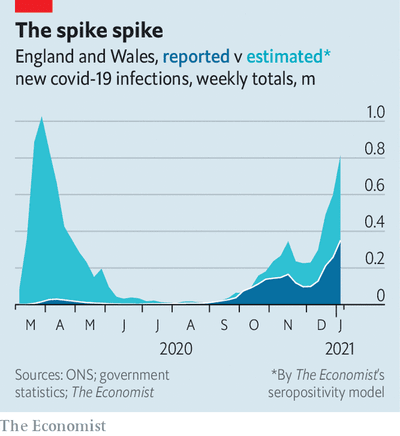

# D329 Britain’s vaccine roll-out races the covid-19 virus
1 Scientists believe a new variant of covid-19 first passed from one person to another in Kent, in the south-east of England. When it happened, in late September, there were just 79 patients in hospital with the virus in the nine counties that make up the region. Three months later admissions are running higher than during the spring peak. “We haven’t run out of oxygen or dexamethasone or ventilators,” says a local doctor. But medical staff are dangerously **thin on the ground**: “We are very close to running out of humans.”

2 Britain is now in a race against the virus. The new variant, which is 50-70% more transmissible, is spreading fast. Having been concentrated in the south-east in the autumn, it has now taken root across the country (as well as beyond Britain’s borders, turning up everywhere from New York to Sydney). Much as Lombardy alerted the world to the pressures covid-19 would place on hospitals, south-east England provides a warning about the impact of the new variant.
The lack of testing during the first wave makes comparisons difficult, but calculations by The Economist suggest the number of cases in England and Wales is now at around 80% of last year’s peak, and is rising fast (see chart).

3 According to estimates by the Office for National Statistics, one in 30 Londoners had covid-19 in the week ending January 2nd, as did one in 50 Britons overall.

5 The government is trying to contain the spread. On January 4th Boris Johnson announced another national lockdown. Yet the prime minister was once again slow to react, doing so a fortnight after the Scientific Advisory Group for Emergencies, an official body, advised that stronger measures would be necessary, and the day many pupils returned to school. Schools and universities have now closed to most students. Outdoor socialising with another person is permitted only if it involves exercise. Scotland, Wales and Northern Ireland have introduced similar measures.

6 The National Health Service is **under strain**. Unlike in the first wave, supply chains are holding up and treatment protocols are in place. Patients admitted to intensive-care units are now a bit more likely to survive. But death numbers are rising fast, breaching the 600-a-day mark on December 28th, the current peak (it takes time for deaths to be recorded).

7 The jump in cases is wreaking **havoc**. Ambulances are queuing up outside hospitals. In a letter seen by itv News, one institution in London warned staff: “We are now in disaster medicine mode. We are no longer providing high standard **critical care**, because we cannot.” A doctor in Kent says that patients have been transferred to intensive-care units in Southampton and Plymouth, which is 250 miles away, because of bed shortages. One concern is that opportunities for this sort of mutual aid will become limited as hospitals fill up across the country.

8 New restrictions should ease the pressure. Yet not all scientists advising the government are confident they will be sufficient to halt the growth in the number of cases, given the increased transmissibility of the new variant. Case counts in the south-east have **levelled off**, even if they have not begun to decline. But during the Christmas break, London’s restrictions were equivalent to the national lockdown, with schools closed for the holidays and most offices shut—and still cases grew.

9 The optimistic interpretation is that this was because people broke the rules over Christmas; the hope is that behaviour will change now Britain has entered, in the words of one scientist, a “real lockdown”. According to data from Google, mobility in London was around 60% lower than normal at the end of the year. Even with the reduction in movement that would be expected over Christmas, as people watch rubbish television rather than head into the office, that was not as low as the 70% reduction during the spring lockdown. As ever, the introduction of new restrictions received widespread support. A poll by YouGov found that 85% back the lockdown.

10 There is not much more behaviour that the government can restrict should cases continue to rise. Nurseries remain open and single households can still form “support bubbles”. People are allowed into workplaces if it is “essential” (which they can define). Once in, they do not have to wear a mask, unless they serve customers. Changing these rules is either **unpalatable** or unlikely to make a big difference.

11 Rapid delivery of vaccines is thus an overwhelming priority. In the face of the new variant, the Joint Committee on Vaccination and Immunisation, an expert group which advises the government, recommended prioritising first doses, with second ones held back for as long as three months (see Briefing). While announcing the new lockdown, Mr Johnson set a target of offering residents and staff in care homes, front-line health- and social-care workers, the clinically vulnerable and everyone over the age of 70 (who together account for 13.6m people) a dose by mid-February. That would greatly reduce deaths and trips to hospital: those over 70 account for more than eight in ten fatalities.

12 So far 1.3m have received jabs, with Britain delivering more than any other European country, but at too slow a rate to meet Mr Johnson’s target. If he is to succeed, roughly that many vaccines will have to be delivered every four days. The process should accelerate once the mhra, a regulator, approves more batches of the Oxford-AstraZeneca vaccine, and the Pfizer-Biontech doses freed up by the dosing strategy are dished out. Next week nearly 1,000 vaccination sites, operated by general practitioners (family doctors) and hospitals, will be joined by seven mass-vaccination centres in exhibition centres and stadiums.

13 It should not take long for this to lighten the health service’s workload, and for the vaccination of medics to reduce staff absences. Yet with hospitals already overloaded, the next few weeks will be **bleak**. “The thought of [case counts] going up any more is pretty awful,” says the doctor in the south-east. The case for getting vaccines out quickly, always strong, has only strengthened. Any slip-ups in the roll-out will come with a heavy toll.

