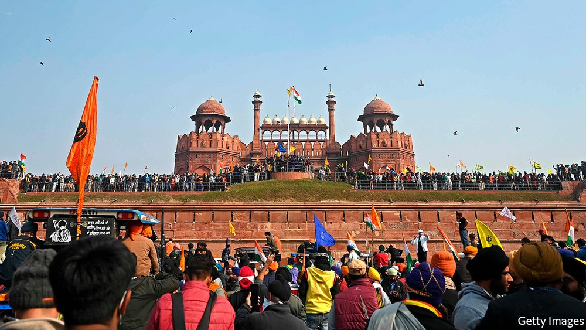

# D342 India’s protesting farmers breach the walls of Delhi’s Red Fort

1 IT WAS THE moment with which India’s farmers’ protest movement will be forever identified. All of a sudden, on the afternoon of January 26th, Republic Day, a singular image flashed across the country’s television screens. Hundreds or possiblythousands of protesters made it to the Red Fort in the heart of old Delhi. Somehow breaching its towering walls, they scrambled up its **parapets** and **unfurled** flags. Not just India’s national tricolour, but also a union’s **garish** flag and the Nishan Sahib, a brilliant triangle representing the **Sikh** faith. The moment did not last long and it was bookended by scenes of minor violence—police firing tear-gas canisters and charging the protesters with rods—but its power as a spectacle overwhelmed everything else on the chaotic stage of the day.

> 2 It can be hard to grasp the scale of the protest that has gripped India’s capital for the past two months. Since November 26th hundreds of thousands of farmers, organised through a **panoply** of more than 40 unions, have been holding down a series of camps surrounding an area of 1,500 square kilometres. Though they come mainly from the northern states of Punjab and Haryana, they are a mix of old and young, rich and poor, Hindu and Sikh. They joined arms against a set of agricultural-reform laws that the government of Narendra Modi, the prime minister, **rammed through** parliament in September. They fear that big agri-business will take them for a ride. They have attracted broad sympathy from across the country; more than 50% of the workforce is in agriculture. But the protesters’ grievances are stubbornly diverse.【凉州】
>
> N-SING[正式][usu N 'of' n]单数型名词A **panoply** **of** things is a wide range of them, especially one that is considered impressive. 大批
>
> 废除“中间人”制度，允许农民将农产品自由出售；农产品价格由市场自由决定；允许企业自由储备农产品。印度政府农业改革方案是想改变之前国家力量起主导作用的情形，转而寻求市场在农业生产中发挥主导作用，真正实现印度农业的市场化，提升其国际竞争能力。但是，莫迪政府此举却遭到大多数农民的抗议，认为这将影响自身的生计，甚至可能导致土地被兼并，从而最终危及到印度传统农业。
>
> **take someone for a ride**:deceive or cheat someone.
>

3 The crowd that stormed the fort had **spun off** from a mobilisation that is orders of magnitude larger. Two months ago Mr Modi’s government had prevented the farmers from entering Delhi, so they pitched their tents on the city’s border. Republic Day was chosen for their show of strength because of the national holiday, which commemorates the adoption of the Indian constitution. In a normal year, the prime minister plays host to foreign **dignitaries** at a colourful review of the country’s fighting forces. To outdo the tanks and missile-launchers, for the past two weeks columns of tractors and lorries, **summoned** for a rally to eclipse Mr Modi’s, had been snaking their way towards Delhi from across northern India. One of the unions estimated that 200,000 tractors were **mustered** for the day itself. The initial idea was to parade them through New Delhi, the British imperial capital, just as Mr Modi would be **presiding over** the customary military **pageantry**. The Supreme Court refused to issue an outright **injunction** against the rally and instead directed the Delhi police—controlled by the national government—to hash out permissible conditions with the farmers’ unions. 【Alex】

> spin off : PHRASAL VERB[商业]动词词组To **spin off** something such as a company means to create a new company that is separate from the original organization. 使脱离 (原组织) 而独立
>
> V-I不及物动词If you **preside over** a meeting or an event, you are in charge. 做主持
>
> N-UNCOUNT不可数名词People use **pageantry** to refer to the colourful and formal things that are done for special official or royal occasions, for example, the wearing of special clothes and the playing of special music. 盛况
>
> N-COUNT[法律]可数名词An **injunction** is a court order, usually one telling someone not to do something. (法院的) 禁令; 强制令
>
> PHRASAL VERB[美国英语][also V n P]动词词组If people **hash out** something such as a plan or an agreement, they decide on it after a lot of discussion. 充分讨论后决定
>
> 4 On January 24th they struck a compromise allowing the tractors to rally on three designated circuits far from the city centre, to start after Mr Modi’s parade had ended. Instead, some factions within the movement **jumped the gun**. They **barged** through the borders at 8am and, in some cases, deviated deliberately from the rally’s planned routes. Other farmers, many seeing the big city for the first time, followed. An even greater number patrolled their assigned routes, where they were greeted in some places by Delhiites throwing **marigold petals**. 【七月】
>
> jump the gun : 偷跑；行动过早；未听发令枪就起跑
>
> V-I[非正式]不及物动词If you **barge into** a place or **barge through** it, you rush or push into it in a rough and rude way. 闯入
>
> 5 Indian television commentators remarked on the **resemblance** between the scene at the fort and the scenes **beamed** from America’s Capitol building on January 6th. The violation of a national symbol was striking. The Red Fort was built in the 17th century by the Mughal emperor Shah Jahan (who erected the Taj Mahal). Delhi was much smaller then, but the red-sandstone fortress was the **nerve centre** of an empire roughly the size of modern India. Jawaharlal Nehru announced the birth of independent India with a resounding speech about the nation’s “tryst with destiny” at midnight on August 15th 1947 from the ramparts of the Red Fort. Every prime minister since has marked that anniversary from the same place. (To Punjabi Sikhs especially, the location represents the distant authority of the state. The ninth of their religion’s founding **gurus** was martyred there by the last of the great Mughals, Shah Jahan’s murderous son.) But the American rioters who rushed their Capitol had gone there with the aim of overturning an election, intending at least to disrupt a formal counting of the vote. Raising only a shout and a banner or two, India’s farmers wanted only to be heard. 【七月】
>
> N-VAR有变体名词If there is a **resemblance** between two people or things, they are similar to each other. 相似之处
>
> V-T/V-I及物动词/不及物动词If radio signals or television pictures **are beamed** somewhere, they are sent there by means of electronic equipment. 播送
>
> N-COUNT[usu with poss]可数名词The **nerve centre** of an organization is the place from where its activities are controlled and where its leaders meet. 枢纽地带
>
> V-T[usu passive]及物动词If someone **is martyred**, they are killed or made to suffer greatly because of their religious or political beliefs. 使殉难; 折磨
>
> “命运的尝试”是独立印度第一任总理贾瓦哈拉尔·尼赫鲁在印度独立前夕在1947年8月14日午夜向议会中的印度宪法议会发表的讲话。它谈到了超越印度历史的各个方面。它被认为是20世纪最伟大的演说之一，也是标志性的演说，捕捉了印度反对大英帝国的印度独立斗争取得的胜利的精髓
>

6 Indians are too accustomed to seeing their police clash with protesters. A whole vocabulary exists to describe **skirmishing**. But the effect of seeing lathi-charges and stone-pelting at the Red Fort, and especially of seeing the wrong flags flying on a national monument, on Republic Day, was transformative. Captain Amarinder Singh, the chief minister of Punjab and a great supporter of the farmers’ cause, **deplored** the “shocking scenes” and predicted that they will “negate the goodwill generated by peacefully protesting farmers”. Other members of his Congress party, the face of the opposition to Mr Modi’s Bharatiya Janata Party (BJP) government, sought to distance themselves from the **unruliness**, as did the Aam Aadmi Party that governs Delhi. 【Alex】

> V-RECIP相互动词Beliefs, ideas, or qualities that **clash** **with** each other are very different from each other and therefore are opposed. (因信仰、观点或质量不同而) 产生分歧
>
> 7 Since taking office in 2014 and then strengthening his hand further with re-election in 2019, Mr Modi has won more political battles and assumed greater control over India’s centres of power than any leader since Indira Gandhi in the 1970s. The other politicians are certainly no match for his re-energised BJP. Even now, with the economy in an unprecedented recession, Mrs Gandhi’s old Congress party barely musters a whimper at the national level, and regional parties prefer to be co-opted by the BJP than to confront it. But a social movement, like these farmers’, or the one that sprang up to decry a discriminatory new citizenship law a year ago, is a different matter—both harder to predict and more slippery in combat. It was such a movement that provoked Mrs Gandhi into declaring an emergency in 1975 and, notoriously, suspending India’s democracy.【坚果壳子】
>

8 Last year’s movement against the citizenship-amendment act was eventually dispersed by the pandemic. Since then the issue has been kept quiet and the movement’s leaders **harassed** or co-opted into quietening down. Many of them were Muslims, which perhaps limited their appeal among a national population that is becoming prouder of its Hindu majority. The Sikh flag atop a national monument could cramp the farmers’ movement by associating them with another minority religion. Some members of the BJP had already tried to **tarnish** the Punjabi farmers by calling them separatists. Mr Modi’s team may be able to win the war of perceptions against this army of **agitated** farmers. But it would be better to devise clever policies and then win elections on the basis of their popularity.

> **the war of perceptions**:舆论战、观念之战
>

