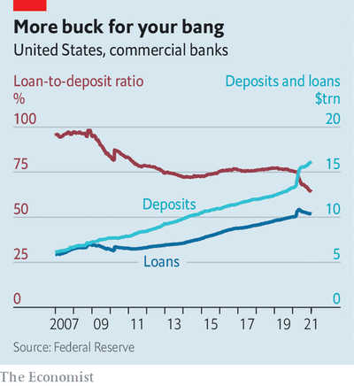

# D343 Have banks now got too much cash?
> V-T及物动词If you **shoo** an animal or a person **away**, you make them go away by waving your hands or arms at them. (挥手)赶走
 > 

1 The fates of the economy and banks are normally closely **entwined**; when customers endure misfortune, loans go unpaid. The summer was marked by a **lull** in covid-19 cases and recovering economic activity. Winter has brought with it more infections and shutdowns. Yet banks’ profits were slender in the summer and, as fourth-quarter earnings released between January 15th and 20th revealed, fattened at the end of the year. What is going on?【Gosto】

> V-T/V-I及物动词/不及物动词If two things **entwine** or **are entwined**, they closely resemble or are linked to each other, and they are difficult to separate or identify. (使)纠缠; (使)紧密结合
>
> V-I不及物动词When something **balloons**, it increases rapidly in amount. (数量上) 猛增
>
> 2 One explanation is that the trading desks and investment banks housed in most big banks have fared well, thanks to a rush of initial public offerings and booming markets. Profits were sky-high at banks that earn most of their revenues from investment banking and trading. Goldman Sachs made $4.5bn in the fourth quarter, half its annual profits in 2020. JPMorgan Chase’s investment-banking profits in the same quarter almost doubled on the year. The firm’s total earnings were a record $12.1bn in the fourth quarter.【凉州】
>
> 3 The bread-and-butter business of commercial and consumer banking also did well. This is, in part, an accounting quirk. When expectations of repayment tumble, banks must write down the value of their assets, which they book as a loss. As a result, many reported slim profits (and in some cases, losses) in the second and third quarters, even though borrowers mostly repaid their loans. Though delinquencies inched up in the fourth quarter, it also contained hope—in the form of a vaccine.【坚果壳子】
>
> ADJ[ADJ n]形容词**Bread-and-butter** issues or matters are ones which are important to most people, because they affect them personally. 最基本的; 影响切身利益的
>
> N-UNCOUNT不可数名词**Delinquency** is criminal behaviour, especially that of young people. 违法行为; 少年犯罪
>

4 Recovery equals repayment. So America’s biggest lenders—Bank of America, Citigroup, JPMorgan and Wells Fargo—have favourably re-evaluated their loan books. In September JPMorgan expected as much as $33.6bn of its $1trn loan book to eventually go unpaid. By the end of December a little under $1.1bn was written off for good. But the bank also now thinks that around $1.8bn that it had previously expected to be lost will be repaid. These averted hypothetical losses add to profits.【Erick】

> 5 This bonanza is a victory for those who spent the past decade attempting to make banks safer. In the past investment-bank earnings were more tied to the economy, thanks to fat portfolios of assets like mortgage-backed securities. Now banks must hold so much capital against volatile assets that they do not bother. When markets whipsawed last year they earned the upside (bumper trading revenues) without the downside (losses on volatile assets).【凉州】
>
> 6 But this earnings season has also revealed how sensible rules can go awry in bizarre times. Banks are usually keen to amass customer deposits. They are cheap sources of funding; the more deposits a bank holds, the more it can lend. Over the past year, monetary easing by the Federal Reserve has injected vast amounts of cash into the banking system and led deposits to balloon. In 2020 an additional $580bn or so piled up at JPMorgan, and $360bn at Bank of America. On one earnings call an analyst called these deposit mountains an “embarrassment of money for the industry”.【七月】
>
> V-I不及物动词When something **balloons**, it increases rapidly in amount. (数量上) 猛增
>

7 Yet post-financial-crisis rules make this cash pile a problem, not a victory. Big banks face high capital requirements if they grow too large. The penalties would be worthwhile if there were enough profitable opportunities. But loan demand has been low. System-wide loan-to-deposit ratios have **plummeted**, from 94% in 2008 to 64% last year. The result is that some banks are attempting to shoo away deposits. Jamie Dimon, JPMorgan’s boss, told investors that the bank had asked some of its big corporate customers to move their cash, reducing the deposit base by $200bn. The firm may “shy away from taking new deposits”, said Jennifer Piepszak, its chief financial officer. The covid-19 crisis has shown the resilience of the financial system. But it has also revealed its  oddities.  【Gosto】

> 巴塞尔协议
>

