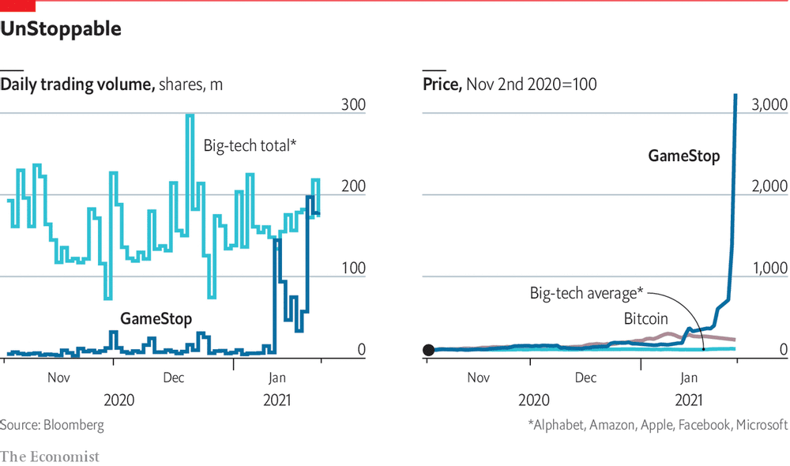

# D344 Day traders have sent GameStop’s share price sky-high

1 FOR MOST of 2020 shares in GameStop, a struggling seller of video games with more than 4,000 shops across America, **fetched** a few dollars **apiece**. The stock languished as the pandemic shuttered malls. But in August Ryan Cohen, the former boss of Chewy, an online pet-food store, started amassing a large stake. In November he wrote an animated letter to the board, urging them to review GameStop's business and invest in e-commerce to boost online sales. Investors seemed to like his plan: by January 11th, when he took a seat on GameStop’s board, his 12.7% stake had doubled in value. The shares were worth around $20.【gunner】

> V-T及物动词If something **fetches** a particular sum of money, it is sold for that amount. 卖得
>
> ADV[amount ADV]副词If a number of similar things are for sale at a certain price **apiece**, that is the price for each one of them. 各
>

2 Then came the madness. By January 27th shares in GameStop were worth 17 times as much as they had been just a fortnight earlier, leaping to a record high of more than $350 a pop. The firm, worth just $250m at its lowest in 2020, now has a market capitalisation of more than $25bn.【gunner】

3 What happened? The jump came after users of r/wallstreetbets, a Reddit forum, which now has almost 3m subscribers, began to take a fancy to the firm. Some posters justified their bullish bets based on company fundamentals, encouraged by Mr Cohen’s involvement. But most seem to have been driven by a vigilante-style desire to stick it to the establishment. GameStop was unloved by the vast majority of institutional investors—and a target of short-sellers. Investors wanting to bet against a company “go short” by borrowing shares and selling them at the market price. The total value of **short positions** in Gamestop reached around 140% of its market capitalisation. After users discovered that a swathe of **hedge funds** had bet against the stock, they began **frantically** buying shares in the hopes of forcing them to take losses.【maturing】

> N-COUNT可数名词**Vigilantes** are people who organize themselves into an unofficial group to protect their community and to catch and punish criminals. (自发组织维持社区治安的) 联防队员
>
> share positions: 证券或外汇交易中未补抛空差额，欠缺的头寸
>

4 This seems to have worked, and for a few reasons. One is the sheer size of retail interest. Tens of thousands of traders join daily trading forums on Reddit.  A decade ago retail trading was just a tenth of total equity volumes; by 2020 its share had risen to a fifth. Second, these retail investors seem to favour maximising their impact on share prices by buying **call options**—short-term leveraged bets that a stock will jump—rather than plain shares. This is riskier, but more effective at driving short-term moves, in part because prices tend to spiral upwards as a result. Traders who sell those derivatives are forced to buy shares to hedge their positions as the price rises. A third reason is the large **short interest**. When investors hold short positions in a company’s shares, they too can be forced to buy as prices climb, to reduce their risk. Two investors with prominent short positions, Melvin Capital and Citron Research, have **thrown in the towel**. Melvin has already had to accept a $2.7bn capital injection from Citadel, another hedge fund.【Alex】

> short interest: 证券或外汇交易中未补抛空差额
>

5 But the main reason why the Reddit buying **spree** has succeeded is probably the attention it has attracted. This week it has enjoyed **wall-to-wall** coverage in the financial press. The White House press secretary even reassured reporters that Janet Yellen, the newly appointed treasury secretary, was keeping an eye on the situation. GameStop was the world’s most heavily traded stock on January 26th, probably because institutional investors have piled in: volumes matched that in the five biggest tech giants combined (see chart). The attention has also spread to other heavily shorted stocks, such as AMC, a cinema chain, and Nokia and Blackberry, former makers of once-fashionable mobile phones.【Gosto】

6 So, has the Reddit mob stuck it to the establishment? Probably not. Ken Griffin, who owns Citadel, also owns a high-frequency-trading firm, Citadel Securities. It makes its money, in part, by filling **order flow** from retail investors, executing their orders on stock exchanges and pocketing the spread. The best way to beat Wall Street is probably not with a torrent of trading, but by buying a cheap index fund and ignoring the markets. That is hard to do, though, when the markets are this much fun.

> https://www.zhihu.com/question/441605142/answer/1703577108
>
> 美国多空大战：互联网+民粹主义，金融暴力+网络暴力
>

