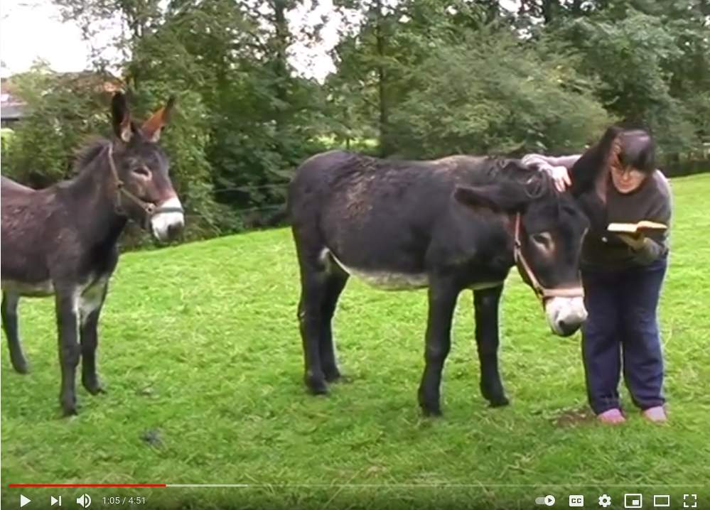

# D355 A tag-team reading of “In Search of Lost Time”
1 Sitting in her pink living room in Tahiti, Natti Tumahai reads in French from “In Search of Lost Time” as her family eats lunch: “I cannot say, looking back, how much of Albertine’s life was overlaid by fluctuating, fleeting and often contradictory desires…” The passage comes from volume five of Marcel Proust’s roman-fleuve, and Ms Tumahai is the 1,262nd person to appear before the camera.

> tag team : two or more people who take turns to do something
>

2 From Bali to Paris, the readers in Véronique Aubouy’s huge project, “Proust Lu” (“Proust Read”), have been captured in bedrooms, offices, supermarkets, factories and beauty spots. Farmers, schoolchildren, businessmen, even the French director’s doctor have participated. “It’s a slice of life,” Ms Aubouy says; “a reading about time, in time.” The cast is as diverse as the novel’s, brought together by their own web of connections and coincidences.

3 Proust’s seven-volume masterpiece runs to more than 4,000 pages. Each participant reads just two of them, so at the current rate the project will not be completed until 2050—57 years after filming began. It is already 150 hours long (much of the footage is available to watch on YouTube). By contrast, Proust took a mere 14 years to write the book, finishing it in 1922, shortly before his death. Tracing the narrator’s life from childhood to old age, “it offers a singularly accurate depiction in fiction of how consciousness works,” says Patrick McGuinness of the University of Oxford. “His writing forces you to inhabit time. It doesn’t do the normal thing of compressing narrative into **chunks**—it makes the narrative more like life.”

4 Ms Aubouy set out to make a screen equivalent. Instead of condensing the text into a conventional plot, thereby losing its rich detail, she divided it into filmable snapshots. Trusting in **happenstance**, she finds and recruits interesting people. Readers then recommend friends. She likens the project to a **locomotive**, “each new person adding a **wagon**”.

> V-T及物动词If you **liken** one thing or person **to** another thing or person, you say that they are similar. 把…比作
>
> A **locomotive** is a large vehicle that pulls a train. 火车头
>

5 They have declaimed from **bunk beds** and stairwells or standing in the sea. Some **are wreathed in** cigarette smoke. A curate with a pigeon on his shoulder is **silhouetted** against the stained-glass window of his **abbey** in Combray, where the novel begins. A straw-strewn cowshed is coldly illuminated by strip-lights: “Madame Swann,” a young woman intones, “seeing the enormous proportions that the Dreyfus affair was assuming, and fearing that her husband’s origins might be used against her, had begged him to no longer speak of the innocence of the convicted man…”

> V-T[文学性]及物动词If something **is wreathed** **in** smoke or mist, it is surrounded by it. 笼罩; 包围
>
> An **abbey** is a church with buildings attached to it in which monks or nuns live or used to live. 修道院
>

6 Differing accents and proficiencies generate a dream-like rhythm that swings between the theatrical and the **prosaic**—just as the novel combines the **mundane** and profound. Actors such as Kevin Kline, Annie Girardot and Mathieu Amalric feature alongside inconnus who have not read aloud since school. “In 2001 one girl chose to rap,” Ms Aubouy recalls. Now 65, Marie Benoît contributed in 2007 from her Normandy **smallholding**, accompanied by two donkeys. The experience “was very moving, because reading in this way, at home, showed that anyone can enjoy Proust.”

> Something that is **prosaic** is dull and uninteresting. 枯燥乏味的
>
> Something that is **mundane** is very ordinary and not at all interesting or unusual. 平凡的; 单调的
>
> **smallholding**: a holding of agricultural land smaller than a small farm 小块农田
>

7 Each scene is one continuous shot, preceded by a slide stating a name and location. Then comes a brief silence, as if the new reader has been listening to the previous one. Like the novel, the clips are portals into lost worlds. Over the decades the images become sharper; fashions, haircuts and the **timbre** of speech evolve.

8 Even during the pandemic, “Proust Lu” has marched on. Ms Aubouy let some participants film their readings on their phones. And the disease itself has echoes in Proust’s life and writing. His father, Adrien Proust, was an epidemiologist who tracked a cholera outbreak in 1869 and proposed a cordon sanitaire to slow its spread. Marcel’s own squeamishness about germs surfaces in volume four, when the narrator relates his discomfort at sharing a lift with a man who has **whooping cough**. Today, as lockdown time has seemed to blur, when days feel long and months short, Proust’s mesmeric work has found its time—again.

> 疫情期间， Proust Lu 仍在进行中。人们用手机拍摄。 这次疫情也呼应着Proust的生活和作品。Proust 的爸爸是流行病学家并且追踪了霍乱。
>

9 Ms Aubouy says readers often believe they have been handed an extract for a reason: though **ostensibly** concerned with a different era, Proust’s story seems to reflect the precise moments they have reached in their lives. “And yet in reality, it’s just the moment we’ve arrived at in the book.” The sensation arises, she thinks, because “the persistence of memory, and the feeling of having wasted time, are universal.” Perhaps never more than now.

> Aubouy 说读者通常认为他们被指定读那两页是有原因的：尽管是不同的年代，Proust的故事似乎恰好反应着他们的当下。 “但事实是，我们恰好处在了书里的这个时刻” 。她认为，这种感觉出现是因为，记忆的持续性和浪费时间的这种感觉是（任意时代）普遍存在的。也许现在是历史之最的时候。
>

