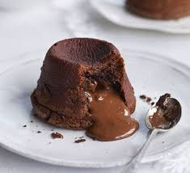

# D359 Valentine’s Day: how chocolate became the food of love
1 Even in a pandemic – perhaps particularly in a pandemic – nothing can stop the onslaught of Valentine’s Day adverts. Goods of all shapes and sizes briefly morph into heart-shaped objects. All manner of food is coloured red or sold as a more romantic version of its former self (spicy “love sausage”, anyone?). Yet when the pressure is on to express our passion, many of us fall back on a Valentine’s staple: chocolate, the ultimate food of love.

> N-COUNT可数名词If you refer to an **onslaught** **of** something, you mean that there is a large amount of it, often so that it is very difficult to deal with. (常指难以应付的) 大量
>
> V-I[非正式]不及物动词If one thing **morphs** **into** another thing, especially something very different, the first thing changes into the second. (尤指很大的、质的)改变; 变化
>
> PHRASAL VERB动词词组If you **fall back on** something, you do it or use it after other things have failed. 转而使用
>

2 The connection between chocolate and romance is an enduring one. Cacao, the base ingredient for chocolate, first acquired a social significance in Mesoamerica, where the beans have been used to flavour food and make drinks since around 2,000bc. Mayans and Aztecs **bartered** with cacao. The ingredient was also an element of ritual offerings, including those linked to fertility and love. Drinks made with cacao and flavoured with spices, honey or flowers were exchanged and drunk at important moments, such as in negotiations between a **suitor** and his prospective father-in-law.

> V-T/V-I及物动词/不及物动词If you **barter** goods, you exchange them for other goods, rather than selling them for money. 以物交换; 以物易物
>
> A woman's **suitor** is a man who wants to marry her. (女性的) 求婚者
>

3 European colonisers were initially sceptical of cacao, but eventually they too were seduced by it and took the beans back to their homelands. At first, chocolate was the **preserve of** royalty and the elites, but a liking for it soon spread. Many were convinced of the energising powers of chocolate – not without reason, since cacao contains theobromine and caffeine, both mild stimulants.

> N-COUNT可数名词If you say that a job or activity is the **preserve of** a particular person or group of people, you mean that they are the only ones who take part in it. 独揽之事; 独占的活动
>

4 It was the Victorians who definitively established chocolate as the food of romance, especially for Valentine’s Day. People sent **sweet nothings** on this day even in medieval times. Charles, duke of Orleans, wrote the first known Valentine’s love poem in 1415 while imprisoned in the Tower of London (“I am already sick of love/My very gentle Valentine,” he told his wife).

> If someone whispers **sweet nothings** to you, they quietly say nice, loving, and flattering things to you. 好听的奉承话; 甜言蜜语
>

5 But it was Richard Cadbury, the eponymous founder of the British chocolate company, who made v-day so sweet. In 1861 Cadbury came up with the idea of stuffing his firm’s **wares** into a heart-shaped box to **flog** in the run-up to February 14th. Even after the chocolates were long gone, lovesick maidens could fill the boxes with mementoes of their **paramours** – and more delicious **treats**.

> **flog**: sell or offer for sale.
>
> **treat** : a sweet, biscuit, or other item of sweet food.
>
> ADJ[正式][ADJ n]形容词An **eponymous** hero or heroine is the character in a play or book whose name is the title of that play or book. (戏剧、书中男女主角)与作品同名的
>
> N-PLURAL复数型名词A person's or a company's **wares** are the things that they are selling. 商品
>
> N-SING[英国英语]单数型名词**The** **run-up** **to** an event is the period of time just before it. 前夕
>
> N-COUNT[老式][oft poss N]可数名词Someone's **paramour** is their lover. 情人
>

6 The Americans tightened the tie between chocolate and romance with the invention of Hershey’s “Kisses” in the early 20th century. These days no Valentine’s meal would be complete without the chocolate **fondant**, an **oozily** suggestive dessert that is a triumph of precise baking. (The pandemic has one positive: this year most of us will legitimately be spared a pricey outing to a restaurant full of awkward couples.)

> **Fondant** is a sweet paste made from sugar and water. 翻糖; 由糖和水做成的糖面团。
>
> **ooze**: (of a fluid) slowly trickle or seep out of something.
>
> **7 The love of chocolate is not always a romance of equals**
>
> The love of chocolate is not always a romance of equals. In America, both men and women buy chocolate for each other on the day of love, but in Japan women are expected to buy chocolates for their sweetheart. The roots of the tradition go back to **confection**ers (again). In the 1950s, heart-shaped chocolates were marketed as an acceptable way for women to express kokuhaku – a confession of their love – which at the time was considered inappropriately forward (men get their chance a month later on “White Day”, when they can reciprocate the gesture).
>
> You can refer to a sweet food that someone has made as a **confection**. 甜食; 甜品
>

8 The food of love may obscure a deeper devotion, however. Look carefully at the chocolate adverts and you’ll see that most feature a woman enjoying her delicious sweet alone. It is almost as though chocolate is a replacement for other earthly delights. Who needs a man – or sex – when a chocolate is just as sweet?

