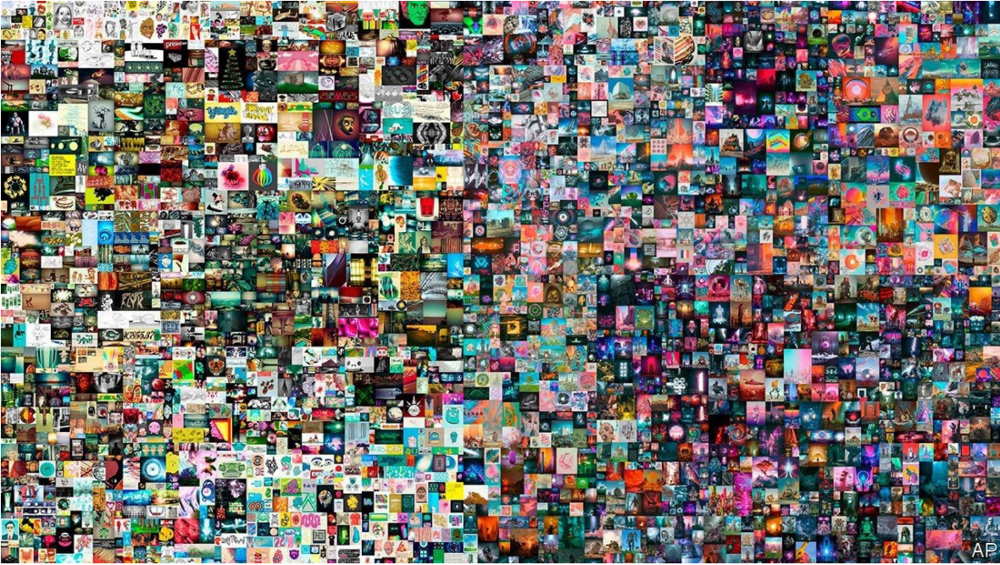
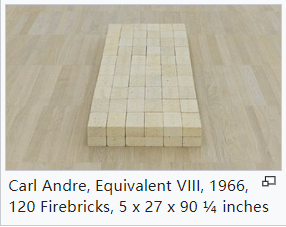

# D397 Non-fungible tokens are useful, innovative—and frothy

1“Equivalent viii” by Carl Andre was a minimalist sculpture bought by Britain’s Tate Gallery in 1972. The Tate described the work as “a rectangular arrangement of 120 firebricks...altering the viewer’s relationship to the surrounding space”. The public called it a pile of bricks. A few years later newspapers execrated the gallery for having wasted brick-shaped wads of cash on the **avant-garde** work.

2 Once again, a famous institution is embracing a controversial new genre. On March 11th Christie’s sold a digital **collage** of images called “Everydays—The First 5,000 Days” for a cool $69.3m. The sale elevated the work’s creator, Mike Winkelmann, **aka** Beeple, to the august company of David Hockney and Jeff Koons, the only two living painters to sell at such prices.

> N-COUNT可数名词A **collage** is a picture that has been made by sticking pieces of coloured paper and cloth onto paper. 拼贴画
>
> august: of noble birth or high rank
>

3 Christie’s sold the artwork as a “non-fungible token” (nft), a craze for which has gripped Silicon Valley’s elite. An nft is a secure, blockchain-based record that represents pieces of digital media. Invented a few years ago, it can link not only to digital art but also to text, videos or bits of code.

> 非同质化代币
>

4 The pile-of-bricks criticism of digital artworks is that, in contrast to physical collectibles, they can be copied with perfect fidelity and consumed infinitely online. They thus have limited inherent value. A token brings **bragging rights** to a unique, authenticated version of a digital artwork, song or cute image of a cat (which first earned nfts their popularity). Another attraction for the creative world is that nfts make it easy to **build in** payments to artists when their works are sold on.

> N-PLURAL复数型名词notional privileges that are gained by defeating a close rival (战胜劲敌后的)吹嘘
>
> V动词to incorporate or construct as an integral part 整合; （作为整体的一部分）造入
>
> NFT 靠猫片火起来的
>

5 Since almost anything can be tokenised and sold if **punters** are willing, the craze stretches beyond pictures. Kings of Leon, a rock band, is selling a new album as an nft and the National Basketball Association is selling clips of famous **dunks**. Creators can turn to a growing collection of marketplaces, such as OpenSea and Nifty Gateway. Even individual tweets are going for big sums (leading some to wonder if the former tweeter-in-chief, Donald Trump, could flog bits of his oeuvre).

> N-COUNT[英国英语][非正式]可数名词People sometimes refer to their customers or clients as **punters**. 客户; 顾客
>
> dunk： 灌篮
>
> flog: 售卖
>

6 The bumper Beeple sale, plus the arrival of ever more creators, means a mania that has been largely confined to crypto and techie circles could move mainstream. The global nft market grew from a few tens of millions of dollars in annual sales a few years ago to over $300m in the past month alone, according to Andreessen Horowitz, a venture-capital firm. nfts **mesh with** the massive network effects of social media and meme culture, notes Sam Hart of the Interchain Foundation, a Swiss backer of blockchain infrastructure. There has been little time to educate buyers, he says.

> ADJ[ADJ n]形容词If you say that something is **bumper** size, you mean that it is very large. 巨大的
>
> Meme culture is the evolving culture created by memes. Initially, memes were an aspect of the internet that people would stumble upon from time to time, find themselves amused, and send to someone else for their enjoyment
>

7 The **pitfalls** are being called out by a few crypto experts. One worry is that broad crypto-enthusiasm may be what is really behind soaring nft values. It has not gone unnoticed that the buyer of Beeple’s “Everydays” is Metakovan, a professional crypto investor. Christie’s got its $69.3m in Ether, a cryptocurrency.

> N-COUNT可数名词The **pitfalls** involved in a particular activity or situation are the things that may go wrong or may cause problems. 隐患
>

8 Some compare the nft craze to the boom in initial coin offerings, a form of crowdfunding in which firms issue digital “coins” in return for a payment, in 2017-18, which turned to bust soon after. The soaring prices of many nfts, reliant on ephemeral buzziness in places like Clubhouse, a hot new audio app, could quickly collapse. Celebrities including Lindsay Lohan jumping on a trend that was meant to be about helping **penniless** artists is, some reckon, another **ominous** sign. The upfront costs of “minting” nfts are low, meanwhile, meaning potentially unlimited supply. (For now nfts’ huge carbon footprint, owing to energy-intensive blockchain transactions, is not transparently recorded.)

> V-T及物动词To **mint** coins or medals means to make them in a mint. 铸造
>

9 A final uncertainty around nfts’ value is that they can in practice be separated from the digital good to which they are tied, undermining their worth. A creator can change the image even after sale. One crypto artist recently “pulled the rug” on some nfts to highlight the flaw. A series of colourful digital portraits suddenly metamorphosed into pictures of antique carpets. But the art market has always been prone to **dodgy** dealing. Picking nfts looks akin to sorting real Rembrandts from those daubed by mere followers.

> pull the rug :扯下遮羞布
>

