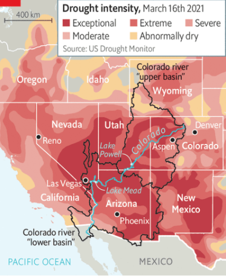
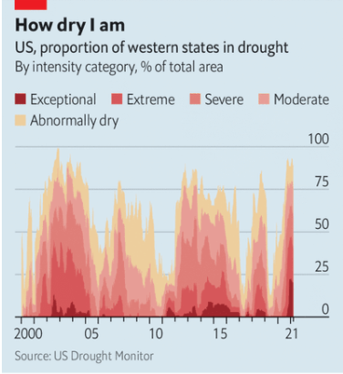

# D404 Snow drought is worsening the American West’s water woes
1 On march 13th Denverites watched from frozen windows as the fourth-biggest snowstorm ever to hit their city buried Colorado’s capital two feet deep, and added fresh powder to the foothills of **the Rockies**. Local officials closed the main highway to the mountains to stop eager skiers getting trapped on icy roads on their way to the slopes. After a dry 2020 and a warm start to winter, the storm brought eastern Colorado’s winter **snowpack** (the accumulation of snow) up to average levels. When it melts, water will **replenish** thirsty reservoirs, rivers and soil. But much of the Mountain West watched the snow falling on Denver with envy.

2 Drought has **afflicted** a large swathe of the region for nearly a year (see map). The Colorado river basin, which includes pieces of seven western states and part of Mexico, has been among the worst-affected areas. A warm spring in 2020 led snow to melt early, which **depleted** the amount of water reservoirs and rivers received during the driest months of the year, in summer and autumn. The annual **monsoons** that the south-west depends on never came—and have been **lacklustre** for four years. The combination of the early melt and a hot, dry summer led to a deadly wildfire season. Colorado and California both suffered their biggest fires on record last year.

> V-T[正式]及物动词If you **are afflicted** **by** pain, illness, or disaster, it affects you badly and makes you suffer. 困扰
>

3 Becky Bolinger, Colorado’s assistant state climatologist, says multiple prolonged periods of drought since 2000 have made it impossible for the country’s biggest reservoirs—Lake Mead in Nevada and Lake Powell on the border of Utah and Arizona—to recover fully. The lakes are now roughly two-fifths full.

4 The **blizzard** that buried Denver did nothing to ease the drought on the other side of the continental divide. The Rockies split Colorado in two: the Front Range, with its high plains, and the Western Slope, where waters flow towards the Pacific. The Mountain Studies Institute, a research group in Silverton, estimates that western Colorado has warmed faster than any part of the country except Alaska.

5 On March 24th snowpack in the south-western corner of the state was at 84% of its normal level for this time of year. That may not seem too bad, but the region needed above-average precipitation this winter to make up for the past year. Citing a lack of snow, Utah’s governor declared a state of emergency and urged Utahns to find ways to save water. The situation looks **bleaker** still farther south. Snowpack in parts of Arizona and New Mexico has fallen to less than 50% of the seasonal average.

6 Average snowpack has been decreasing for decades. Philip Mote, a professor of atmospheric sciences at Oregon State University, found in 2018 that annual snowpack in the American West has declined by 15-30% since 1915. But studying snow drought (and indeed using the term itself) is a recent phenomenon, says Dan McEvoy, a climatologist at the Western Regional Climate Centre in Reno, Nevada. He reckons that warmer winters due to rising carbon-dioxide emissions have made the droughts more frequent and harder to ignore. A lack of snow deprives soil and forests of essential nutrients. It also increases river temperatures and can **heighten** the risk and severity of wildfires. Unstable snowpack also seems to have contributed to an increase in avalanche deaths this year**.**

7 Not only the environment suffers for want of snow. The economies of many towns in the West are centred on the white stuff and the tourists that come in search of it. “In the ski industry, snow is currency,” says Auden Schendler, the vice-president of sustainability at Aspen Snowmass resort. Winter-sports tourism is a $20bn industry in America. Snow drought is an **existential** threat.
Because drought is a **perennial** problem in the West, adaptation has become a way of life. Some farmers in Colorado and the north-west are experimenting with farming without irrigation. Colorado’s proposed covid-19 stimulus plan includes up to $55m to fight drought and fire.

8 But the future promises ever more complicated water problems. The **compact** governing the use of the Colorado river expires in 2026. The agreement, negotiated in 1922, called for “upper basin” states to share water equally with “lower basin” ones. It is showing its age. Today around 40m people depend on the river for water. States, tribes, the Mexican government, developers, environmentalists and farmers all want a say in how the water is allocated. The lower basin is also home to some of America’s fastest-growing cities, such as Phoenix and Las Vegas.

> compact: N名词an official contract or agreement 官方合同; 官方协议
>

9 It would be hard enough to draw up a modern compact that satisfies so many competing interests. Add a shrinking water supply and growing populations, and a battle over the river looms. Individual states are getting ready for it. Utah has created a new agency to argue for more water on the state’s behalf. The fight over water, much like the West itself, is heating up.

