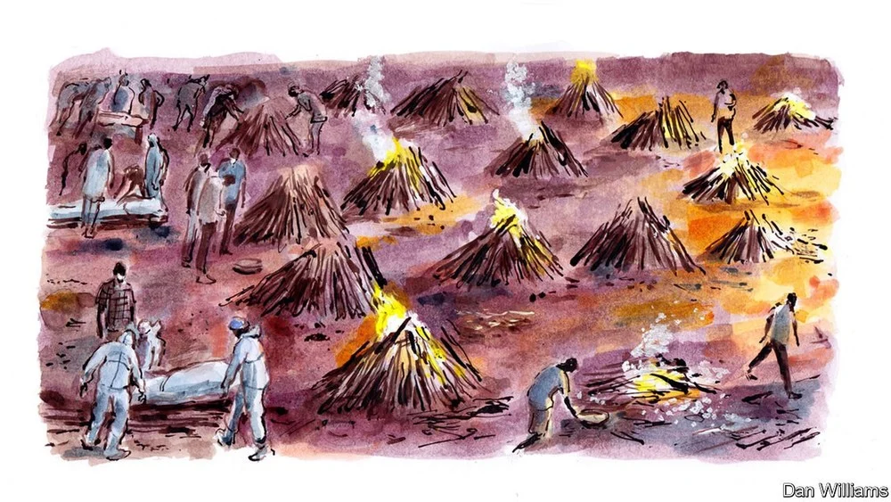

# D436 India’s second wave of covid-19 feels nothing like its first

1 WE ARE AMID an ocean of human suffering but cannot see it. Having returned abruptly to the kind of isolation we hoped we had put behind us months ago, my wife, our two little boys and I are staying put in our nice flat, in a leafy “colony” near the centre of Delhi. Our new rule is strict: we do not go outside for any reason. The past 12 months have trained us well enough for that; these routines are well-worn, for parents and children. We grown-ups however cannot stay away from our phones, and so peace of mind is a distant memory. My wife just called from downstairs. Her friend’s brother-in-law needs an oxygen concentrator or he is likely to die at home. If we find one for him (and she is already working her connections), can we scrounge enough cash to buy another, for ourselves?

2 The mind’s eye is filled with pictures of desperate families scrambling after oxygen cylinders, failing more often than not. All day the early-summer heat has me picturing bodies, bagged and stacked on the pavement, waiting their turn for the pyres that burn everywhere across the city. Sometimes I switch off the screen in my home office on the second floor and step onto the roof terrace to water potted plants and scan the neighbourhood below. All is quiet and green. Smoke from the crematorium down the street has disappeared into the usual haze of the season. Our small park is more leaf-blown than usual, but someone has been watering there too. A security guard at the corner is wearing his mask, but he’s been doing that for a year now, as if the past month were nothing new. In contrast to the first lockdown, the milkman is still coming and newspapers are being delivered.

3 Yet everything has changed, with a speed that we still cannot comprehend. My family had hunkered down much harder than most. We kept our social life in forfeit and wore masks outdoors, if not always at the playground. We had come to seem like laggards within India. Most of this country began to relax after September if not earlier, as the caseload started to drop. Just last month I started travelling again—I was road-tripping through weekly markets, sampling country liquor offered by strangers for a cute feature story, then watching a jubilant political rally fill a small town’s bazaar. Days later I was dandling my two-year-old on my lap at an airport, sharing his first iced lolly. Those were the before times. A fortnight later, back in Delhi, I find that more than half of my friends have covid-19, in their families if not in their own bodies. Acquaintances are dying faster than they can be counted. I read in the papers that the forestry department is clear-cutting parkland to feed more wood to those pyres.

4 The official news outlets also bring the daily statistics: 386,000 new infections today, 208,000 dead counted since the pandemic began. Between the lines, it is possible to read the disclaimers too. If only 1.7m tests are being conducted per day, what can that 386,000 really mean? Is it that 0.0004% of the country has come down with the virus since yesterday, or that nearly 23% did? That would be 314m people, nearly the whole population of America. Obviously, the true number lies between those absurd extremes, but who knows where? The statistics about death tolls are more nakedly false. It is plain that thousands are dying every day, but who, where and exactly how many we cannot know, thanks to some petty deceptions but mostly sheer confusion. I get a better sense from the piecemeal reporting in Indian websites covering, say, the smaller towns and cities of Uttar Pradesh, where none of the official line can be trusted, than from my fellow observers forced to stay in the capital.

5 But the saddest and also the most terrifying accounts all come via the phone, in texts or panicked voices. Everyone is ill and no one can find medical help. Stating the obvious, the American embassy mass-messages, “Access to all types of medical care is becoming severely limited in India due to the surge in Covid-19 cases” and concludes that my fellow Americans should make plans to leave the country “as soon as it is safe to do so”. Social-media feeds are an endless list of pleas on behalf of the dying. A friend from Lucknow, living in New York, writes elegant, almost daily obituaries for friends from his hometown—three of them, I can’t help noting, are my age, and at least one was, also like me, fully vaccinated.

6 I have a nightly ritual of phone calls to check on friends within a two-mile radius. An elderly woman has recovered, but feels distraught that her neighbours across the street both died. Another friend’s aunt is still ailing but in the meantime her husband died—I hadn’t heard he was infected. Newborn twins, their parents and their nanny are all running a fever in tandem. A WhatsApp group set up by foreign journalists to discuss visa issues has become another place to plead for help finding medical supplies. It informs me that the clinic where I found my own second dose of AstraZeneca a week ago has run out of vaccines. Only 1.8% of the country has been fully vaccinated and it is anybody’s guess how long it will take to manufacture or import the roughly 2bn doses we are left wanting.

7 Watching the other international correspondents fall ill and scramble to leave tends to make me want to stay behind these locked doors, with my potted plants and boisterous little kids. Appliances may be breaking down, but our groceries keep coming and the WiFi works. An NGO in Delhi counts more than 100 Indian journalists who have died of covid-19, 52 of them this month. For their bravery, I am able to read about those pyres, without having to risk seeing them for myself.

8 This horror is noticed abroad. Messages from faraway friends I haven’t seen in years convince me of that. They are worried for us and I am happy to reassure them that we four are fine, relieved to be talking about the situation from the bird’s-eye view of my terrace. Much easier on the nerves than ringing up the next-door neighbour to find out whether our mutual friend is still alive.

9 But my long-distance conversations convince me that something has been lost in the transmission. These well-read friends in Europe, America and East Asia never understood how different the past year of covid was, here in India—and so they cannot understand what it feels like now to hit the vertical wall of this so-called second wave. I struggle to convey that we have not been on a wavy ride, like Britain’s or some American states’. Look at the shape of our graphs. Our first surge was scary, but tapered away like the tail of a paper tiger. The virus had spread everywhere during 2020, no doubt, despite a brutal lockdown and other efforts at containment. Sero-positivity surveys conducted in some cities showed that majorities of large populations had been exposed to the coronavirus and developed antibodies to it. But Indian bodies resisted it, perhaps, they say, because of “cross immunity” gained unnoticed over lifetimes lived amid the barrage of everyday germs. The rickety hospitals stayed afloat too, and eventually their covid wards emptied. By the beginning of 2021 we were saying that 150,000 Indians had died. For perspective: three times as many die from tuberculosis every year. “At the beginning of this pandemic, the whole world was worried about India’s situation,” the prime minister, Narendra Modi, recalled in a triumphal mood only in February. “But today India’s fight against corona is inspiring the entire world.”

10 India fought a phony war and—by dumb luck—it won. Then suddenly, less than three weeks ago, our world turned upside down. Having taken credit for his country’s divine good fortune of last year, Mr Modi will want to shrug off blame for the second wave, as if it were an act of God which no preparation could have averted or even lessened. There is a lot to say about what could have been done instead. Yet without any of the government’s self-serving intentions, many of the rest of us feel convinced that a different disease has emerged since our year-long **dry run** began. Covid-21 I find myself calling it.

11 The facts one would need to build that case stay stubbornly out of reach. The available genomic analysis shows that the distinctively Indian “double mutant” variant, B.1.617, is prevalent in some parts of the country but not in Delhi, where the Kentish B.1.1.7 is like wildfire. India is woefully behind in sequencing its strains, having only announced a genomic consortium in December 2020 and then funding it only in March.

12 What is clear to clinicians, as opposed to the boffins, is that covid-21 is more transmissible than the kind we saw last year. A doctor friend tells another friend in her podcast that this is “much much more contagious, much much more transmissible than the wild variety of covid-19.” It used to be that just one member of a household might catch it. Now everyone does. In our extended family, in Kolkata, 13 of 15 people under one roof became infected before any showed symptoms.

13 Its “immune-escape” mutations are **formidable**. Being vaccinated, I am sensitive to the stories of inoculated people falling ill—which could not be more common, in my social circles—and even dying. The vaccines are saving lives, no doubt. Deaths among the fully vaccinated are rare; I hear of them only among friends of friends of friends, like the poor 25-year-old lab technician in a hospital whose best friend teaches German to a pal of mine over Zoom.

14 Which brings us to the fact that this time young people and even children are developing symptoms, including an erstwhile quarantine-playmate of our four-year-old. Younger adults are becoming severely ill, as they did not last year. Finally, those people who have had the disease twice, a plentiful category thanks to that “immune-escape” feature, say that the reinfection feels different. The fever comes quicker and they are more prone to developing pneumonia.

15 Dumb, divine luck with covid-19, and now the bad luck of covid-21, as if it were retribution. That is the way it feels to those of us who find ourselves without access to reliable aggregations of information, but awash in personal anecdotes. I suspect that someday biomedical research may prove that the two kinds of luck were connected, but we will have to wait years for that.

16 For now there is much outrage. Maybe Mr Modi’s government will pay a price for its blunders and complacency. I suspect that this is mostly expressed as a wishful diversion, in tragic pursuit of a silver lining. That would be a way for my part of Delhi, those who have the privilege of sitting at home and contemplating escape, to take a break from our primary occupations: fear and sorrow.

> 今天是劳动节，请加倍劳动 ：）
>

