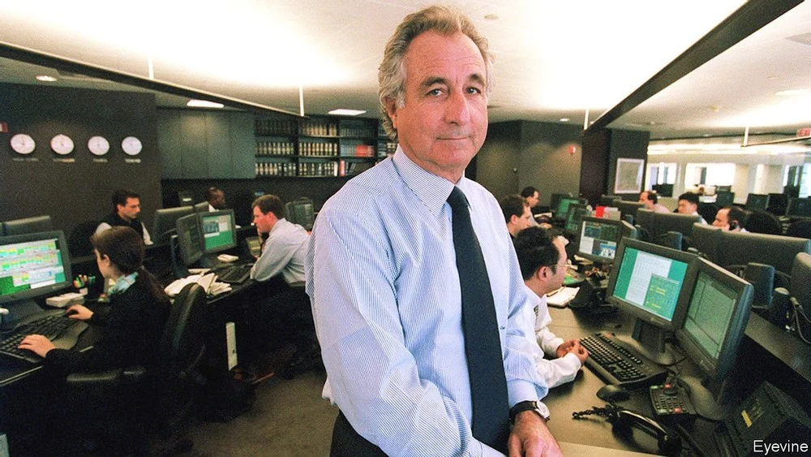

# D437 Bernard Madoff died in prison on April 14th

1 It was rare for Bernard Madoff to invite anyone to his investment-advisory office. Almost all the employees in his brokerage firm, Bernard L. Madoff Investment Securities, were kept out of that part, and had no idea what went on inside. The door was locked. Like his other offices, it was immaculate, with a starkly modernist décor of black, white and grey. When he caught one of his employees eating a pear there, dripping juice onto the grey carpet tiles, he immediately ripped out the stained tile and laid another. No sloppiness allowed.

> brokerage firm：经纪公司
>
> keep out：留待户外; 引发留待户外
>
> immaculate： 完美无缺的 [强调]
>
> starkly modernist：鲜明地现代主义
>
> carpet tiles ：地毯砖
>

2 He set the tone himself, in a Savile Row suit with his wedding ring, gold or platinum, exactly matched to the wristband of his vintage watch of the day. All was done with elaborate care, including the handling of other people’s money. A very simple scheme ensured that, come what may, his private clients received compound average annual returns of a steady 15% on their investments. It worked so well that despite the recession of the early 1990s, the financial crisis of 1998 and the September 11th attacks, savings sent to him inexorably grew, as if by magic.

> Savile Row：萨维尔街（世界最顶级西服手工缝制圣地）
>
> come what may： 不管发生什么；无论如何
>
> inexorably： 不可阻挡的 [正式]
>

3 Everyone wanted to know how it was done, and he was not about to tell them. If they pressed him he would say it was a proprietary strategy, with details not to be discussed. This was a private fund, secret and exclusive; what went on there was no one’s business. Clients loved that special feeling. Their funds would be diversified, they learned, across solid property, blue-chip stocks like Intel and Coca-Cola, Treasury bonds. He knew the ways of the market inside out; he had even modernised it, helping to launch the first electronic stockmarket, Nasdaq, and becoming its chairman. He was famously respected on Wall Street. All that, and he charged no commission for his money-management services! He was happy, he would say, just to earn commissions on the trades.

> proprietary： 专营的；所有的，所有权的
>

4 Happy because, in that mysterious office, he was carrying on the biggest Ponzi scheme in history. It was simplicity itself. The money sent to him by new investors was used to pay existing investors, as well as any redemptions (which he honoured in full and promptly). Some was also diverted into beach houses for him and the family in Long Island and Cap d’Antibes, and into trips to Las Vegas for the accounts manager. The money flowed round and round in a delightfully circular way. And there was plenty of it: by 2001 he was managing billions, and his clients included Tufts and Yeshiva universities (he was a trustee of Yeshiva), hsbc, Nomura, the Royal Bank of Scotland, Steven Spielberg, John Malkovich and several Jewish charities. As a Jewish boy from Queens, he had a special interest in helping such causes, as he told Elie Wiesel, the Nobel peace prizewinner, over dinner once. Wiesel’s foundation invested $15.2m with him, and lost it all—as did almost 5,000 other investors, most of them ordinary elderly folk, who lost a total of $64.8bn on paper and around $20bn in hard, and hard-earned, cash. That money was still being recovered on the day he died.

> Cap d'Antibes： 安提布岬
>
> Tufts and Yeshiva：塔夫茨大学，叶史瓦大学
>
> Nomura：野村证券
>

5 No trades were ever made with it. It went straight to him and to the scheme. Meanwhile he trusted a tiny band of employees to insert fake trades into customer statements, based on his own best calculations of how share prices had moved. If inspectors asked for records he could not immediately produce, these too would be fresh-made and, if too suspiciously warm from the printer, cooled in the office fridge.

6 Inspectors seldom got suspicious, however, because they liked and trusted him. He had not spent a third of his time in Washington in the late 1980s and early 1990s, cosying up to the Securities and Exchange Commission, for nothing. In 1992 the sec found out that two accountants from his father-in-law’s firm had channelled $440m to him since 1962, offering clients annual returns of up to 20%, but not registering the notes they issued with the sec as the law required. He returned the money (taking it from one of his largest investor’s accounts), and the regulators left him alone. Sometimes they even asked his advice on market operations. So when the financial press in the early 2000s began to smell something rotten in his secret system, regulators still trusted him entirely. Five inspections brought up nothing alarming.

> cosying up：亲近某人; 讨好某人
>
> channel： 调拨 (钱、资源)
>
> Securities and Exchange Commission：证券交易委员会
>

7 It took the financial meltdown of 2008 to expose him. Suddenly he had more than $12bn to find for investors withdrawing their funds in panic, and he could not cover it. In December he confessed to his two sons, who worked for him, that it was all just one big lie. Then, while he took the staff out for a party at a Mexican restaurant, the family lawyer called the regulators in. His sons, who both died before him, were never reconciled with him.

8 Everyone was dumbfounded. His legitimate business had flourished for 36 years, skilfully built up from trading over-the-counter penny stocks to a firm with 200 employees and a glassy Midtown office. He did not need the money. At his trial in 2009 he called his giant fraud a “problem”, something out of his control. But that hardly squared with a scam he had been conducting, in its tiniest details, since the 1960s. And the scam itself did not fit with the Bernie his employees thought they knew, treating them in his quiet, fussy way like family; or whom his wife Ruth thought she knew, after 50 years; or with the industrious, outgoing student who had worked his way through college by installing lawn-sprinklers on the side; or that affable guy at the country club who would softly suggest, over supper, that his closed fund might have room for just one more.

> dumbfounded： 目瞪口呆的
>
> over-the-counter：场外交易，现货
>
> penny stocks：低价股
>
> squared with： 与…协调或一致、符合
>
> fussy：挑剔的
>
> lawn-sprinkler： 草坪撒水器
>

9 Not being a man of many words, he said little to explain himself after his arrest. His talk of “torment” and “horrible guilt” was given short shrift by the judge, who sentenced him to the maximum possible, 150 years. His sorrow, the judge thought, was mostly for the more than $170bn in assets that were forfeited by court order: for the $7m Manhattan penthouse, the power boats, the private jet. The accused himself remarked that the fraud had gone on and on because he could not accept the fact that for once in his life, he had failed. In other words, he could not bear to tell his clients that he was not a magician. So he ruined them instead.

> short shrift：不理会，
>
> forfeited： (因违规或做错事而) 失去; 被迫放弃
>
> penthouse： 顶层豪华公寓
>
> power boat：汽艇
>

