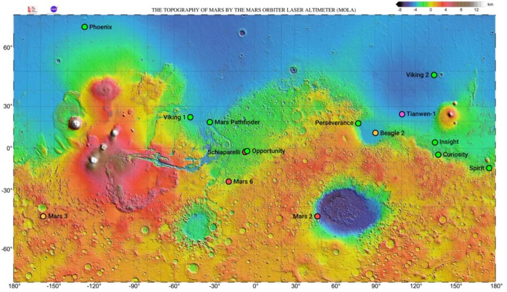

# D453 China lands a rover on Mars
> **rover**：探测器
 > 
> **feat**：壮举、伟业
 > 

1 CHINA WOKE up on May 15th to see a new slogan on its television screens and spreading through its social media: Ni Hao Huo Xing, “Hello Mars”. A few hours previously the Tianwen-1 mission, which has been circling Mars since February 10th, had changed its orbit and dropped a **landing capsule** into the planet’s atmosphere. Nine minutes later China became only the second country ever to land a rover successfully on the surface of the planet. It is an impressive achievement.

> **landing capsule**：着陆仓
>

2 The undertaking had not been widely trailed, presumably because the risk that the landing would fail was deemed quite high, and the idea that it might do so publicly unpalatable to the Chinese National Space Administration and the Communist Party. The **reticence** is understandable. To land, the spacecraft had to decelerate from an orbital speed of 17,000 kilometres an hour; it did so first through friction, blazing through the upper atmosphere like a meteor, then by means of a **parachute**, then with rocket engines. For this to work properly the initial angle of entry had to be just so, the parachute deployment perfect, and the mechanisms for letting go of the heatshield and, later, the parachute assembly properly timed.

> **undertaking**：(尤指艰巨的) 任务; 工作
>
> **unpalatable**：令人不愉快的; 使人难以接受的
>
> **Chinese National Space Administration**：中国国家航天局
>
> '**reticence**：沉默寡言
>
> **friction**：摩擦
>
> **heatshield**：隔热罩
>
> **Trail**: give advance publicity to (a film, broadcast, or proposal).
>
> **orbital speed**：轨道速度
>

3 To make things even harder, once it was near the surface and operating under rocket power, the lander had to hover briefly, so that its sensors could make sure the patch of terrain below it was suitable for landing, before gently lowering itself to the cold dry ground. And the spacecraft had to do all this with no human supervision. Mars is currently 320m km from Earth, meaning radio signals between the planets take 18 minutes to travel each way. By the time mission control knew for sure that the descent was underway, the red dust kicked up by the landing at 25ºN, 110ºE had long since settled.

> **underway**：正在进行中
>
> **mission control**：地面指挥中心
>

4 Perched on top of the landing platform is a 240kg rover called Zhurong, after a Chinese fire god. If all continues to go according to plan, it will soon trundle down a ramp and onto the surface of Utopia Planitia, one of the large, low-lying plains of the planet’s northern hemisphere. Perhaps the most interesting of its suite of instruments is a ground-penetrating radar that will be able to look for water ice at depths of up to 100 metres. The distribution of ice is of consuming interest to the scientists who study Mars, defining as it does the limits of the planet’s potential habitability both in its less-arid past and, perhaps, its human-settled future.

> **Perch**：栖息
>
> **Zhurong**：祝融
>
> **trundle**：缓慢行进
>
> **ramp**：斜坡
>
> **Utopia Planitia**：“**乌托邦平原**”是火星上最大的平原，那里是一片红土平原，偶有陨石坑分布。
>

5 Radar studies from orbit and other observations have shown there is extensive water ice below the surface of the northern parts of Utopia. When the robotic arm of America’s Viking-2 lander (now the Gerald Soffen Memorial Station) scraped trenches in the soil up at 48ºN in 1976 there may have been ice just ten centimetres beyond its grasp. Near-surface ice is much less likely under Zhurong’s more southerly stamping ground. But you don’t know until you look. That is why it is called exploration.

> **stamp**： 盖 (章); 印 (某标记); 打上 (某字)
>
> **stomping(stamping) ground**： 常去之地 a place or area that someone is very familiar with and where they like to spend time
>

6 This Chinese success shows off the country’s growing capabilities in space. Given that America’s National Aeronautics and Space Administration (NASA) was able to manage similar soft landings for its two Vikings in the 1970s, the level of the achievement might seem overstated. The Soviet Union, too, managed a soft landing as part of its Mars 3 mission in 1971, though as the spacecraft stopped communicating with Earth very shortly after touchdown it can hardly be counted a complete success. And Perseverance, the nuclear-powered one-tonne lander that America put down on the surface in February, is significantly more sophisticated than Zhurong.

> **touchdown**：着陆
>

7 But for a space agency to land a rover, or indeed anything, successfully on its very first mission to Mars is still impressive. It proved beyond the European Space Agency in 2003, and a subsequent attempt by ESA and Roscosmos, the Russian space agency, failed in 2016 (the two space agencies will try again in 2023). And China has hardly been concentrating on Mars alone. In January 2019 it became the first country to put a rover on the far side of the Moon; in December 2020 a separate mission made it the first country since the 1970s to return samples from the Moon. And last month it launched the first part of a new space station which its astronauts will soon start using.

> **European Space Agency**：欧洲航天局
>
> **Roscosmos**：俄罗斯航天局
>

8 How long Zhurong has to explore the surface is hard to say. It is similar in design to the two rovers America landed in 2004, Spirit and Opportunity: six-wheeled, solar-powered and with an official life expectancy of 90 sols (a sol is a Martian day, 40 minutes longer than an Earthly one). Spirit ended up lasting six years, Opportunity 14. If Chinese engineering is of a similar calibre, Zhurong will have a long life.

> **calibre**：质量、能力、才敢
>

9 It may even get to see the next landmark in Mars exploration: the return of samples to Earth, a goal NASA has spoken of, but not realised, for decades. Part of Perserverance’s mission is to assemble a cache of samples which a subsequent mission will be able to put into a rocket capable of lifting them into orbit, and thence back to Earth. China is reported to be planning a sample-return mission around 2028-30. At the moment China, though well behind NASA in the exploration of Mars, is catching up quickly. It is not inconceivable that, in ten years' time, it might overtake it.

> **overtake**：赶超
>
> https://www.youtube.com/watch?v=cibwHSTzRXw&ab_channel=Reach
>
> https://www.youtube.com/watch?v=hEfAxmkBagg&t=152s&ab_channel=AMSAT-DLAMSATDeutschland
>
> http://finance.people.com.cn/n1/2021/0515/c1004-32104054.html
>

