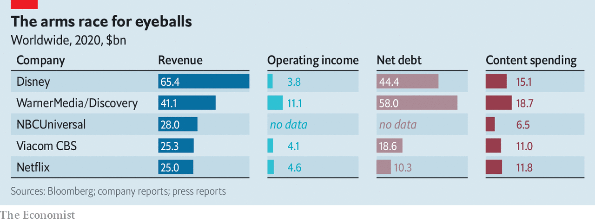

# D455 The Warner-Discovery deal and the future of streaming
1 ONE OF THE biggest hits of recent years on Discovery’s cable television network is “90 Day Fiancé”, a reality show that follows the fortunes of couples in America on K-1 visas. A condition of the visa is that the pair must marry within three months, or else leave the country. Many of the show’s romances are rocky. But the couples—and riveted viewers—know that, unless they **tie the knot** in time, deportation awaits.

> **fortune**：命运
>
> **K-1 visas**: 未婚夫（妻）类签证
>
> **rocky**：不稳定
>
> **rivet**：be rivet by迷住.
>
> **tie the knot**：结婚、喜结连理
>
> **deportation**：驱逐出境
>

2 On May 17th Discovery announced that it was to form a marriage of necessity of its own, joining forces with WarnerMedia, which is to be spun off from its owner, AT&T, a telecoms giant. Combined, the two firms will form the world’s second-largest media company by revenue, behind only Disney. Their hope is that this scale will allow them to survive an existential battle for viewers that makes “Godzilla vs. Kong” look like cautious cuddling. The announcement has already caused speculation about further mergers, as panicked media companies seek partners before it is too late. Some may already have missed their moment.

3 At first sight Warner and Discovery make an odd couple. The former specialises in high-quality TV series and films, such as “Game of Thrones” or the Godzilla-Kong saga, whereas Discovery serves up cheap factual fare. Yet their different programming, and the **sheer** quantity of it, ought to help them appeal to a wider audience. The $19bn that the two companies spent on content last year was more than both Disney and Netflix (see chart). The combined firm will have the biggest share of American cable viewers, its channels accounting for 29% of viewing time last year, according to MoffettNathanson, a research firm, which expects it to use its heft to negotiate better affiliate fees and ad rates. It expects to save $3bn a year in costs.

> **heft**：影响力、分量、重要性
>
> **affiliate fee**：联营费
>

4 For AT&T, the deal represents an admission that its expensive foray into entertainment has failed. It bought Time Warner in 2016 for $85bn, later changing its name to WarnerMedia. The previous year it had purchased DirecTV, a satellite-television firm, for $67bn, including debt. The idea was to vertically integrate the businesses of content creation and distribution. Yet in February it spun out DirecTV in a deal that valued the firm at just $16bn. By hiving off WarnerMedia it will receive the equivalent of $43bn upfront, in a combination of cash, securities and transferred debt. As well as this, AT&T shareholders will own 71% of the new company, with Discovery’s shareholders getting the rest.

> **foray**：涉足
>
> **hive off**: 脱离、分出
>
> **upfront**：预付金
>

5 The new company is to be run by Discovery’s boss, David Zaslav, leaving no place for Jason Kilar, who was hired a year ago to run WarnerMedia. Mr Kilar, whose background is in technology, had **gone all out** to push HBO Max, Warner’s streaming service. In January he announced that all of this year’s releases from the Warner Bros studio would be made available for streaming at the same time that they launched in cinemas. Hollywood traditionalists were **scandalised**; many now feel some satisfaction. “AT&T **backstabs** its own hatchet man”, ran one headline in Variety, an industry magazine.

> **Go all out**：全力以赴、不遗余力
>
> **scandalised**：震惊、愤慨
>
> **Hatchet man**：打手、机构内执行大量裁员任务的人，尤指在不必要的情况下无情裁员的人 [非正式]
>

6 The **shotgun wedding** may be awkward, but it is necessary. Competition in streaming, already brutal, is about to become more so. The lockdowns of 2020 provided a captive audience: total media-consumption time increased by 12% between the second and fourth quarters of last year, according to a nine-country survey by MIDiA Research, a firm of analysts. The average American household subscribed to four streaming services. As the world opens up people will spend less time in front of the box. Consumer spending on video media shrank by 2% year on year in the first quarter, according to GroupM, a giant in the business of placing adverts on behalf of clients. In recent weeks Netflix and Disney, the leading streamers, have both missed forecasts for subscriber growth.

> **shotgun wedding**：企业间仓促兼并 [商业]、仓促结婚（特别是奉子成婚）
>

7 To compete in this environment, says Michael Nathanson of MoffettNathanson, a streaming service needs four things: scale at home, high-quality content, a flexible balance-sheet to pay for it and, to help spread the costs, the ability to expand internationally. HBO Max ticked the first two boxes, with a compelling catalogue and a solid presence in America. But AT&T’s sickly balance-sheet has made it hard to keep up with the likes of Netflix in spending on shows. And having chosen to license its content to distributors in other countries, such as Sky in Britain, rather than set up shop there itself, its international footprint is puny.

> **puny**：弱小的
>

8 The Discovery deal helps to tackle both of these problems. Warner will no longer be beholden to AT&T’s balance-sheet, although the new firm will start life with hefty debts of its own. And Discovery+ is already up and running in Europe and India. This earns the combined company a place in the top tier of streamers, alongside Netflix, Disney and Amazon, says Mr Nathanson. Amazon is looking to shore up its position, and is reportedly in talks to buy Metro-Goldwyn-Mayer, the studio behind the James Bond films, for $9bn.

> **beholden**：有义务的、欠人情的
>
> **hefty**：沉重的、庞大的
>
> **Shore up**：to support or help (something)
>
> **Metro-Goldwyn-Mayer**：米高梅
>

9 Where does that leave the rest? Some are scrambling to form mergers of their own. On the same day that the Warner-Discovery deal was announced, two big French broadcasters, TF1 and M6, announced that they would join forces, arguing that together they could better compete with international streamers. Brian Wieser of GroupM expects more consolidation in Europe, highlighting BritBox, owned by Britain’s BBC and ITV, and TVNow, owned by RTL, a European group, as services that will require much bigger investments if they are to be competitive.

> **Consolidation**：兼并、融合、巩固
>

10 Of the larger American firms, NBCUniversal, which is owned by Comcast, a cable giant, and last year launched its Peacock streaming service, and ViacomCBS, which recently unveiled its own equivalent, Paramount+, are in a **sticky** position. Their competing television interests would make it difficult for them to merge. They could buy other media properties that have not already been snapped up, such as AMC Networks, which owns several entertainment channels, or Lionsgate, the studio behind films like “The Hunger Games” and TV shows like “Mad Men”. But none of these assets alone would help a company to leap to global scale. Those that have not already arranged their **nuptials** may face the corporate equivalent of unceremonious deportation.

> **sticky**：令人尴尬的、棘手的
>
> **Snap up**：争购
>
> **nuptial**：婚姻【老】
>
> **unceremonious：having** or showing a lack of courtesy; rough or abrupt.
>

