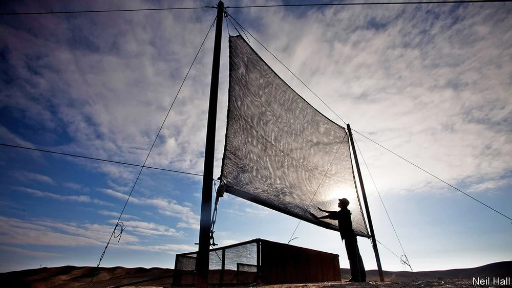

# D463 A better fog-trap

1 EVERY NIGHT, air cooled and moistened by the Humboldt current blows over Chile’s northern coast and across the Atacama desert. The billowing banks of fog thus created might look insubstantial, but there is water here to be captured—and in this, the driest place on Earth, capture it people do. Fog-harvesting will never be big business, for it needs particular conditions to operate well. But in zones like the Atacama, where moisture-laden breezes bring fog but no rain, the invention in the 1960s of traps which can pluck that moisture from the air has helped sustain settlements otherwise on the brink of drought.

2 Fog-traps are polymer-mesh screens mounted in metal frames (see picture). As misty zephyrs blow through them, droplets of water adhere to the mesh. These absorb others until the result breaks free and runs down the screen, as a raindrop runs down a window pane, into a collector. A typical trap, with a 40-square-metre collecting area, yields about 200 litres a day. That is enough to supply around 60 people with drinking water. Such a collector costs $1,000 or so, and will last a decade.

3 A simple idea, then. But even simple technology can be upgraded. And that is exactly what  Urszula Stachewicz of the AGH University of Science and Technology, in Krakow, Poland, proposes to do.

4 Her upgrade relies on giving the mesh a slight electrical charge. Overall, the molecules in it are electrically neutral. But polymer molecules are large, and their electrons can move about within them. Uneven distribution of these electrons means some parts of a molecule are positive and some negative. That fact might be exploited to give the outside of each thread in a mesh one electrical polarity (either positive or negative) while burying the other polarity in the thread’s interior. Just as static electricity will attract a balloon to a wall, a surface charge created in this way will attract water droplets from the air.

5 Previous attempts to do this have coated the threads with metal. But that is expensive. As they describe in ACS Nano, Dr Stachewicz and her student Daniel Ura have done it by changing the way the threads are spun, which is cheap.

6 At the moment, those threads are created by a process called melt-spinning. This involves melting the polymer and pushing the resulting liquid through a hollow needle, out of a hole in the needle’s tip and onto a spinning drum, where it cools and solidifies. Dr Stachewicz and Mr Ura propose instead to use a technique called electrospinning. This also involves a hollow needle. But instead of being melted, the polymer is dissolved in a solvent, and instead of being propelled from the needle’s tip by pressure from behind, it is attracted to the drum by the creation of an electrical potential difference between the drum and the needle. As the stream of dissolved polymer travels through the air, the solvent evaporates, leaving behind a solid thread.

> 熔体纺丝是一种金属成形技术，通常用于形成具有特定原子结构的金属或合金薄带。熔纺金属的一些重要商业应用包括高效变压器，传感设备，电信设备和电力电子设备。典型的熔融纺丝工艺包括通过将熔融金属喷射到旋转的轮或鼓上来浇铸熔融金属，所述旋转的轮或鼓通常由水或液氮在内部冷却。熔融材料在与滚筒的大而冷的表面积接触时迅速固化。
>
> 静电纺丝, 简称电纺，使用电荷从液体中抽极细纤维的工程过程。静电纺丝不需要化学混凝或者高温来从液体里生产固体纤维，这使得这个过程特别宜于用来生产大分子或者复合分子的纤维。静电纺丝也可以被用来从熔化液里抽取纤维，这样获得的最终产品中没有溶剂的痕迹。
>

7 One consequence of electrospinning is that the voltage attracting the thread from needle to drum also attracts or repels, according to their polarity, the charges on the molecules within. This reorients those molecules, aligning them (and thus their charges) in a way that does not happen in a melt-spun thread. That can create the sort of polarity difference between the interior and the exterior of a thread the two researchers were looking for.

8 Dr Stachewicz and Mr Ura experimented with different potential differences between needle and drum and eventually found one that resulted in meshes able to collect 50% more water than commercial versions, at no extra cost of production. At the moment these are just prototypes, but they expect soon to have a practical version which can be made available for sale. And that will certainly improve the lives of people who rely for their survival on drawing water not from a well, but from thin air.

> https://pubs.acs.org/doi/pdf/10.1021/acsnano.1c01437
>

