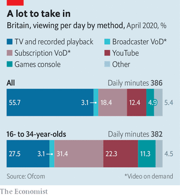

# D466 The BBC has bigger problems than a misbehaving interviewer
> **caught between**: 夹在中间
 > 

1 Relations between the British Broadcasting Corporation and the government have always been delicate. Stanley Baldwin bridled at the bbc’s coverage of the General Strike of 1926. Margaret Thatcher was infuriated by its reporting from the Falklands. Hugh Carleton Greene, the corporation’s boss in the 1960s, confessed that, when dealing with Harold Wilson’s government, “I found my experience as head of psychological warfare in Malaya in 1947 extremely useful.”

> **bridle at**：瞧不起
>

2 The latest spat pits the bbc against not just Downing Street but the royal family, as well as many viewers. An independent inquiry released on May 20th found that one of its most famous scoops, an interview in 1995 in which Princess Diana claimed that “there were three of us in this marriage”, was secured partly by deception. Martin Bashir, the interviewer, forged documents to persuade the princess that she was being spied on. A bbc probe at the time led by Tony Hall, who later became director-general, covered it up.

> **scoop**：独家新闻
>
> **probe**：调查
>
> **Pit against**: to cause (someone or something) to fight or compete against (another person or thing)
>

3 The bbc promises a review of its editorial practices and another report into its dealings with Mr Bashir, who left the corporation earlier this month citing ill-health. Two former executives, including Lord Hall, have quit their new jobs. Prince William declared the revelations proof that the interview “established a false narrative” about his mother. The government is drawing broader lessons. Oliver Dowden, the culture secretary, wrote in the Rupert Murdoch-owned Times newspaper that the bbc needed “a new emphasis on accuracy, impartiality and diversity of opinion”. To avoid “groupthink”, he said, “cultural change must be a focus”.

> **draw lessons**：吸取教训
>

4 Conservative politicians have long suspected the bbc of closet liberal leanings. Boris Johnson’s government uses the “Brexit-Bashing Corporation” as a punchbag, as part of a strategy of drawing cultural dividing lines rather than economic ones. But the real danger posed by political skirmishes such as that over Mr Bashir is one of distraction. The more the bbc focuses on government assaults, the less it is able to cope with bigger threats emanating mostly from America.

> **closet**：秘密的
>
> **punchbag**：发泄怒气的对象
>
> **skirmish**：小规模战斗; 小冲突
>
> **emanate**：散发出
>

5 More than six out of ten British homes now subscribe to an American video-streaming service. The result is more competition for eyeballs. In the past decade Britons have gone from watching four hours a day of broadcast television to just under three. Among under-35s, broadcast tv accounts for less than a third of video viewing (see chart).

6 The bbc is good at new media. Its website is Britain’s fourth-most visited after Google, YouTube and Facebook. The iPlayer streaming service, which the bbc launched in 2007 (the same year Netflix began streaming) is used by more people in Britain than any subscription platform. It is not enough. In 2019 under-35s spent less than an hour a day consuming bbc output, across television, radio and the internet, down by 17 minutes in just two years.

7 The compulsory licence fee through which it is funded is not cheap: at £159 ($225) a year, it would be enough for a basic subscription to both Netflix and Disney+, with money left over for popcorn. But the bbc is limited to about 25m fee-paying households and cannot borrow. Streaming companies have the world to fish in—Netflix has over 200m subscribers, Disney+ 100m—and are willing to lose money for years in the pursuit of market share. Whereas the bbc commissioned £2.8bn of content in 2020, Netflix and Disney+ have a combined budget this year of more than $20bn. Amazon recently earmarked nearly half a billion dollars for a single “Lord of the Rings” series.

> **earmark**：留出（钱等）（用作目的）
>

8 Commercial media outfits are rushing to bulk up. WarnerMedia, creator of “Game of Thrones”, “Harry Potter” and other hits, has announced plans to merge with Discovery. France’s largest and third-largest channels, tf1 and m6, will also try to merge, to provide une réponse française to the Americans. The bbc has teamed up with itv, Britain’s biggest commercial broadcaster, to run BritBox, an international streaming service. With 2.6m subscribers it is a minnow.

> **outfit**：机构
>
> **minnow**：影响力低的存在
>
> **The last stronghold**
>

9 No big streamer does news, an area where the bbc remains strong. Last year 70% of Britons with internet access said they had absorbed its reports in one medium or another during the past week, according to the Reuters Institute at Oxford University; among 18- to 24-year-olds the figure was 51%. This represents a drop since 2015, when 79% of all adults and 68% of young people tuned in. But the bbc remains “undoubtedly, and by a massive margin” the main source of news in Britain, says Rasmus Nielsen of the Reuters Institute.

> **stronghold**: 大本营
>

10 The corporation is at least stronger than other national broadcasters, which have seen similar declines in reach. Fully 86% of Britons say they are satisfied with their public-service media, versus between 50% and 61% of French, German, Spanish and Italian viewers. For all his complaining about the bbc, “Boris is intelligent enough to see that shutting it down would backfire,” says one senior Tory. The elderly, who make up the core of the Conservative vote, remain bbc addicts. And Mr Johnson’s healthy poll ratings mean he owes no favours to Mr Murdoch, who has long lobbied for the corporation to be trimmed.

11 Still, as the variety of entertainment from streamers grows, a compulsory levy to fund comedy, drama and the like looks odd. In the age of linear viewing, public-service broadcasters had to combine news with lighter fare to get people to tune in. The on-demand era has decoupled the two, making it harder to argue that everyone should pay for “Strictly Come Dancing”. Expect a smaller, newsier bbc in future—and direct the blame, or credit, not to Westminster but to Hollywood.

> **fare**：费用
>
> **public-service broadcaster**：公共广播公司
>

