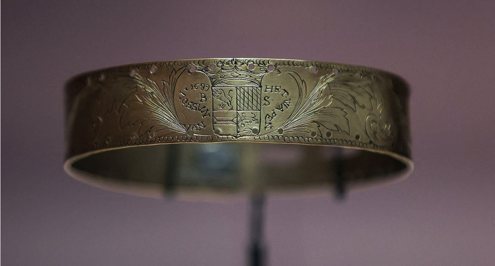
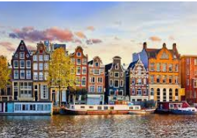

# D477 A new exhibition illuminates the history of Dutch slavery
> **Once among the world’s leading slavers, the Dutch have long sought to play down this part of their colonial past**
 > 

1 In 1881 someone donated an antique brass circlet to the Rijksmuseum, the Dutch national museum of art and history. The object (pictured) is a bit of a stumper. Engraved with a heraldic shield and the year 1689, it bears no indication of what purpose it served. The museum staff listed it as a dog collar.

> **brass circlet**：铜镯子
>
> **Rijksmuseum**：阿姆斯特丹国立博物馆
>
> **stump**：a puzzling question
>
> **heraldic**：纹章学的; 纹章的
>

2 They could have investigated more thoroughly. Scattered through the Rijksmuseum’s collection are paintings showing similar collars worn not by dogs, but by young black men. Referred to as “Moors”, they were routinely kept as servants in wealthy 17th-century Dutch households, a sideline of the vast European human-trafficking operation that carried millions of enslaved Africans to the Americas.

> **Moors**：摩尔人
>
> **sideline**：边线
>

3 Slavery was not a distant memory in 1881. On some Dutch colonial plantations it had ended just a decade earlier. Yet a curator at the Rijksmuseum apparently failed to make the connection. Had Dutch society really forgotten such objects? Or was it trying not to see them?

> **colonial plantation**：殖民地种植园
>
> **curator**：馆长
>

4 The collar is on display in the museum’s new exhibition on the history of enslavement in the Netherlands and its former colonies. (King Willem-Alexander opened the exhibition in May, but the museum remains closed until June 5th due to covid-19 restrictions.) It is part of a broad movement to re-examine the country’s colonial past. The Netherlands ruled Indonesia, Suriname, Curaçao and several other Caribbean islands from the 1600s until the mid-20th century, first through its East India and West India Companies (the voc and gwc) and later directly. Slaves laboured on coffee, spice and sugar plantations through to the 1860s. During their Golden Age of painters and tulips, the Dutch were among the world’s leading slavers, conquering forts in west Africa to seize the trade from the Portuguese.

> **collar**：项圈
>
> **Suriname[ˌsʊərɪˈnɑːm; ˌsʊərɪˈnæm]**：苏里南共和国
>
> **Curaçao** [,kjuərə'səu]：库拉索岛（荷属安的列斯岛屿）
>
> **fort**：堡垒
>

5 In modern times the Dutch have played down this history. But that has become harder as the Netherlands has grown more multicultural. The biggest Dutch immigrant communities come from Morocco and Turkey, but those from Suriname, the Caribbean and Indonesia make up about 5% of the population. Arguments over “Zwarte Piet” (a blackface tradition associated with the St Nicholas Day holiday) and Black Lives Matter have **riven** Dutch politics. For the Rijksmuseum, bringing the other side of the colonial past into view is a condition for staying relevant.

> **Zwarte Piet**：黑彼得，是圣诞老人（荷兰语：Sinterklaas）的随从。黑彼得被认为是一个摩尔人，来自西班牙，传统上以黑人的形象出现，而他的扮演者也一般会戴上黑色面具并穿上文艺复兴时期的服装。
>
> **St Nicholas**：圣尼古拉斯，地名
>
> **rive**：劈开
>

6 One challenge in staging an exhibition on slavery is a lack of physical material. “Enslaved people were not allowed to own objects, they were not allowed to write, they were hardly ever depicted,” says Valika Smeulders, the Rijksmuseum’s chief historian, who hails from Curaçao. The museum redresses this by uncovering traces in its collection that had gone unnoticed. In Bartholomeus van der Helst’s painting of an Amsterdam shooting company from 1639, an unidentified black youth stands at the centre. Rembrandt’s opulent portraits of Marten Soolmans and Oopjen Coppit are well known; less so is that their wealth came in part from the slave-driven sugar trade.

> **hails from**：来自于
>
> **redress**：补救
>

7 A second technique is to examine everyday objects from the slave economy, such as plantation bells. For slaves they could be a relief or an omen, signalling the end of the day and the weighing of the harvest, which might **presage** a beating if the quota was not met. The logo of the gwc, a nostalgic sight on old canal houses in Dutch cities, takes on a different aura once you have seen it on a branding iron used on humans. Other objects testify to the perseverance of enslaved people: a botanist’s samples from Suriname in 1687 include sesame and okra, African crops that must have been planted by captives. Oral history adds another layer. Songs from Suriname, Curaçao and South Africa (originally a Dutch colony) sound like lullabies, until you hear the translations. Shon ta bende nos, mama, katibu ta galina: “The landlord sells us, mama, slaves are chickens.”

> **omen**：预兆
>
> **presage**：预兆
>
> **beating**：毒打
>
> **canal house**：
>
> **branding iron**：火印
>
> **okra**：秋葵
>
> **captives**：俘虏
>

8 The exhibition is structured around the stories of ten individuals, five connected to the functioning of the slave system and five embodying resistance against it. The direct testimony of Wally, a slave in Suriname, exists because he was interrogated in court. He and four others were **gruesomely** executed in 1707 after they ran off into the jungle in protest at tough new work rules. Works by Dirk Valkenburg, a painter dispatched by the absentee owner in Amsterdam to record his plantation, provide visual context. Valkenburg’s depiction of what looks like a holiday celebration is magnificent: the revellers leap from the canvas, individual and compelling. It is all the more shocking to read that this seemingly empathetic painter had condemned Wally, calling him a “troublemaker”.

9 Some of the history in the exhibition is path-breaking. The Dutch tend to identify slavery with the Americas, but another huge branch of the trade shipped captives from the Ganges delta to Indonesia, whence they might be sold on to South Africa or occasionally the Netherlands itself. The attention to enslaved Africans and Asians in Holland is new, too. Slavery was illegal in the Dutch homeland, but slaves brought there remained in **servitude**, perhaps because they had few options.

10 Some found their way into Dutch society nonetheless. One was Paulus Maurus, a servant of the wealthy Nassau La Lecq clan, an offshoot of the Dutch royal family. Church records show that he became a cavalry drummer in the regiment of the Netherlands’ top commander, and that he married a Dutch woman in 1684 and had a child. A painting of Dutch cavalry decades later shows just such a mounted black drummer, wearing what seems to be a metal collar. Indeed, the engraved shield on the brass collar from 1689 seems to belong to the house of Nassau La Lecq. The case is circumstantial, but it may have been Maurus who wore it.

> **offshoot**：分支
>
> **cavalry**：骑兵
>
> **mounted**：骑马的
>

11 What drove this system was money. The exhibition could do with a bit more economics, but it makes clear that the financial incentives were immense. In 1621 Jan Pieterszoon Coen, an officer of the voc, massacred 14,000 of the 15,000 inhabitants of the Moluccan island of Great Banda, at the time the world’s chief source of nutmeg, and replaced them with imported slaves. He did so to secure a monopoly on a spice that sold for hundreds of times as much in Europe as in South-East Asia.

> **Moluccan**：摩鹿加群岛（为印度尼西亚境内众多群岛之一）
>
> **nutmeg**: 肉豆蔻; 通常用于给甜食调味
>

12 All this is grim, but it is also riveting. That makes the relative unfamiliarity of the history of slavery, a central aspect of European colonialism, even harder to explain. Many Europeans feel that slavery gets too much attention, that it took place long ago and has nothing to do with them. The resentment **gives away the game**. In the colonial age, the voices of slaves were silenced because hearing them might upend the socioeconomic system. Later, th ey were silenced because hearing them makes the heirs of that system feel guilty. Yet as psychotherapists know, the truth is more interesting than the silences and fables under which it is concealed.

> **riveting**：引人入胜的
>
> **give the game away**: inadvertently reveal something secret.
>

