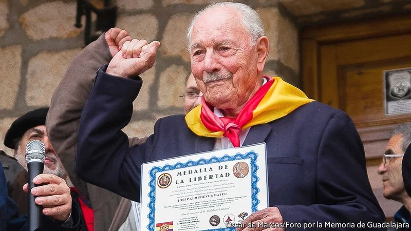

# D478 Josep Almudéver died on May 23rd
> **International Brigades**：是由共产国际组建，在西班牙内战中援助西班牙第二共和国（尤其是其中的人民阵线）的军事单位。该军事单位前后存在约两年
 > 

1 Old soldiers often lose their enthusiasm for fighting. They speak instead of peace and, in fading voices, warn the young against the folly of war. Not so Josep Almudéver. At the drop of a hat he would unfurl the Spanish Republican flag he always carried with him, yellow, red and purple, the colours of dawn, and drape it proudly round his shoulders. He would rather forget to eat, than forget that flag. Then he would raise his **clenched** fist, shout “Viva el socialismo!” in a voice still carrying and clear, and break into a Republican song. No stopping him.

> **folly**：愚蠢的事
>
> **unfurl**：展开
>

2 He was still at heart the boy of 17 who tried all the recruitment offices round his village, Alcàsser in the province of Valencia, to enlist in the fight to save the Second Republic from Francisco Franco’s fascists. The moment Franco’s coup against the elected government ignited the civil war, in July 1936, he had to join up. He was too young, but “You won’t stop him marching,” his father told the secretary at the Socialist Party office, who then obligingly accepted his age as 19. He was still 17, on the bleak, freezing front line at Teruel in Aragon where the Republican forces were trying to dislodge Franco’s troops, when shrapnel ploughed into his chest and shoulder. But it didn’t hurt for long and, after some weeks, he was looking for a front line again.

> **coup**：政变
>
> **bleak**：荒凉的
>
> **Aragon**：（位于西班牙与法国交界处）
>
> **dislodge**：驱逐
>
> **shrapnel [ˈʃræpnəl]**：(炸弹或炮弹的) 碎片
>
> **Plough into**：撞
>

3 After the defeat at Teruel, where the airpower of Nazi Germany came to Franco’s aid, many Republicans lost stomach for the fight. He was all the keener. His youth was still a problem, though—unless he enlisted as a foreigner. Luckily he was both French and Spanish, born in Marseille when his valenciano father was looking for work there. So in May 1938, flaunting his French side, he joined the International Brigades. He was now part of a force of some 40,000 fighters who had flocked to Spain to save the world from fascism, by saving the Republic first. They came from all over Europe, Asia and America, and in every left-wing colour: socialists, communists, anarchists and Trotskyists, with a fringe of writers, drifters and romantics. It was like being on a medieval crusade, but with rifles and artillery (when it turned up) and a role as shock troops, helping as needed. The Brigades were his ideal of what the Left could be, like the Popular Front forged from Spain’s warring parties in 1936: all factions uniting to bring down capitalism and raise up the working class.

> **valenciano**：瓦伦西亚
>
> **flaunt**：炫耀
>
> **anarchists**：无政府主义这
>
> **Trotskyists[ˈtrɑːtskiɪst]**：托派分子，支持列夫·托洛茨基的革命左派思想的人
>
> **a fringe of**：一小部分的
>
> **artillery**：大炮
>
> **shock troop**：突击部队
>
> **forge**：锻造
>

4 His brigade, 129, was the latest to be formed and, as it turned out, the last. The fighters were fresh, even scoring small victories in the general Republican retreat. Huge previous losses meant that most brigadistas by then were Spaniards, but his own division had a Dutchman, a German, a Swiss, an American (their chief mechanic), even a Chinaman. His regular comrade, David, was Canadian. They could barely talk to each other, but got on fine. There were no conflicts. Others reported plenty of strife in the Brigades, as well as the overpowering camp smell of rotting oats and urine, the same old bean stew eaten out of dirty tins, and the tedium of weeks spent waiting for orders from their Republican commanders. He did not even mind the waiting much.

> **brigade**：旅
>
> **strife**：冲突
>
> **tedium**：枯燥无聊
>

5 Besides, as he kept stressing, the Republic did not lose the war. It was betrayed by the non-intervention pact signed by the major Western powers in 1936, pledging to keep out of the struggle. When he had marched away from Alcàsser on that shining September morning, the people cheering mightily, he carried an antiquated rifle and no bullets, because the French now refused to send the munitions which Spain had ordered and paid for. Fascist Italy and Germany, however, ignored the pact and piled in on Franco’s side, as at Teruel. Pobre República, poor Republic, he sighed. Against criminals like those, it hadn’t stood a chance. As for the idea that Spain’s was a “civil war”, how stupid that was. It was a world war fought on one small, bloody stage.

> **antiquated**：陈旧的; 过时的 [表不满]
>
> **munition**：军火
>
> **pile in**：塞进、挤入
>
> **non-intervention pact**：https://en.wikipedia.org/wiki/Non-intervention_in_the_Spanish_Civil_War
>

6 Everything might have been different. When the Republic was first declared in 1931, he saw freedom explode in the streets. The new government brought in secular schools and votes for women, but Catholic op'ponents gave the poor food and bedsheets, and votes slipped away. He began to read newspapers to the local peasants, two-thirds of them illiterate, explaining that socialism would build a better world. He still believed it would when, in October 1938, the Republican government doomed itself by telling all its foreign fighters to go home. It was hoping for the same gesture from Franco, with his thousands of Germans and Italians and Mo'roccans, but those did not leave. Pobre República.

> **secular**：非宗教的
>

7 He did not go to France, as he could have done. Instead he lingered unhappily in Valencia, and was arrested. He was sent for several months to the Albatera concentration camp, where he was made to watch the executions of Republican fighters as young as himself. Their screams still haunted him and filled his eyes with tears. After more months in an ordinary prison he was released, but went on fighting as a maqui in the north-east until, in 1947, he fled into definitive exile at Pamiers, near Toulouse. He had a young family now, and could not keep taking risks. He settled to his father’s trade of building and bricklaying.

> **Valencia[və'lenʃɪə]** ：巴伦西亚（西班牙城市）
>
> **definitive**：明确的
>
> **maqui**：The **Spanish Maquis** were **Spanish** guerrillas exiled in France after the **Spanish** Civil War who continued to fight against Francoist **Spain** until the early 1960s
>

8 Nothing, however, dulled his passionate interest in the progress or non-progress of the Left. Its divisions continued to frustrate him, both in France and in Spain, to which he was not allowed to return until 1965. Why was it so hard for the Socialists and Podemos to unite for the good of the workers? Because they were still in thrall to capitalists, as the Second Republic, too, had turned out to be. The rich always ended up winning, he would say, scornfully rubbing his fingertips together. Money ruled. The king, “Colonel” Juan Carlos as he called him, had sent him a million pesetas for enduring prison, but he wouldn’t touch it. He didn’t want it.
**Podemos：Spanish** political party

> **in thrall to**：被……束缚
>
> **scornfully**：轻蔑地
>

9 Instead, in his flat in Pamiers, his riches lay around him: posters, scarves, medals and plaques glowing with yellow, red and purple. Che Guevara’s face was on the wall, and beside it his own young face, with the same rapt expression of waiting for the great socialist dawn. If Spain still needed him, he would take up arms. And on foot, ancient but agile, he would cross the Pyrenees.

> **rapt**： 专心致志的; 全神贯注的; 着迷的 [文学性] [usu ADJ n]
>
> **agile**：敏捷的
>
> **Pyrenees**：庇里牛斯山（欧洲西南部最大山脉）
>
> **peseta**：比索
>

