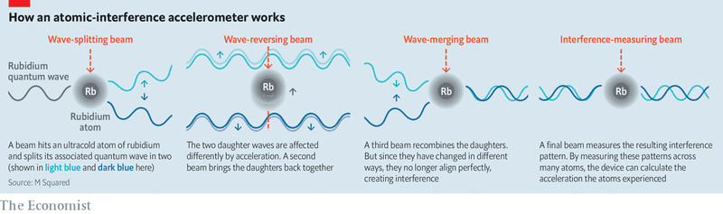

# D481 Quantum weirdness helps design better accelerometers
> **accele'rometer**：加速度计
 > 
> 参考文献：http://www.opticsjournal.net/richHtml/lop/2018/55/9/090003.html
 > 

1 “Build a better accelerometer and the world will make a beaten path to your door.” Not, perhaps, as snappy as Ralph Waldo Emerson’s original aphorism about a mousetrap. But it is the hope of Graeme Malcolm, a physicist at the University of Strathclyde, in Glasgow. Dr Malcolm’s speciality is high-purity lasers. These can be used to make instruments of great precision. And those, in turn, can be employed to build devices which can detect the tiniest of forces—as tiny, for example, as the gravitational pull of a passing lorry.

> **beaten path**：常规、惯例、A "**beaten path**" refers to a route that is frequently traveled.
>
> **snappy**： (说话)诙谐活泼的; 爽朗明快的 [usu ADJ n]；穿着入时的; 时髦的 [ADJ n]
>
> **aphorism**： 格言; 警句 [正式]
>
> **lorry**：卡车 [英国英语]
>
> Ralph Waldo Emerson：艾默生，一句谚语：**Build** a **better** mousetrap, and the **world will beat** a **path** to **your door**
>

2 Laser light is famously pure. The way lasers work means that the beams which emerge from them are monochromatic. But there is purity, and then there is purity. In a truly monochromatic beam, all light would be of exactly the same frequency. In practice, this never happens. Wobbles caused by small temperature changes and vibrations, and by imperfections in the mirrored cavity in which the beam is generated and amplified, mean no laser beam is perfectly pure. The light from a cheap laser pointer might have a frequency range—known as its line width—of 500 megahertz (mHz), while the line width of a specialised scientific laser would be nearer 1mHz. Dr Malcolm’s latest offering, by contrast, has a line width of a mere 20Hz.

> **monochromatic**：单频的
>
> **mirrored cavity**：反射腔？
>
> **laser pointer**：
>
> **line width**：线宽
>
> **megahertz**：赫兆
>
> **purity**：纯度（例：激光光谱纯度）
>

3 This device, dubbed SolsTiS, has a cavity containing titanium-doped sapphire. This is a common material for lasers, but SolsTiS’s cavity is shaped, by precise engineering and the locking of the components into place after calibration, in a way that both encourages single-frequency emission and ensures that waste heat is dissipated rapidly.

> **dub**：把…称为 [journalism]
>
> **titanium-doped**：掺钛
>
> **sapphire[ˈsæfaɪər]**：蓝宝石
>
> **calibration**：校准
>
> **dissipate**：驱散; 消散 [正式]
>

4 The purity of the resulting beam permits it to do something that seems extraordinary to those (ie, most human beings) who are used to dealing with the world of classical, rather than quantum, mechanics. This is, in effect, to divide atoms temporarily in two using a trick which takes advantage of the fact that all particles, however apparently substantial, are actually also waves.

> **classical**：此处指经典力学
>
> **quantum, mechanics**：此处合指量子力学
>
> **particle**：粒子
>

5 To pull off this trick the output from the SolsTiS is divided into multiple beams. The atoms in question are a diffuse gas of  rubidium in a cell refrigerated to within ten millionths of a degree of absolute zero. This extreme coldness is achieved by using six of these beams to slow the atoms down, in a process called Doppler cooling.

> **output**：输出
>
> **diffuse**：弥漫的
>
> **rubidium[ruːˈbɪdiəm]**： 铷
>
> **Doppler cooling**：多普勒制冷
>
> **6 Location, location, location**
>
> In conditions of such quietude atoms hit by a pulse of light of the correct frequency (to which the SolsTiS laser is tuned), will split into two quantum waves which move apart (see diagram). A second pulse reverses this, bringing the two waves back together, and a third allows them to interfere with each other, creating a characteristic interference pattern that depends on any acceleration the waves underwent when they were separated. A further laser pulse can detect the different interference patterns in the different atoms in the cell, and that information will reveal the amount of acceleration the atoms underwent. To exploit this phenomenon, Dr Malcolm has started a company called M Squared. The plan is to use this atomic interference to create an accelerometer with at least 100 times the precision of existing versions.
>
> **quietude**：寂静 [正式]
>
> **reverse**：使 (决定、政策、趋势) 转向; 逆转
>
> **exploit**：利用
>

7 Miniature accelerometers are already common (most mobile phones, for example, contain one), but these are mechanical rather than laser-based devices. Their job is inertial navigation, which divides acceleration by time to work out speed and direction travelled, and hence location. Drive into a tunnel, and inertial navigation tracks your position after you lose the gps satellite signal.

> **inertial navigation**：惯性导航
>

8 Such devices drift rapidly, however. The slightest error is quickly amplified into a big miscalculation of position. Your phone will not stay on track for more than a few minutes, and even the best military-grade inertial-navigation systems, which employ lasers, but not atomic interference, drift by kilometres a day. Atomic-interference accelerometers would, by contrast, drift only 2km a month.

> **miscalculation**：误判
>
> **military-grade inertial-navigation system**：军用级惯性导航系统
>

9 To start with, this reliability will be expensive and require fairly large pieces of kit. It will therefore be of interest mainly for military use, and for one or two other specialist applications, such as mining, where satellite-based navigation is impossible. But the equipment needed should ultimately shrink to chip-size, with a corresponding fall in cost. That would permit its inclusion in vehicles, phones and other mobile electronics, which could be useful in a world of driverless cars, deliveries by drone and autonomous air taxis.

10 Atomic-interference accelerometers would have other uses, too. Point one vertically and it would become a gravimeter—a device to measure gravity, the strength of which varies subtly from place to place depending on the local geology. Prospectors for oil and minerals have employed gravimeters since the 1930s. Atomic-interference gravimeters promise to be a thousand times more sensitive than current devices. Dr Malcolm says the firm is testing a prototype that, when placed on a barge going over an aqueduct, can detect lorries passing beneath by their gravitational attraction. Such sensitive instruments will provide a finer-grained understanding of an area’s geology before expensive drilling begins.

> **gravimeter**：重力仪、重力计
>
> **Prospector**： 探矿者
>
> **barge**：平底载货船
>
> **aqueduct**： 高架渠; 渡槽; 桥管
>
> **finer-grained** ：involving great attention to detail.
>

11 The first lasers were laboratory curiosities with little practical use, but that has changed enormously over the years. Now, lasers are the basis of multiple better **mousetrap**s, from broadband fibre networks to barcode scanners. Using them to manipulate the quantum properties of atoms in this way promises more such mousetraps in the future.

> broadband fibre network：宽带光纤网络
>
> barcode scanner：条形码扫描器
>
> manipulate：操纵
>

