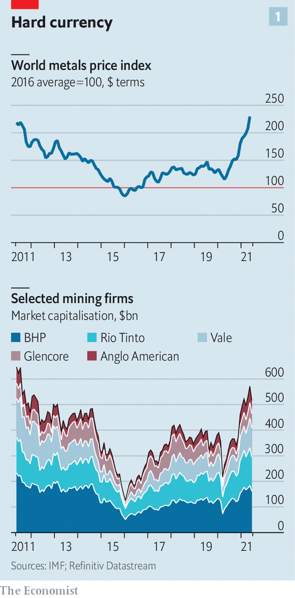
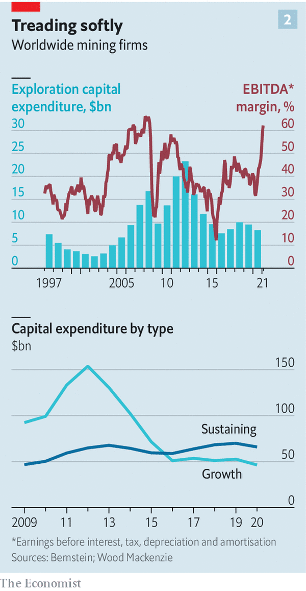

# D498 Big miners’ capital discipline is good news for investors
1 High in the mountains of southern Peru lies Quellaveco, a vast open-pit copper mine. It is one of the world’s largest untapped deposits of the red metal. Anglo American, a mining giant and its majority owner, has, along with another investor, spent over $5bn getting it up and running. It is expected to come online in 2022. Once operational it will add more than 10% to the copper output of Peru, the world’s second-biggest producer of the stuff.

> **open-pit**：露天矿 [美国英语]
>
> **untapped**： (供给、资源)未利用的 [usu ADJ n]
>

2 In the past when commodity prices were surging, as they have been of late (see chart 1), the world’s miners would be piling into projects like Quellaveco. This time the notable thing about it is its uniqueness. Few of the diversified mining behemoths—Anglo American, bhp, Glencore, Rio Tinto and Vale—have big new mines in the works. That is partly because of the industry’s long lead times; Anglo bought Quellaveco in 1992. But other forces, too, lie beneath the subdued investment. They will have consequences for the mineral-intensive energy transition towards a climate-friendlier world.

> **behemoth/bɪˈhiːmɒθ/**：庞然大物; 难以驾驭的事物 [journalism] [文学性]
>
> **piling into**：挤进
>
> **in the works**：正在进行中 ; 准备中
>
> **Anglo American**：英美资源集团
>
> **BHP**：必和必拓
>
> **Glencore**：嘉能可
>
> **Rio Tinto**: 力拓矿业集团
>
> **Subdued**: lacking in vitality, intensity, or strength.
>
> **Vale**：淡水河谷
>

3 The big five miners consolidated their market power with a spate of huge mergers in the 2000s, just in time for China’s emergence as a voracious consumer of metals. The result was a 15-year supercycle of high prices. Miners splurged around $1trn chasing higher volumes and mega-projects. Many proved disastrous—perhaps a fifth of that investment was returned to shareholders, according to one estimate. After a round of firings, a new generation of mining bosses promised to do better. In the past few years value, not volume, became the industry’s watchword. “We will never lose our capital discipline,” vows Eduardo Bartolomeo, boss of Vale.

> **consolidate**：合并
>
> **a spate of**：一连串的（多指不愉快的事件）
>
> **voracious**：贪婪的; 如饥似渴的 [文学性]
>
> **watchword**：口号; 格言
>
> **capital discipline**：Where a company exercises **discipline** and prudence in how much money it borrows, raises and spends, in order to deliver the best returns to its shareholders and ensure its long-term stability.
>

4 So far the miners have kept their promise. Although capital spending in the industry has grown since 2015, it is still 50% below its peak in 2012. Most of that has gone on sustaining current output, not adding new capacity. Even as rising metals prices have padded profit margins, spending on exploration has stayed low, notes Danielle Chigumira of Bernstein, a broker (see chart 2). That is a break from the past.

> **pad**：(用软物) 填充; 垫衬、虚报 (花费)
>

5 Whether the sobriety lasts will depend on a fresh crop of ceos. In the past 18 months three of the big five got new bosses. In January 2020 Mike Henry took the reins at bhp. A year later Jakob Stausholm became boss of Rio Tinto, after his predecessor was fired in the wake of the destruction of a 46,000-year-old Aboriginal site in Australia. On July 1st Gary Nagle will take the top job at Glencore, ending Ivan Glasenberg’s 19-year reign at the Swiss-based trader-turned-miner. Mark Cutifani, Anglo American’s boss, may retire next year.

> **sobriety**：清醒 [正式]
>
> **a crop of**：一批
>
> **in the wake of**：作为…的结果
>

6 Their biggest challenge is responding to the energy transition. The companies have taken some defensive steps, getting out of the most carbon-intensive operations. Rio Tinto left the thermal-coal business in 2018. On June 6th Anglo spun off its coal operation. bhp and Vale have promised to do the same. Mines across the world are emitting less carbon dioxide, as operators invest in renewable power and try to electrify mining vehicles.

> **spin off**：使脱离 (原组织) 而独立 [商业]
>
> **thermal-coal**：热能煤
>

7 On paper, the energy transition could be a mining bonanza. If the world is to meet the Paris climate agreement’s target of limiting global warming to 1.5°C above pre-industrial levels, the demand for metals such as cobalt, copper, lithium and nickel will explode. The International Energy Agency, a forecaster, calculates that an electric car needs six times the mineral content of one with an internal combustion engine. The average onshore wind farm is nine times more resource-intensive than a gas-fired power plant.

> **cobalt**：钴
>
> **internal combustion engine**：内燃机
>

8 Shifting towards green metals is, however, proving harder than moving away from dirty minerals. The big-five miners’ portfolios are weighed down with commodities from the past supercycle. Iron ore and fossil fuels still account for over half their mining revenues and three-quarters of their gross operating profits. High metal prices make potential targets look dear.

> **ore**：矿石
>

9 The other option, developing their own projects, also presents problems. One is investors. Since torching shareholder value the last time around, miners have been on a tight leash. Bosses “know the way to be sacked is to have one of these mega-projects”, says one big investor. Much of the cash flowing in thanks to surging commodity prices is going back to shareholders in record dividends and buy-backs. One mining executive fears that the fat returns have changed the make-up of his shareholders, attracting yield-hungry investors averse to growth projects.

> **tight leash**：严格控制
>
> **sack**：开除 [英国英语] [非正式]
>
> **averse to**：反对；不乐意；厌恶
>

10 Second, many energy-transition metals are simply too small a market for the big miners to bother with. Take lithium, which is used in batteries. In 2004 Rio Tinto discovered a large deposit in Jadar in Serbia. When the project comes online in a few years it may add 2-3% to Rio’s revenue, reckons Liam Fitzpatrick of Deutsche Bank. That is not enough to move the needle at a firm with a market value of $140bn. The market for cobalt is even smaller.

> **move the needle**：实现目标
>

11 The exception is copper. Its ubiquitous use in electrical wiring makes it one of the biggest metals markets by value even today. If the world is to meet its climate goals, demand for it could almost triple. However, finding a big new copper project is hard. Prospected deposits are getting smaller and ore grades worse. That makes mining them more expensive. Possibly except for swashbuckling Glencore, big miners increasingly steer clear of less-explored copper-rich regions like the Democratic Republic of Congo (drc), which tend to be politically unstable. Even when miners find a seam, increasing output is a slog—and becoming more of one as public pressure mounts on miners to mitigate risks to the local environment and residents. The average mine takes over 15 years to move from discovery to production.

> **swashbuckling**：历经艰险的; 惊心动魄的、 虚张声势的；恃强凌弱的
>
> **steer clear of**：避开
>
> **seam**： (煤) 层
>
> **slog**：苦干 [非正式] [also no det]
>

12 Then there is resource nationalism. The covid-19 pandemic has emptied government coffers. Miners worry that they will be asked to make up the shortfall. Chile, the world’s largest copper producer, is rewriting its constitution. A new bill making its way through parliament could slap an 80% tax on mining profits. Peru’s left-wing president-elect, Pedro Castillo, wants to tax mining profits at 70%. Zambia and Panama, two other copper-rich countries, are also considering higher taxes.

> **coffers**： (某机构的)金库
>
> **president-elect**：(仍未赴任的)当选总统; 候任总统
>
> **slap on**：impose a fine or other penalty on a person or organization.
>

13 One thing that could loosen the mining supermajors’ purse-strings is competition. Small firms, such as Lithium Americas and Global Cobalt, hope to strike it big. So do some non-Western giants. Norilsk Nickel, a large Russian miner, plans to invest $15bn-17.5bn over five years (last year it spent $1.7bn). Zijin Mining, a Chinese rival, also has big expansion plans. If prices stay high—which some mining bosses doubt given their rapid rise, as well as copper’s slide since its peak in May—certain big projects in tricky places like the drc may begin to look attractive again.

> **supermajor**：石油巨头
>
> **purse-string**：financial resources
>

14 Price support could come courtesy of governments in the West. On June 8th the White House published an inter-agency review of supply chains, arguing for more action in securing critical minerals, including lithium and nickel. The eu wants to do the same with its green industrial strategy. Mr Bartolomeo of Vale expects miners to forge more strategic partnerships with national authorities in the future.

15 If supply does not increase, however, shortages of some metals such as copper may prove unavoidable. Some of the shortfall could perhaps be met by substituting other metals or more recycling of previously used ones. But not all of it. Investors applaud the mining bosses’ newfound restraint. The planet may prefer a return to past exuberance.

> **exuberance**：快乐有活力的行为、繁茂
>

