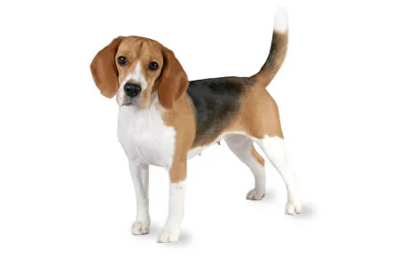
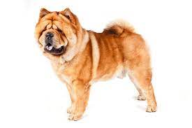
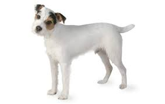

# D504 Dastardly crimes such as dog-napping are on the rise
> **dastardly**：恶劣的 [老式] [ADJ n]
 > 

1 When lisa dean, the director of Beauty’s Legacy, an animal-welfare charity, gets a call from a victim of pet theft, hundreds of volunteers **spring into action**. Posters and six-foot banners are designed; support teams **console distraught** victims and go door-to-door appealing for witnesses. Drones fly over housing estates and a technician views cctv footage to identify vehicles. The charity liaises with the police and microchip companies. If leads can be identified, charged doorstep negotiations with the presumed thieves ensue. “We don’t go steaming in there all guns blazing,” says Ms Dean, “because then the dogs will just be killed.”

> **spring into action**：马上投入行动
>
> **console**：安慰
>
> **distraught**：心烦意乱的
>

2 Britain is a nation of pet-lovers, and now more than ever. According to the Pet Food Manufacturers’ Association, a trade body, since the start of the pandemic some 3m Britons have welcomed a new pet in their homes. The aim of many was to entertain children during lockdown or give parents an excuse for a long walk. But as a result, prices skyrocketed. In March 2020 a **Beagle** puppy would have **set you back** £563 ($777); by December, that had risen to £1,447. Over the same period, the price of a **Chow Chow** rose by 149%, to £2,789.

> **Set someone back**：使某人破费
>
> **Beagle**：比格犬
>
> **Chow Chow**：中国松狮犬
>

3 And where there is money to be made, there will be criminals to make it. Across 31 of the 43 police forces in England and Wales, 1,791 pet-theft offences were recorded in 2020-21, 11% more than during the previous year. “It’s being talked about at a level not seen before,” says Owen Sharp of the Dogs’ Trust, a charity. One of those talking about it is the prime minister, Boris Johnson, who has called for tougher sentencing for pet thieves.

4 One reason criminals are attracted to pet theft is that the risks are low. Despite the deep emotional bond many owners form with their pets, they are classified as **inanimate** objects. Another is that stealing a pet can offer more than a **one-off** profit: some thieves are also in the business of breeding dogs. They set up in garages, **garden shed**s or **derelict** warehouses, and work on creating “designer” crossbreeds. They are “crossbreeding anything and everything and then giving it a name”, says Ms Dean. “So you’ll get a **Jack Russell** and they cross it with a Chihuahua and it becomes a Jackahuahua.”

> **Inanimate**: 无生命的
>
> **One-off**：一次性事物
>
> **garden shed**: 花园棚屋
>
> **derelict**：废弃的
>
> **Jack Russell**：杰克罗素犬
>

5 What the police do when pet theft is reported varies wildly by region. In Gloucestershire, they have created a **canine**-dna database to enable them to identify pets, even if thieves have removed microchips. In other parts of Britain, however, thefts go uninvestigated. Bereft owners launch social-media campaigns, follow up leads themselves—and even steal their pets back, if they get the opportunity.

> **canine**[ˈkeɪnaɪn]：犬的 [ADJ n]
>

6 Official lack of interest has created space for a handful of specialist “pet detectives”. Ms Dean, a former pre-school teacher, set up Beauty’s Legacy to help others after her own cat, Beauty, was nabbed. Others offer a costly professional service. Colin Butcher of the Pet Detectives is a former police detective inspector. He thinks the work should be done by people with proper investigative experience. Whereas once pet thieves were farmworkers who **made off with** “high-value **gun dogs**”, he says, or ex-partners seeking revenge or pet custody, now many are organised criminals. Private investigation is leading to private prosecution. On July 2nd a court will hear what Mr Butcher believes is the first private prosecution for dog theft in England.

> **made off**：(常指为逃离而) 尽快离开
>
> **gun dogs**：猎狗
>

7 More professional help may soon be at hand. On May 8th the government launched a Pet Theft Taskforce to figure out, together with police, how to **collar** more **crooks**. In a debate in Parliament on June 28th, triggered by two online petitions that **garnered** more than 200,000 signatures between them, mps echoed the petitioners’ call for a centralised database of microchipped pets. Catching the pet-nappers will take doggedness.

> **collar**：戴项圈
>
> **crook**：无赖; 恶棍 [非正式]
>
> **garner**：获得; 收集 [正式]
>
> **doggedness**：坚持不懈，The quality of being dogged; stubbornness; firm or sullen determination or obstinacy
>

