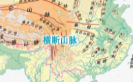

# D506 Deep in rural China, bitcoin miners are packing up
> **Clampdown**：制裁 [journalism] [oft N 'on' n]
 > 

1 In the hengduan mountains of Sichuan province, **swollen** brown rivers and trees heavy with ripe mangoes do not evoke digital **wizardry**. Yet until recently, there were buildings here with **rack upon rack** of specialised computers. They were often near **hydropower** plants that supplied them with electricity from dams. They needed lots of power. Their machines were used for “mining”, a process that involves validating transactions conducted in bitcoin and other digital currencies by solving **cryptographic** puzzles. In return, they received newly minted coins. The buildings were recognisable by their huge cooling systems: usually a wall on one side covered in giant fans to draw in air.

> **swollen**：上涨的（一般因为下雨）
>
> **wizardry[ˈwɪzərdri]**：魔法、巫术
>
> **rack upon rack**：一架又一架
>
> **hydropower**：水力发电
>
> **cryptographic**：关于密码的
>

2 But across Sichuan, the fans have stopped **whirring**. In May, a government committee tasked with promoting financial stability vowed to put a stop to bitcoin mining. Within weeks the authorities in four main mining regions—Inner Mongolia, Sichuan, Xinjiang and Yunnan—ordered the closure of local projects. Residents of Inner Mongolia were urged to call a hotline to report anyone **flouting** the ban. In parts of Sichuan, miners were ordered to clear out computers and **demolish** buildings housing them overnight. Power suppliers pulled the plug on most of them.

> **whir**：发出嗡嗡声
>
> **flout**：无视
>
> **demolish**：彻底摧毁
>

3 The clampdown has had a global impact. Bitcoin’s “hash rate”, a measure of the computational power being used by the world’s mining machines, has fallen by half in recent weeks. Its “difficulty rate”, which rises and falls as computers join or leave the mining effort, last week fell to an **all-time** low. China had accounted for about 65% of bitcoins earned through mining, according to the Cambridge Bitcoin Electricity Consumption Index. But analysts think about 90% of its mining has now ceased. Chinese miners are selling their computers at half their value.

> **all-time**：空前的
>
> **Clampdown**: 严厉打击；强制执行
>

4 China’s mining boom began in 2017, after a surge in the price of bitcoin caught the attention of local entrepreneurs. The country was already making most of the machines that mine bitcoin globally, as well as the tailor-made chips on which they run. It also had the capacity to produce more power than it needed. In 2018 this excess amounted to 70 **terawatt**-hours (twh), equivalent to Switzerland’s total energy production. Rather than let the **surplus** go to waste, plants sold it to mining farms. The seasons would determine where those farms operated. After the end of Sichuan’s drenching summer rains, when prices there would rise, miners would drive their machines to somewhere near a cheaper source, usually coal-fired power plants thousands of kilometres away in Xinjiang and Inner Mongolia. (Energy from solar and wind power is not reliable enough to power non-stop mining.)

> **terawatt**：兆兆瓦(1012) watts
>
> **Surplus**: 过剩；剩余
>
> **Drench**: 淋透；雨淋
>

5 In 2017 China, fearing a loss of financial control, banned cryptocurrency trading. But local governments still welcomed the miners: they were a source of taxes and other levies. In June a state-run zone in Ya’an, a city in Sichuan, had been set to open in time for the start of the rainy season. It was offering cheap power for mining and other digital activities. “It was a win-win,” says Kirk Su, a miner who had been planning to put some of his machines in the zone. “China was leading in mining in all respects: cheap power, cheap labour, fast and easy access to kit,” he says.
**A tax** is a financial charge on individuals or businesses collected by the Government. It’s used to pay for public spending.
**A duty** is a type of tax that’s charged specifically on the value of goods and services, such as VAT. **A levy** is an obligatory payment to the Government or another organisation.

> **kit**: v. 装备 n.成套工具
>

6 Then came the clampdown. It was targeted in part at the cryptocurrency traders. The mining industry itself has little to do with the volatile business of trading. But miners could not function without converting their new bitcoins into yuan. For this they used exchanges that had moved offshore after the trading ban, but still targeted Chinese users. The government may have decided that to **rid** China of crypto transactions, “mining had to go”, says Bobby Lee, who co-founded China’s first cryptocurrency exchange (it was forced to shut in 2017). He now runs Ballet, an app that lets users manage their digital currency.

> **rid**： 使 (某地、某人) 摆脱
>

7 Another aim may have been to reduce emissions. The Cambridge numbers suggest that Chinese miners used around 83twh of electricity a year, similar to Belgium’s total power consumption. (Still, China could have chosen to ban mining only in its coal-**belching** north, says Mr Lee.) Officials may also have worried about **collusion** between local governments and mining operations, some of which had been getting subsidies **earmarked for** innovative big-data firms.

> **belch**：喷出？to come out of sth in large amounts
>
> **collusion**： (尤指国家或组织间之间秘密或非法的) 串通; 勾结
>
> **Be earmarked for** ：留出
>

8 The central government said it wanted to “**resolutely** prevent the transmission of individual-level risks to broader society”. That may, in part, have been a reference to the activities of some mines that had been setting up Ponzi-like schemes, promising big returns to investors. Other scammers have been **masquerading** as cryptocurrency traders. Last year over 100 people were arrested for running two such operations, PlusToken and WoToken.

> **resolutely**：毅然地
>
> **masquerade**：冒充
>
> **Scammer**: 骗子，互联网诈骗犯
>

9 To **evade** the clampdown, big miners have sent their machines overseas. Mr Su, who also runs a logistics business that transports mining machines, has been **chartering** Boeing[ˈboʊɪŋ] 747s to get used ones out swiftly. Most are going to Russia and Kazakhstan[ˌkæzəkˈstɑːn], which together account for about 13% of the world’s bitcoin mining. But there are few data centres abroad with space for lots of new machines, including in America, the second-biggest miner. Building a farm there costs between five and ten times what it does in China, says Mr Su. That is too much for most Chinese miners. More than half of their computers will **stay put** for now, he says.

> **evade**：逃避
>
> **charter**：包租plane or boat
>
> **stay put**：留在原地
>

10 Some smaller miners are still finding ways to operate. One says he is lucky to have teamed up with a privately owned hydropower station that is **loth** to forgo the extra revenue (it risks being fined by the grid or booted off it). While meeting your correspondent, he **struck a deal** to buy a farm from a fellow miner for 5m yuan ($770,000), powered by a plant that is off the grid. If his machines can function there for 15 days, he will have earned his investment back in bitcoin.

> **loth=loath**：be loath to do不情愿的
>
> **strike a deal**：达成交易
>
> **off the grid**：不入网的（不使用公用输电网、煤气输送网、自来水网等）、与外界隔离
>

11 In an abandoned school in southern Sichuan, Mr Su has stored 10,000 machines from some of his **shuttered** farms. For every day they spend there, unplugged and stacked to the ceiling, he says that 1m yuan in potential profit is lost. ■

> **shuttered**：装有百叶窗的; 关上（或装有）护窗的
>

