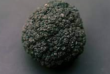

# D513 A marine biologist dives to where blue gives way to black
> **The Brilliant Abyss.** By Helen Scales. Atlantic Monthly Press; 304 pages; $27. Bloomsbury Sigma; £16.99
 > 

1 Many visitors only **skim** the surface of the ocean—swimming from the beach or **slicing through whitecaps** on a sailing boat. In “The Brilliant **Abyss**”, Helen Scales, a marine biologist whose previous books explored the shallower reaches of the sea, dives deep and revealingly into the **realm** below 660 feet where sunlit blue begins to give way to black.

> **skim**：略过
>
> **Slice through**：穿梭于
>
> **whitecaps**：浪端的白泡沫
>
> **Abyss[əˈbɪs]**：深渊[文学性]
>
> **realm[relm]**：(活动、兴趣、思想的) 领域 [正式]
>

2 As Ms Scales notes, it is often said that more is known of the Moon’s surface, exposed to anyone with a telescope, than about the geography of the deep-sea floor, which a dark **cloak** of water obscures. It is a **rugged**, complex and shifting terrain—subject to earthquakes **precipitated** by the movement of **tectonic plates**, and punctuated by **seamounts** (mountains formed by volcanic activity) and **hydrothermal vents** that emit sulphurous, **scalding** fluids.

> **cloak**：斗篷
>
> **rugged[ˈrʌɡɪd]**：高低不平的
>
> **tectonic plates**：地壳构造板块
>
> **precipitate**：造成…仓促发生 [正式]
>
> **terrain**：地形
>
> **seamount**：海底山
>
> **hydrothermal vent**：深海热泉
>
> **scalding**：滚烫的
>

3 In these underwater extremes of dark and cold, and the boiling waters **disgorged** by vents, life survives and even thrives. It includes sea cucumbers that **slough off** their illuminated skin to distract predators, **yeti crabs** as hairy as their name suggests, fish masked in ultra-black skin that makes them all but invisible, and a sponge that looks like a glass of milk frozen in **mid-spill**. As well as its role as a climate regulator and **carbon sink,** the deep, in its **vibrant profusion**, prompts reflections on the possibility of life on other planets.

> **disgorge**：倒出 [书面]spongesponge
>
> **slough off**：甩掉(忧虑等)
>
> **yeti crabs**：雪人蟹
>
> **carbon sink**：碳汇，是指通过植树造林、植被恢复等措施，吸收大气中的二氧化碳，从而减少温室气体在大气中浓度的过程、活动或机制
>
> **profusion**：大量; 丰富 [正式]
>
> **vibrant**：充满生机的
>

4 Less **beguiling** things **lurk** down there too. Plastic bags and packaging have been spotted by **submersibles** in the seven-mile-deep Mariana Trench. Nuclear waste, chemicals and oil spills, such as the one from the Deepwater Horizon **rig** in 2010, have turned sections of sea floor into poisonous dumps. Exploitation adds to the **blight**. The orange roughy, a white-fleshed fish that congregates around seamounts (also known, less appetisingly, as a **slimehead**) has been dangerously overfished.

> **beguiling**：迷人的 [书面]、欺骗的
>
> **lurk**： 潜伏
>
> **submersibles** ：能在水下操作的
>
> **rig**：钻井设备
>
> **orange roughy**：罗非鱼
>
> **blight**：祸因
>
> **slimehead**：
>

5 An experimental push to harvest sea-floor **nodules** laced with manganese, nickel, cobalt and other metals is another threat. The potential damage to the seabed from remotely operated machines is **analogous**, Ms Scales argues, to the most toxic mining on dry land. But the revenues could be huge. An analysis by the Massachusetts Institute of Technology calculated that a single seabed mine could net $1bn a year.

> **nodule**：海地结核
>
> 锰结核
>
> **analogous**：类似的 [正式]
>

6 And an ecological case for the initiative can be made. “I get very uncomfortable when people describe us as deep-sea miners,” says Gerard Barron of DeepGreen Metals, a deep-sea mining company targeting the metals used in electric-car batteries. “We want to help the world transition away from fossil fuels.” Because the long-term impact is unknown, Ms Scales is sceptical; her argument is compelling, even if her explanation of car batteries is a **slog**. Yet another marine biologist doubts that mining would be **forestalled** “even if we found unicorns on the sea floor”.

> **slog**：苦干 [非正式]
>
> **forestall**：预先阻止
>

7 Early European **cartographers** often used **sea serpent**s to mark **uncharted** depths. Hic sunt dracones—Here be dragons—reads the inscription flagging an **unfathomable** stretch of water on a globe made in 1510. But the most threatening sea monster of all may be man. ■

> **cartographer**：地图绘制员
>
> **sea serpent**：传说中一种类似蛇或龙的生物
>
> **uncharted**： (情形、经历、活动)不为人熟悉的; (地域、水域)未被探索的 [usu ADJ n]
>
> **inscription**：铭文; 碑文、题词
>
> **unfathomable**： (事物)不可理解的、(人、表情)莫测的 [文学性]
>
> **a stretch of**：一大片
>

