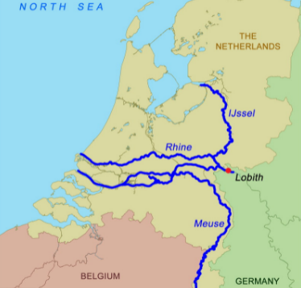

# D514 Devastating floods in Germany warn Europe of the dangers of warming
1 THE LOW-PRESSURE region began forming on July 11th over the area where Germany meets Belgium, Luxembourg and the Netherlands. Hundreds of kilometres wide and **puffed up** by heat—in the Netherlands, it had been the hottest June since 1901—it sucked in moisture from lakes and wet soil all across central Europe. Then it sat there for days, **disgorging colossal** quantities of rain. Some regions got over 90mm of precipitation on July 13th and a further 70mm or more the next day. Reservoirs filled, sewer systems saturated and streams jumped their banks.

> **puff up**：使肿胀
>
> **disgorge**：喷出
>
> **colossal**：巨大的
>

2 Soon entire towns were underwater. Across Germany’s north-western states of North Rhine-Westphalia and Rhineland-Palatinate, bridges, cars and houses were swept away. German headlines called it a Jahrhundertflut, a once-in-a-century flood. In fact devastating floods have become more frequent in recent decades. But these seem to be the worst in post-war history. In Rhineland-Palatinate at least 63 deaths had been reported as of July 16th, twelve of them patients in a home for the handicapped. In Germany as a whole deaths have risen to over a hundred. Hundreds more are missing.

3 Belgium and the Netherlands are renowned for their sophisticated systems of dykes and canals. Yet in parts of the Dutch province of Limburg, where clay-rich soil keeps water at the surface, mud and water flowed through the streets a metre deep. The Dutch government declared the province a disaster area and sent in the armed forces. In Caumerbeek, an overwhelmed fish pond sent water **cascading** onto two medieval windmills. A dike break on a shipping canal near Maastricht forced a number of neighbourhoods to be evacuated.

> **cascade**：倾泻
>

4 Horst Seehofer, Germany’s interior minister, immediately linked the disaster to greenhouse-gas-driven climate change: “Any sensible person must get the fact that freak weather of this density and frequency is not a normal phenomenon in this part of the world.” A formal attribution along those lines may not be soon forthcoming. Floods are more difficult to attribute to climate change than other extreme events, such as the recent heatwave in the Pacific north-west. Many factors play a role, including rainfall, **soil saturation**, topography and urban development, which prevents water from draining away.

> **soil saturation**：土壤保和
>

5 Summer floods are more complicated still. In winter, the heavy rainfall that leads to flooding tends to be caused by large-scale weather systems, explains Friederike Otto, a climatologist at Oxford University. But summer rain tends to be generated locally—so locally that most climate models do not have a high enough resolution to incorporate them. Climate scientists disagree over whether a warming climate leads to “blocking” events that keep weather systems stuck in one spot. And though the storm in Germany was very slow-moving, it is not clear it was held up by a blocking event.

6 But the warming climate definitely makes severe rain more likely. Higher temperatures let air hold more water vapour: for every degree Celsius of warming, the atmosphere can absorb 7% more moisture. Wetter air leads to stronger bursts of rainfall, which tends to be more destructive. So although the exact cause of any flood is hard to pin down, global warming will produce more of the type of rainfall that leads to flooding.

7 In Germany, where the campaign for a national election on September 26th is in full swing, the floods are already affecting politics. Armin Laschet, the Christian Democratic party’s candidate for the **chancellorship** and the premier of North Rhine-Westphalia, called for beefing up efforts to fight climate change. Mr Laschet has been attacked for his unwillingness to commit to climate policies as demanding as those put forward by other parties.

> **chancellorship**：总理(首相); 总理(首相)任期 [usu 'the' N]
>

8 Germans’ concern over climate and energy policies has been rising for years, particularly after a string of storms and hot, dry summers that **took a toll on** the country’s beloved forests and dried up its rivers. The Greens, now the country’s number-two party and a **contender** to provide the chancellor, may stand to benefit from the floods.

> **take a toll on**：给…造成重大伤亡（或损失）
>
> **contender**：竞争者
>

9 **Downstream** in the Netherlands the question was whether the Delta Programme, the national flood-prevention system, will prove adequate. The country forms the delta of the **Meuse** and the **Rhine**. As those rivers mounted in Germany, Dutch water authorities watched anxiously to see how much would be coming downstream. In some places huge **floodgates** were closed to keep canals from overflowing. Elsewhere **sluices** were opened to allow water to move through faster. At 4am on July 16th the current-monitoring station on the Meuse at the Dutch town of Eijsden registered a flow of 3,260 cubic metres per second, the highest since 1911, before starting to drop.

> **Downstream**：下游
>
> **Meuse**：默兹（欧洲河流）
>
> **Rhine**：莱茵河
>
> **floodgate**：水闸、使...一发不可收拾 [usu PHR 'to/for' n]
>
> **sluice[sluːs]**：有闸水道
>

10 By midday on July 16th the rain had at last moved on towards the south. But the rivers have yet to reach their peaks. The Dutch authorities expect that by Monday July 19th the level of the Rhine at the German-Dutch border will reach at least 14.5 metres above “normal Amsterdam level”, the national standard. This water must be **dissipated** and flushed out to sea before it overwhelms the cities of the lowlands.

> **dissipate**：驱散; 消散 [正式]
>

11 The Delta Programme is designed to handle far greater volumes of water than are currently expected. Still, the scale of the emergency led some to worry. “The rain that’s falling now is the sort of thing we had expected to see in 2050,” said Patrick van der Broeck, the dijkgraaf (dyke **warden**) of Limburg. The last serious flood emergency in the Netherlands was in 1995, he continued, and the sense of danger seemed to have **ebbed** from the collective memory.

> **warden**：看守人
>
> **ebb**：退潮
>

12 The floods do make clear that much of Europe is ill-equipped to deal with heavy rains. Despite adequate forecasting, says Hannah Cloke, a **hydrologist** at the University of Reading, there was a “mass communication breakdown” between officials, media and the public in many affected areas. As a result, citizens took too few precautions and local authorities were ill-prepared. Ms Otto agrees: “I think people, especially in Germany, have no idea that you can actually die from the weather.”

> **hydrologist**：水文学者
>

