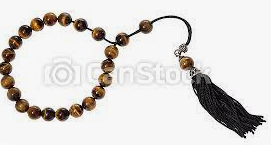

# D522 Yang Huaiding died on June 13th
1 If you had been riding on one of China’s **crammed**, **rickety** green trains in 1989, bouncing in a hard-seat carriage, you might have noticed Yang Huaiding sitting nearby. Or you might not. He had **taken pains not to** stand out, wearing **drab** clothes and carrying a faded **mock-leather** travel bag. The black-rimmed glasses, messy hair and stained teeth were his customary look. If he was smoking more than usual, and wiping more sweat, it was because in the bag, layered in newspaper, he had thousands of yuan in ten-yuan notes. He needed a police escort and, at times, he hired one.

> **crammed**：塞满的
>
> **rickety**：摇晃的; 不稳固的
>
> **take pains to**：尽力、煞费苦心
>
> **drab**：单调乏味的、土褐色的
>
> **mock-leather**：人造革
>

2 He was travelling to Hefei, in Anhui province, from Shanghai, his home town, to buy Chinese government bonds. In 1988 the Communist regime, needing to rebuild the economy and **shore up** its state-owned enterprises, had decided in a limited way to let the public become investors. Bonds could be freely traded, at first, in only seven cities. But Shanghai and Hefei, two of the seven, were only a night’s train ride apart. And Mr Yang had learned, from intense **scouring** of local papers in the public library, that bonds priced at 94 yuan in relatively poor Anhui, where collective farmers were getting them as part of their wages, were selling at quite a bit more in Shanghai. Hence the travel-bag, containing (since he had no chequebook) a large **wodge** of his savings.

> **shore up**：支持，支撑；加固
>
> **scour**：四处搜索
>
> **wodge**：(从某物上切下来的)一团; 一块 [英国英语][非正式]
>

3 He was the first man in China to do long-distance bulk trading in government bonds, making a million yuan by it, his first “bucket of gold”. And he had also been the first to buy them. Most others were **wary**, even afraid, of this bizarre capitalist venture, but he was not. He liked the old saying that the first man to suppose a crab might be edible was either very forward-looking or very hungry. He was both, and later, when he had become a famous name in investing, his business card declared: “Learn from those who have the courage to eat crab...and make friends with them!”

> **wary**： 小心的; 提防的
>

4 On April 21st 1988, therefore, he had been at the doors as the bond sale started, with 20,000 yuan (then $5,400) saved from his job as a warehouse-keeper at the Shanghai Ferroalloy Factory and from his wife’s business ventures on the side. That morning he put his money into a single bond; in the afternoon he sold it at a profit of 800 yuan, or more than his annual salary. He was hooked. When in 1990 the government ordered trading to be done through two national stock exchanges, he sailed into the Shanghai securities market as if born to it. His first purchase was 2,000 shares in a maker of television tubes, bought for 100 yuan each and sold in six months for more than 800. Another bucket of gold. He had long since given up the factory for a private trading room in an investment firm where, fortified by giant tea-jars and countless Double Happiness cigarettes, he watched and played the market all day.

5 By now his name was Yang Baiwan, Millions Yang, and crowds of eager Chinese **punters** **jostled** to follow his example. If a warehouse-keeper with only an elementary education, living in a one-room flat, could make such a fortune in the markets, so could they. They hung on his advice, besieging him in the street and at his office door in lunch-breaks, clamouring for tips. He had plenty: “When the front of the exchange is full of bicycles, sell.” “The only money you really have is in your pocket.” “Hunt the bottom, avoid the top.” He wrote five books, gave lectures, and in 1993—when the Shanghai market got too **frothy**, and he prudently dumped his stock when the index hit 1,500, thereby missing the inevitable crash—was hired as a professor. Though institutional investors rapidly took over from amateur traders, China’s leap to becoming the world’s second-largest stockmarket was largely spurred by people like him.

> **punter**：客户; 顾客 [英国英语] [非正式]、下赌注者
>
> **jostle**：推搡; 推挤
>
> **frothy**：多泡的 [usu ADJ n]
>

6 Wealth did not seem to change him much. After his first **windfall** he treated himself to some fancy foreign cigarettes and shared them round the factory. He bought a sharp suit or two. But a polo shirt or an **anorak** was more his style, and he carried on living for some time with his wife and son in the one-room flat where, early on, he had spread out his profits in bundles all over the bed.

> **windfall**：意外之财
>
> **anorak[ˈænəræk]**：带帽防水夹克 [英国英语]
>
> **sharp suit**：富有质感且剪裁得体的西装
>

7 His fans called him the Stock God, riding the markets like a **rip tide** or striding boldly through its **ravening** flames. He viewed it more like ordinary life (his entire life), with many downs as well as ups. A chunky set of **worry beads** was also on his desk. When in 2007 on state tv he recommended PetroChina stocks, which then dived, he vowed not to give his tips so casually again. When some people complained, as they loudly did, that his Millions Software didn’t work and that his investment system made them no money, he shrugged. It was no good treating the market like a casino. You had to study it constantly, the companies, the conditions, the mood, before you jumped.

> **rip tide**：激流
>
> **ravening**： (尤指狼等动物)嗜杀成性的
>
> **worry bead**：
>

8 He also closely watched what the government was doing. His big break in 1988 had come from a surprising change of policy. Another might come in the very next **communiqué** out of a **plenary** session of the Central Committee. And he wanted to be double-sure his rampant capitalist doings stayed within Communist rules. As a teenager, born in “new China” under the red flag, he had been a Red Guard, struggling **gamely** to enforce a traffic **edict** in Shanghai that revolutionary red meant “Go”, not “Stop”. Now he **fretted** that what he was doing, urging on the economy by buying cheap and selling dear, was **profiteering** and therefore a crime. Among his many firsts was the first voluntary trip by a Chinese man to a tax office (his father had worked in one), to ask whether he owed any tax on his bond sales. The sweet answer was no.

> **communiqué[kə,mjuːnɪ'keɪ]**：公报 [正式]
>
> **plenary**： 全体出席的
>
> **gamely**：勇敢地; 坚决地
>
> **edict**：命令; 指令
>
> **fret**：担心
>
> **profiteering**：投机倒把 [商业]
>
> **big break**： 重大转机
>

9 In fact, he was fairly sure he was a hero of the people. Chinese state tv said as much in 1998, when he was named “Man of the 20th Anniversary of China’s Reform and Opening Up”. And he made the case himself. The revolution’s goal, he said, was to make people rich, and that was what a stockmarket did. It was a socialist university of finance without walls; anyone could play it, learn from it and become as rich as he was, or richer. He had set the example, picked up the crab, boiled it, cracked it open and feasted. Then all China had shared it and immediately decided that they loved it, too.

