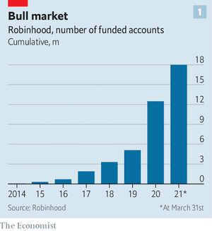
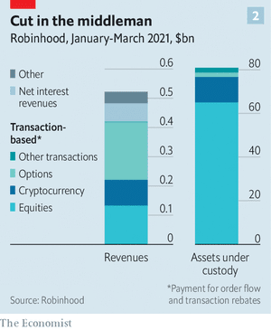

# D525 Robinhood takes its IPO to the masses
1 IT WOULD BE hard for a firm that describes itself as “**democratising** investing” to go public in any other way. When Robinhood lists on the **Nasdaq** on July 29th institutional investors will, as is usual, be able to buy and trade shares on the exchange. Less **conventionally**, the retail-trading platform will also sell a third of the shares in itself to its customers.

> **democratize**： 使大众化； 民主化
>
> **Nasdaq** ：纳斯达克股票交易所
>
> **conventionally**： 照惯例
>

2 Your **correspondent** felt a frisson of excitement as she participated in an IPO for the first time, bidding for a single share in Robinhood. The **slick** graphics explained how IPO shares are allocated, and reassured **punter**s that—unlike at other brokers—order size, assets and the age of the account would play no part in whether a bid was accepted or not. Before most firms go public they do a roadshow, which typically involves investment bankers **compiling** slick slideshows, donning their sharpest suits and **fanning out** to meeting rooms in big cities to **canvass** support from pension funds, asset managers and other big institutional investors. Robinhood instead made its 40-minute pitch online to anyone who wanted to listen, on the Saturday afternoon ahead of its **debut**.

> **correspondent**：通讯记者；客户；通信者；代理商行
>
> **frisson** ：n. 颤抖；战栗
>
> **slick**：adj. 光滑的；华而不实的；聪明的；熟练的
>
> **punter**：n. 船夫，用篙撑船的人；赌博者
>
> **compiling**：n. 汇编， 汇集；编译
>
> **fan out**：成扇形散开
>
> **canvass** ：v. 游说，拉选票；征求意见；努力争取支持
>
> **debut**： /deɪˈbjuː/： n. 初次登台；开张
>

3 The anti-establishment approach is all too fitting. No other company’s rise has been as **inextricably** linked to the current retail-investing **craze**, fuelled by online forums and lockdown-induced spare time. Robinhood, which is expected to fetch a valuation of $35bn, has seen its user base explode during the pandemic (see chart 1). Its prospects are likely to follow wherever the retail **mania**, the subject of much regulatory **hand-wringing**, goes next.

> **inextricably**：adv. 不可分开地，密不可分地；逃不掉地
>
> **craze**：n. 狂热
>
> **mania**：n. 狂热；狂躁；热衷
>
> **hand-wringing**：搓手；绝望；束手无策
>

4 For decades retail investors were overlooked and underserved. The rich might have **dabble**d in trading stocks directly, but most workers earned **defined-benefit** pensions, which kicked any **portfolio**-management decisions to pension-fund managers. The transition to self-directed 401K retirement plans, registered investment advisers and retail brokers was at first accompanied by wide trading **spreads** and meaty fees.

> **dabble**：溅湿；浸入水中； 涉猎
>
> **defined-benefit**: 固定收益
>
> **portfolio**： 证公文包；文件夹；证券投资
>
> **spread**：价差 [商业]
>

5 Then the adoption of new technologies—such as computerised trading and wicked-fast **marketmaking algorithm**s—helped **erode** spreads. In 2013 Baiju Bhatt and Vlad Tenev, Robinhood’s founders and former employees of marketmakers, saw that it might be possible for a retail broker to make money by offering consumers commission-free stock trading. It could instead earn revenues through “payment for order flow”, the practice by which a high-frequency marketmaker offers a broker a better execution price than the prevailing price for a stock on an exchange, and pays out a little of the spread it earns to the broker through a profit-sharing **arrangement.**

> **algorithm**：n. 算法，运算法则
>
> **marketmaking**：作价、做市活动
>
> **erode:** vt. 腐蚀，侵蚀；使减少
>
> **Order Flow:** 订单流 an advanced charting software which enables you to read all trading orders that are processed in the market.
>
> **profit-sharing arrangement**：分润安排
>

6 For a time the big retail brokers ignored the **plucky** **upstart** and continued to charge commissions and fees. But by 2019 the writing was on the wall. A quick, brutal price war broke out. Charles Schwab, followed by E*Trade, TD Ameritrade and eventually the biggest broker of all, Fidelity, **succumb**ed, **scrapping** their commissions and trading fees.

> **plucky**：adj. 有勇气的，大胆的
>
> **upstart:** n. 暴发户；自命不凡的人; adj. 暴富的；自命不凡的; vt.使…崛起
>
> **succumb**: vi. 屈服；死；被压垮
>
> **scrapping**：废弃；取消（计划等）；打架；激烈竞争
>
> If you say that the **writing is on the wall**, you mean that there are clear signs that a situation is going to become very difficult or unpleasant.
>

7 Lower costs for investors are a **laudable** thing. At Robinhood’s roadshow Mr Tenev claimed that his firm helped people buy shares in firms they love and got them excited about investing. By the broker’s reckoning, half of all **brokerage** accounts opened in America since 2015 have been set up through its platform. But Robinhood has also been at the centre of unease about the retail revolution, which peaked during the **speculative** frenzy in GameStop, a struggling video-game retailer, earlier this year. The company’s share price spiked from $17 in January to more than $450 two weeks later. So much of the trading volume came from retail investors, and so much of it was directed through Robinhood, that the broker was forced to suspend trading in GameStop because it lacked the capital to cover the lag between its customers’ trades and their settlement. Some **disgruntle**d investors even protested outside Robinhood’s headquarters (see picture).

> **laudable**: adj. 值得赞赏的
>
> **brokerage**: n. 佣金；回扣；中间人业务
>
> **speculative**: 投机的
>
> **frenzy**: n. 狂怒，暴怒，狂暴
>
> **disgruntle:** 使……不高兴，使愠怒
>

8 The **queasiness** over Robinhood’s success stems from two sources. For a start, when the price of something falls, people tend to do more of it. According to data in the firm’s IPO filing, around half of its customers check their investments in their app every day. But plenty of research papers find that the more people trade, the worse their returns. Another concern is that Robinhood exposes its users to risky products. Its **profit margin**s are slimmest for the **vanilla stuff**, like stock trading, but rise as its customers dabble in riskier, more complicated markets, such as trading **derivative**s or buying **cryptocurren**cies. Although **option**s and cryptocurrencies make up about 17% of the $80bn in assets that Robinhood oversees, about half of its transaction revenues come from these categories (see chart 2).

> **queasiness** : 恶心
>
> **profit margin**： 利润率
>
> **derivative**：n. 派生物；金融衍生产品；
>
> **cryptocurrency**: n. 加密货币
>
> **Option**: 期权
>

9 These concerns have led lawmakers to question whether retail investors stand to make any gains from Robinhood. Summoned to Congress after the GameStop affair, Mr Tenev claimed that its customers had earned more than $35bn in profits by buying stocks and investments, compared with what they had deposited with the broker. But Jim Himes, a congressman from Connecticut and a former banker, **skewer**ed him. “$35bn is a meaningless number unless you convert it to a **rate of return** so that I can compare it to **Treasuries**, so I can compare it to the S&P 500.” Mr Tenev deflected, claiming the right comparison was the lower bar of “not investing at all” because many of Robinhood’s customers were new to trading.

> **skewer** /ˈskjuːər/ : n. 烤肉叉子；串肉扦；针; vt. 刺穿；**讽刺**
>
> **Treasury**：债券
>
> **deflect**: vt. 使转向/弯曲; vi. 转向；偏斜
>
> **rate of return**：回报率
>

10 Whether the firm’s empowerment of retail investors has been desirable or not is more than a philosophical matter. It is also the key question that any investor, institutional or retail, will have to wrestle with ahead of its debut. This is largely because it is where the risks and rewards for potential shareholders lie.

11 The upside seems to lie in the retail frenzy continuing. It was common (including in the pages of The Economist) to expect that the GameStop episode could be the **undoing** of Robinhood; that its original adopters might feel betrayed by the firm’s **suspension** of trading in GameStop and **junk** the app. But the company’s prospectus reveals that the **adage** “all publicity is good publicity” still holds. In the first quarter of 2021 alone some 5.5m funded trading accounts were opened on Robinhood.

> **upside**: n. （不利局面中）积极面；（股票价格）上涨
>
> **undoing** : n. 毁灭；取消；毁灭的原因
>
> **suspension**:  n. 悬浮；暂停；停职
>
> **adage**: n. 格言，谚语；箴言
>
> **all publicity is good publicity**：it is better that something receives bad publicity than no publicity at all
>

12 Much of the broker’s 300-page prospectus, however, discusses the big risks to its business. These include the possible introduction of a financial-transaction tax, which might **scupper** Robinhood’s ability to offer free trading and **deter** customers from trading every day. It also includes the possibility that payment for **order flow**, which accounts for 80% of Robinhood’s revenues, might be restricted or banned by regulators. Gary Gensler, the head of the Securities and Exchange Commission, has said his agency is looking closely into whether the current market structure creates conflicts of interest; the financial-services committee of the House of Representatives, which hosted the GameStop hearing, has drafted a bill that would ban payment for **order flow**. Given all this, and the **sheer** unpredictability of the retail mania, your correspondent feels comfortable with her bid for just a single share.

> **scupper** : vt. 使船沉没；突袭
>
> **deter**: vt. 制止，阻止；使打消念头
>
> **sheer**: adj. 绝对的；透明的；纯粹的; adv. 完全；陡峭地; vi. 偏航
>
> **PFOF是**“**payment for order flow**”的缩写，意思**是股票**经纪商收到客户买卖**股票**
>
> 的订单后，将订单发给高频交易公司。 这种公司依靠复杂的电脑算法，可以锚定股价在以秒为单位的时间内的微小价差变化，进行高速的交易操作。
>

