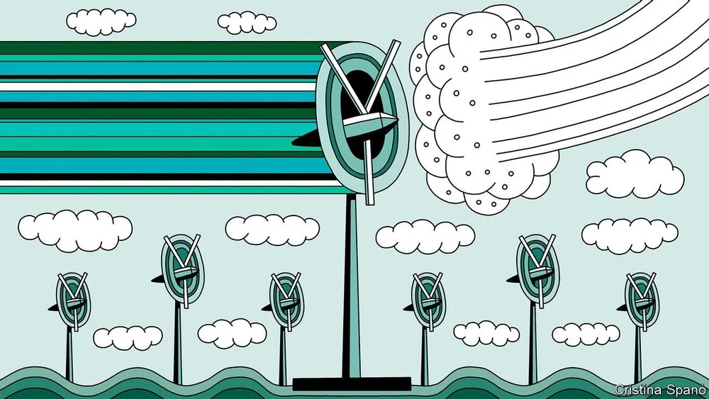
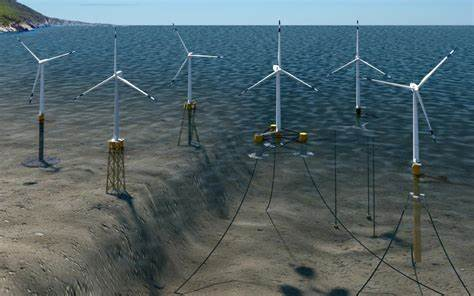
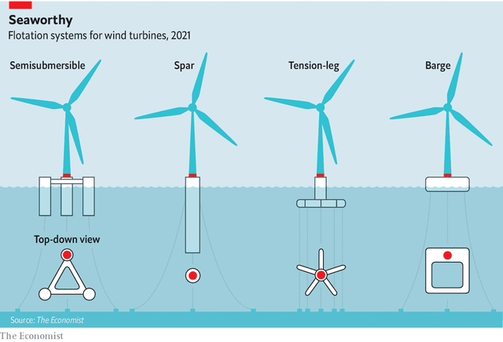
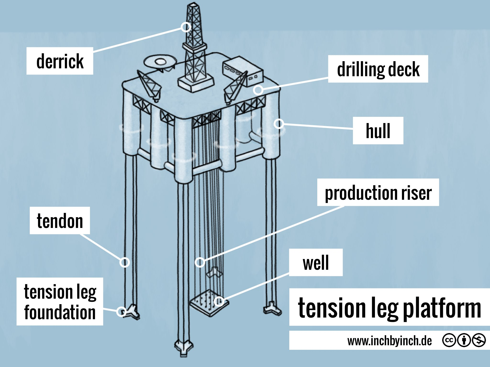
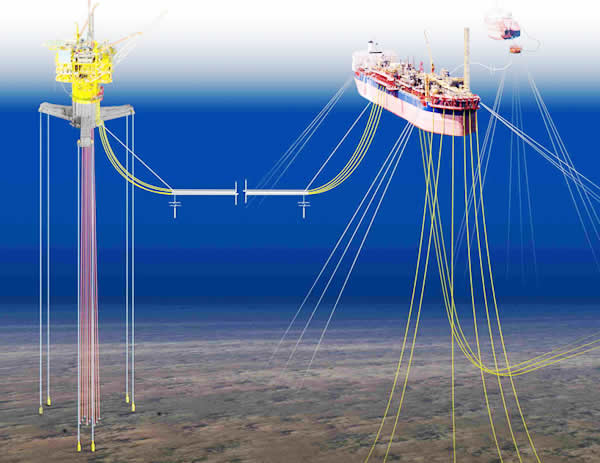
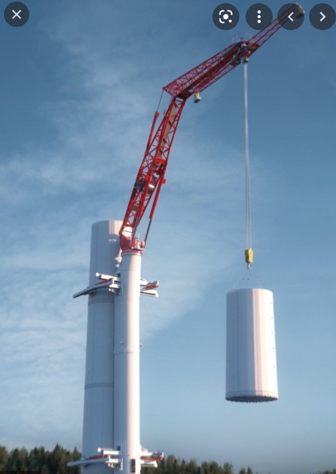
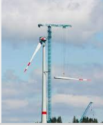
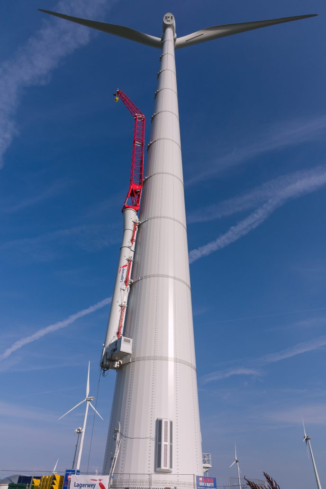

# D526-527 Floating wind turbines could rise to great heights
> **turbine[ˈtɜːrbaɪn]**: 涡轮（机器）
 > 

1 On july 16th Royal Dutch Shell, an oil and gas company, and Scottish Power, a subsidiary of **Iberdrola**, a Spanish electricity utility, made an announcement. They were, they said, jointly submitting proposals to the British authorities to build, **off the coast** of Scotland, the first large-scale set of floating wind farms in the world. At the moment, the largest **floating farm** is a six-turbine, 50mw array which is due for completion next month in the North Sea, 15km from **Aberdeen**. The **consortium**, by contrast, has said it is thinking in gigawatts (gw).

> **Iberdrola**：伊比德罗拉（）
>
> **off the coast** ：沿岸
>
> **floating farm**：漂浮式风电场
>
> **Aberdeen**：亚伯丁（英国苏格兰一郡 ）
>
> **consortium**：财团；联合；合伙
>
> **gigawatts**：千兆瓦；十亿瓦特
>

2 Offshore wind farms with foundations in the seabed are now part of the energy mix in several places. In the past four years their capacity has nearly doubled, from 19gw to 35gw, and **amortised** costs have dropped by a third, from $120 per mw-hour to $80. They are, however, of limited **deployability**, being restricted to waters shallower than about 60 metres.

> **amortised** ：摊余成本（用实际利率作计算利息的基础，投资成本减去利息后的金额）
>
> **deployability**：可靠性；可信任；可部署性
>

3 Unfortunately, 80% of the world’s offshore wind blows over places deeper than that. Making these accessible, says the International Energy Agency, an **offshoot** of the oecd, would unlock enough power to meet the world’s **probable** electrical needs in 2040 11 times over. The trick is to build turbines which, though **moor**ed to the seabed, will float. If Shell and Scottish Power can **pull this trick off**, it will be a big step towards tapping that potential.

> **offshoot** ：n. 分支；支流；衍生物
>
> **oecd**： 经济合作与发展组织
>
> **probable**：adj. 很可能的；可信的； n. 很可能的事；大有希望的候选者
>
> **moor**：v. 固定；系住；使停泊；n. 沼泽，荒野；高沼地的草原；猎场
>
> **pull trick off**：达到目的
>
> **Blowing in the wind**
>

4 A decade ago, floating-turbine technology was a **fringe** affair. The difficulty was not the turbines themselves, but making them float. The oil and gas industry had, since the 1960s, developed a range of floating **foundations** that could keep **titanic** objects like **drilling rig**s stable at sea. But transferring that know-how to wind power was hardly straightforward. First, unlike an oil **rig**, a wind turbine is **lanky** and top-heavy, making it **prone** to tip over. Second, turbines generate powerful **gyroscopic** forces that would further destabilise a floating machine. It was hard, in those days, to see how these problems could be solved cheaply enough to compete with turbines **bolted** to the ocean floor—much less with conventional power sources.

> **fringe**：n. 边缘；穗；刘海； adj. 边缘的；附加的
>
> **titanic** ：adj. 巨大的；
>
> **foundation**：基座、基础
>
> **drilling rig**： 钻机，钻探装置
>
> **lanky**：adj. 瘦长的
>
> **prone**：adj. 俯卧的；有…倾向的
>
> **gyroscopic**：adj. 回转仪的，[航][水运] 陀螺的
>
> **bolted** ：adj. 用螺栓栓的；脱离的，分开的
>
> **Drilling rig**：钻机
>

5 No longer. A decade of development has yielded two things: proof that turbines can float and clarity as to how these floating units might look. Engineers achieved this through patient **prototyping**. They took designs previously tested in university wave pools and scaled them up into small demonstration units off the coasts of Norway, Portugal and Japan.

> **prototyping**：n. [计] 样机研究；原型设计
>

6 Each unit, **bedeck**ed with sensors, gathered data on variables such as pitch, wind speed and wave height. These data were then folded into designs, for bigger, more stable units. The results, visible today in newer models off the Norwegian and Portuguese coasts, can safely float turbines four times as powerful as their predecessors. Engineers therefore consider the flotation problem solved. “The turbines function nicely. They don’t flip. It can be done,” said Alla Weinstein, a pioneer of the field who is now pursuing permits for a floating wind farm off the coast of California.

> **bedeck**：vt. 装饰；修饰
>
> **Pitch control**：变桨距、变桨距系统 is **the technology used to operate and control the angle of the blades in a wind turbine**.
>

7 Four approaches to flotation have emerged (see diagram). The commonest is a **semisubmersible**. Principle Power, an American company, is one firm pursuing this. Semisubmersibles come in various designs. Principle’s uses a **buoyant** steel triangle that has water-filled cans at two of the vertices. These **ballast** tanks balance the weight of a turbine at the third **vertex**, with water pumped around inside the triangle to **trim** its stability.

> **semisubmersible**：adj. 半潜式的
>
> **buoyant**：adj. 轻快的；有浮力的；上涨的
>
> **ballast**：n. 压舱物，[建] 压载物；道渣，碎石
>
> **vertex**：顶点
>
> **trim**: 修剪；微调;
>

8 A second tack, pursued by, among others, Equinor, a Norwegian firm, is to stick a turbine on a bottle called a spar that is filled with heavy ballast, to make it float upright. Equinor does this by placing the turbine on top of an 80-metre-high concrete tube containing water, rocks or some other cheap and heavy material.

> 传统式 Spar 平台，其主体是一个大直径、大吃水的具有规则外形的浮式柱状结构，主体中一种是硬舱，位于壳体的上部，用来提供平台的浮力。中间部分是储存舱，在平台建造时，底部为平衡稳定舱
>

9 Two other approaches are less developed, but may prove useful. Glosten, an American engineering firm that has formed a partnership with General Electric, uses a **tension-leg** platform. This is a starfish-shaped steel structure with a turbine at its hub. The starfish is submerged and **yoked** to the ocean floor with cables. This arrangement, similar to that for the ultra-deep-water Magnolia rig, drilling in the Gulf of Mexico, holds the turbine upright. And bw Ideol, a Norwegian firm, **erect**s the turbine on a flat concrete or steel barge that resembles an empty picture frame. When the turbine **sway**s, water **sloshes** within the frame, dampening its movement. The company claims its prototype, off the coast of Japan, has already survived three typhoons.

> **tension-leg**: 张力支柱
>
> **yoke**：v. 用轭把（动物）套在一起；给（动物）上轭；（使）强行结合；（使）工作
>
> **erect**：竖立；建造；创立；安装
>
> **sway**： 影响；摇摆
>
> **sloshes**：溅，泼；在泥中荡
>
> **Barge**: 平底载货船
>
> **Just do it**
>

10 Project developers have seen enough to convince them. Though the Shell-Scottish Power **consortium’s** proposals (which make no mention of a preferred technological approach) are the most ambitious so far, they are not the first. Besides the 50mw array off Aberdeen, which is owned by Grupo Cobra, a Spanish construction company that uses Principle’s design, Equinor has begun construction on an 11-unit, 88mw project which will power a group of North Sea drilling platforms. Total, a French oil and gas company, and Green Investment Group, a project-development arm of Macquarie, a bank, intend to start work on a 500mw floating wind project off the coast of South Korea by 2023—though they, too, have not yet specified which technology they plan to use.

> **consortium**：联盟
>
> **Macquarie**：麦格理银行
>

11 Bigger farms obviously require more turbines. But they also, ideally, require bigger turbines. And the bigger a turbine is, the harder it is to maintain. Wind turbines occasionally need big parts, like blades or generators, replaced. That is challenging on **terra firma**. But on land, a crane can brace itself against the earth. At sea, “**jackup**” vessels achieve similar stability by dropping steel legs to the seabed. Floating turbines will, however, operate in waters too deep for jackup vessels to work, so any vessel servicing one will have, itself, to remain floating. “You have two structures that are moving, and you’re going to shift the load from one of these moving structures to another one,” said Olav-Bernt Haga, a project director at Equinor. This will be technically demanding and thus hard to do cheaply.

> **terra firma**：陆地
>
> **jackup**：自升式
>

12 A group called the Floating Wind Joint Industry Project (fwjip), the job of which is to **flag up** matters of collective interest, **deems** this an urgent problem. This group is made up of 17 project developers and the Carbon Trust, a not-for-profit consultancy based in Britain. In an analysis published last year the fwjip said that wind turbines are nearing the physical limits of what can be handled at sea. The oil industry has a number of **heavy-lift** ships that work in deep water. But these are optimised for weight, not height, and are expensive to hire. The floating-wind industry needs new answers, or it could find itself **stunted**, both literally and metaphorically.

> **flag up**：指出
>
> **deem**：视作
>
> **heavy-lift**：重型起重
>
> **stunted**：生长不良的；未能充分发展的
>

13 Fortunately, prospects are in development. They take two broad approaches to the problem: lifting and climbing. An example of the former is owl Heavy Lift, a Dutch company, which has started work on the owl-010, a vessel dedicated to offshore-wind maintenance. Anyone working on floating wind turbines must **contend with** waves. A gentle swell at the surface can cause a **treacherous sweep** up high. The owl-010 will **iron out** the effect of this swaying by using **motion-compensation** software that steadies the position of the crane’s hook to within 5cm. This works even when that hook is 150 metres above sea level.

> **treacherous**：危险的; 变化莫测的
>
> **sweep**：(风、海浪等) 卷走
>
> **iron out**：解决
>
> **Contend with**：抵抗
>
> **motion-compensation**：运动补偿
>

14 The price tags for such vessels, though, start at around $250m. The cost alone implies that the industry would have to share a small number of ships, presenting a bottleneck to growth. That is why some propose to stop reaching up to turbines, and to start climbing them, instead.

> **Reach for the sky**
>

15 Climbing cranes, which scurry up the very object they are building, are often used to raise skyscrapers on land. They are unproven at sea, but several groups are developing versions that might suit floating wind power. senseWind, a firm in Cambridge, England, for example, suggests putting tracks on the sides of turbine towers. This would let a ship pull up alongside, place a maintenance car on the tracks, and thus move large parts up and down the tower.

> **scurry**：(尤指因受惊而) 急促跑 [书面]
>

16 Others propose to lift from the turbine itself. Most turbines have a small crane for light items. Liftra, a Danish company, uses this to raise progressively larger cranes. The biggest fits in a standard 40-foot (12.2 metre) shipping container. Once **bolted on,** the company claims, the arrangement is as powerful as a conventional external crane. Alternatively, as Conbit, a Dutch contractor, proposes, pulling a few metal parts and cables to the top of the tower would allow a **heavy-duty** crane to be fashioned temporarily on the turbine’s crown.

> **bolt on**：栓在…上；连接在…上
>
> **heavy-duty**：结实耐用的
>

17 None of these technologies is beyond the prototype stage. But they may prove valuable for the mega-turbines of tomorrow, be they fixed or floating. For floating turbines, however, an alternative may exist. Unlike fixed turbines, they can be unplugged and dragged to shore. Recent analysis sponsored by the fwjip suggests that what is best in individual circumstances may depend on location. If a floating turbine is near the shore, it may be easiest to **tow it back** to port for repair. If far away, **exotic** **gadgets** like the owl-010 or climbing cranes may work better.

> **tow back**：拉回
>
> **Exotic**: 舶来品；外来物；外来品种
>
> **Gadget**: 小工具; 小配件
>

18 The **upshot** of all this is that it may soon be possible to extract a lot more electrical power from the wind, to do so without covering hillsides with turbines, and to make a profit while doing it. And that is enough to put wind in anyone’s sails.

> **upshot**：(通常指出乎意外的) 结果
>
> **hillside**：小山坡
>
> “put the wind in someone's sails“ :**to make someone feel more confident to do something”**
>

