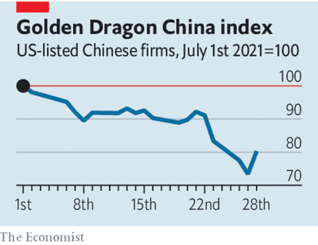

# D530 China’s crackdown on the online-education business marks a turning-point
1 To get rich is glorious, Deng Xiaoping supposedly said. “To get as rich as Jack Ma is clearly not so glorious,” **quipped** an investor last November when the initial public offering of Mr Ma’s Ant Group was cancelled on the **say-so** of China’s financial regulators. A lot of foreign investors interpreted it as a **slap-down** to China’s best-known billionaire and thus a warning to the country’s other **plutocrats** not to **get too big for their boots**.

> **quip**：嘲弄；讥讽
>
> **say-so**：允许 [非正式]主张；发言权；个人意见；权威性的决定
>
> **slap-down**：严厉责备、粗暴地禁止；镇压[非正式]
>
> **plutocrats**：富豪 [正式]
>
> **get too big for their boots**：behaving as if you are more important than you really are
>

2 But in the months since then the scope of the regulatory crackdown has grown ever wider. China’s two internet giants, Alibaba and Tencent, are being worked over by the **antitrust** authorities. Earlier this month Didi Global, a ride-hailing service, was caught in the net just days after it listed in New York. And in the past week the education-technology industry has become a target. New regulations bar any company that teaches subjects on the school curriculum from **listing abroad**, having foreign investors or making profits. When it comes to teaching schoolchildren, no one should get rich.

> **antitrust** : 反垄断
>
> **listing abroad**：海外上市
>

3 The market response to the latest bureaucratic **diktat** was a sharp **sell-off**. The share prices of a **trio** of Chinese online-tutoring firms listed in New York fell by two-thirds. The panic spread to other Chinese firms listed in America. The Nasdaq Golden Dragon China Index, which tracks the biggest stocks of this kind, fell by almost 20% over three days. The **contagion** took in China’s onshore market, with share prices down across the board.

> **bureaucratic**：官僚主义
>
> **diktat** ： 勒令; 专制统治 [表不满]
>
> **sell-off**： (国有企业、公司股份等的) 出售 [商业]、大量抛售
>
> **trio**：三人小组; 三件套
>
> **contagion** ：传染
>
> **across the board**：全盘的，全面的，全体的
>

4 China’s preferences now seem clear. It wishes to see capital raised on its own exchanges, within its **purview** and on the terms that it **dictate**s. The effects of this on financial markets are likely to **linger**. China itself may be the biggest loser.

> **purview** ：范围 [正式]
>
> **dictate**：命令；指示；听写
>
> **linger**：徘徊；消磨；缓慢度过；苟延残喘
>

5 Start with the effect on the market value of tech firms outside China. The tech-heavy Nasdaq index also sold off in response to the **rout** of Chinese tech stocks, because the latest episode signalled that investing in technology carries regulatory risk. In America Joe Biden’s administration has also sought to strengthen oversight of big tech, by beefing up **antitrust**. But **trustbusting** in America takes place in a legal context. There is a body of **jurisprudence** that limits how far the authorities can go in **clipping the wings** of tech giants, even those making profits many find **ob'scene**: Alphabet, Apple, Facebook and Microsoft all reported a record second-quarter **haul** this week. If Chinese rivals are **mired** in **red tape**, that is **all to the good** of big tech in America.

> **rout** ：一举击败
>
> **antitrust**： 反垄断的
>
> **trustbusting** ：取缔垄断
>
> **jurisprudence** ：法学 [正式]、法律体系
>
> **clipping the wings**：To restrict one's freedom, power, or full potential.
>
> **obscene**: 可憎的/淫秽的
>
> **Haul**：A slang term **for a profit**, especially the profit from a single project as opposed to that for the whole company.
>
> **mired** [maɪrd] ：陷入困境的
>
> **red tape**：<贬> 繁文缛节；原指扎文件的红带；官僚作风
>
> **all to the good**：used to say that something that happens is good, especially when it is in addition to or as the result of something else
>

6 And the clampdown will indeed harm Chinese tech. Investors who piled in during recent years have this week been **pummelled** in public markets. Private American capital is also tied up in Chinese startups. The value in those ventures is now, in effect, frozen. The route to an ipo for a young Chinese firm—the reliable way for venture capitalists to get their money back—now borders on **perilous**. A lot of Chinese firms have raised money abroad in vehicles known as **variable-interest** entities, which are essentially synthetic shares. This route may now be blocked for ever. And venture capitalists will surely be **charier** about backing Chinese tech startups, however promising.

> **pummel**：(用拳头)连续打
>
> **perilous**: 危/冒险的
>
> **variable-interest**：不固定利息
>
> VIE 可变利益实体
>
> **chary** ：谨慎
>

7 Still more worrying is that any investment, even in an onshore non-tech firm, is now at risk from arbitrary rule changes. That will raise the cost of capital for Chinese firms. China’s securities regulator hastily convened a meeting with international bankers this week to reassure them that only education-based firms were being targeted. It suggests that China’s policy **brass**, having **startle**d markets, have realised that they may have miscalculated.

> **brass**：people in authority or of high military rank.
>
> **startle**：使吓一跳/惊奇
>

8 It certainly looks that way. The capital markets are not a tap that regulators can turn on and off when it suits them. True, investors’ memories can be short. But China is gaining a reputation for regulatory **high-handedness** that it can shed only by starting to follow transparent rules—and that is precisely the sort of **subordination** the Communist Party **abhor**s.

> **high-handedness**：高压
>
> **subordination** ：从属；附属；主从关系
>
> **abhor**：痛恨/憎恶
>

