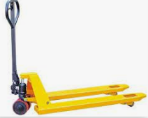
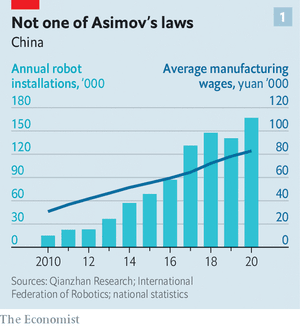
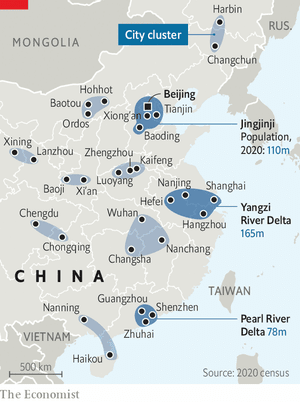
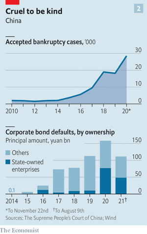

# D541-D542 China’s future economic potential hinges on its productivity
> **hinge on**：完全取决于
 > 

1 Noblelift, based in Changxing, a town on the banks of Tai Lake, provides robotic tools for warehouse management: self-driving **pallet jacks** and sorting systems that make picking and fetching quicker and less dependent on humans. The factories in which it builds its wares are themselves **a blur of** robot arms. “There’s no comparison with the way things used to be,” says Ding Yi, Noblelift’s founder. The company’s main factory has only 350 workers. He says that in the old days it would have needed nearly four times as many.

> **pallet jack**：液压车
>
> **a blur of**：模糊不清的一片
>

2 In 2010 China was home to fewer than 50,000 industrial robots. Today it has 800,000—nearly one in three of the robots in the world. This is in part because robots are cheaper than they used to be, and more capable. But it is also because, as China has grown wealthier and older, wages have increased a lot.

3 Factory workers who earned about 8,000 yuan a year in 2000 ($1,000, at the time) may now make almost ten times that. For bosses like Mr Yi that has dramatically **tipped the balance** in favour of automation (see chart 1). Almost overnight, Chinese industry has gone from being labour-intensive to robot-intensive.

> Companies are always in pursuit of such ways to increase productivity. Countries in search of economic growth like them, too. Xi Jinping, China’s president, has made productivity a priority.
>
> **tip the balance**：打破平衡、扭转局势
>

4 In some respects, the ambitions of Mr Yi and Mr Xi seem well aligned. But many observers believe that Mr Xi is relying too little on the market forces which have shaped Mr Yi’s investments and too much on state power. As a result he risks steering the country away from the high-productivity future he wants to bring about. The shape of tomorrow’s global economy hangs on whether those critics are right or whether, armed with numerous detailed plans and burdened with glorious purpose, China’s leaders can achieve their goal.

5 Economic growth depends on just three basic factors: how many people are working; how much capital they have at their disposal; and how productive they are. China’s **turbocharged** growth over the past four decades was the result of all three factors coming together **at full pelt**.

> **turbocharged**：powerful, fast, or exciting，(发动机或车辆)装有涡轮增压器的
>
> **at full pelt**：最高速度、能量或力量
>

6 The urban workforce soared from 100m in 1980 to about 500m today. The increase in the capital stock was even more dramatic. In 1980 China had fewer than 15,000 kilometres of modern road; today it has more than 700,000km, not to mention high-speed trains, too many airports **to shake a stick at**, **power grid**s and all the other **accoutrements** of industry. And at the same time China experienced a productivity boom thanks, in large part, to the steady **dismantlement** of central planning. Competition shook up the economy. Businesses became better run and workers went wherever wages were highest.

> **to shake a stick at**：A large quantity, more than one can count
>
> **power grid**: 电力网
>
> **accoutrement**：装备
>
> **dismantlement** : 拆卸；拆除设备；拆除方法
>
> **Shook up**:To do something different from one's normal routine in order to make things feel new or interesting.
>

7 From 1980 to 2010 China’s annual gdp growth averaged 10%. In the past decade, though, things slowed down. The central bank now thinks potential growth is about 5.5% a year. The working-age population is no longer expanding; the latest national census, published in May, revealed a total population on the brink of decline. The appetite for infrastructure is increasingly **sated**, if not **glutted**; spending on the built environment has reached the per-person levels of much wealthier countries.

> **sated**：吃多了的
>
> **glutted**：供过于求、供应过剩
>

8 That leaves productivity **paramount**. But the improvements which came from loosened state control have not been maintained. The World Bank calculates that, since 2008, China’s **total-factor productivity** (tfp)—the amount of gdp growth that cannot be explained by capital or labour—has grown by just 1.1% per year, less than a third the rate of the previous three decades. That is still double the level in America over the same decade. But the relevant comparator for Mr Xi and his colleagues is China’s recent past.

> **paramount**：首要的
>
> **total-factor productivity**：全要素生产率
>
> 在各种生产要素的投入水平既定的条件下，所达到的额外生产效率。即生产活动在一定时间内的效率。全要素生产率的增长率常被视为科技进步的指标。
>

9 Some of this slowdown simply reflects the move from catch-up to caught-up. Developed countries have lower potential productivity growth. But many analysts also think that China’s economic model is particularly wasteful, a failing evidenced by its surging debts. Nowadays it adds about four yuan of new debt for every additional yuan of gdp; a decade ago it needed just two yuan of debt to get the same result.

> **Speed it up a notch**
>

10 It was in 2017 that Mr Xi, better known for quoting Mao and Marx, started to talk of tfp and the need to increase it. In March last year, just as China emerged from its covid-19 lockdown, the central committee of the Communist Party and the State Council released a 32-point vision for boosting productivity. In the five-year plan for the economy which was finalised this March, the government specified that it wants labour productivity to grow quicker than gdp.

11 If there is to be real progress, it will be driven by companies and individuals, not top-down diktats. But the state’s moves are shaping the landscape in which those processes will play out. **With all due respect** to the government’s 32 points, it is possible to batch them into three broad categories: industrial modernisation; further urbanisation along new lines; and what might be called catch-up reforms.

> **With all due respect** :恕我直言；冒昧的说
>

12 The first element, as Noblelift illustrates, is the upgrading of industry. For companies the calculations are simple: modernising their factories stops them from becoming uncompetitive. The government, though, has two grander goals.

13 The one which has received most attention outside China is a perceived geopolitical **imperative**. Faced with rising American **enmity**, China wants to cultivate greater self-reliance in making essential products from semiconductors to agricultural machinery. That goal, encapsulated in the “Made in China 2025” policy, requires improving its factories, raising its ambitions and conquering new industries.

> **imperative**：紧迫之事
>
> **enmity**：敌意
>

14 The other goal reflects economic philosophy. China believes that sustaining high productivity depends on retaining a large manufacturing base. Schooled in Marxist doctrine, China’s leaders have long regarded industry as more economically valuable and more strategically useful than services. Whether the services in question consist of waiting tables or creating financial **derivative**s hardly matters.

> **derivative**: 衍生物；派生词
>

15 That is a debatable proposition: service-sector work can be highly productive. Nevertheless, the government has **cemented** it as policy. It will fight to prevent a decline in manufacturing’s share of gdp, which at about 25% is higher than that of Germany or Japan, the industrial heavyweights of the rich world.
Plans to achieve this go well beyond automating assembly lines. The government is giving companies advice and subsidies to get information technology deeply embedded into all their operations. Local developers are designing software tailored to helping them manage their processes more efficiently.

> **cement**：巩固 (关系、协约)
>

16 Until a few years ago factory bosses regularly kept track of inventories and orders on paper, says Zhou Yuxiang, founder of Black Lake, one such developer. The desktop-based systems of SAP and Oracle never translated well to China. Now, manufacturers are using applications on their mobile phones, letting them collect, analyse and act on data in real time. “They are becoming the most flexible companies in the world,” he says. The country hopes that it can enjoy a late-starter advantage in digitising industry, in the same way that it **leapfrogged** from being a cash-dominated economy to being the world leader in mobile payments.

> **leapfrog**：(利用别人成就) 超越
>

17 The second part of the productivity push is better urbanisation: bigger **agglomeration**s to which workers have better access. China has capped the size of its biggest cities, fearful that they might become unmanageable. At the same time, it knows that bigger urban agglomerations, which allow for specialised labour and **interwoven** supply chains, tend to be more productive. So it is developing giant city clusters in which big hubs are linked to smaller satellites. The idea is to generate the benefits of agglomeration without horrifically congested traffic, overburdened schools and other very-big-city blues.

> **agglomeration**：凝聚；城市群；结块
>
> **interweave**:交织；织进；使交错编织；使紧密结合
>

18 China has approved plans for 11 **mega**-clusters in all (see map). The average population of the five biggest is about 110m, nearly three times bigger than the 40m in Greater Tokyo, the world’s biggest existing cluster. Having discussed the idea for several years the government is beginning to invest in making it real. Over the next three years it has committed to double the length of intercity commuter rail lines.

> **mega**:巨大的；极佳的
>

19 Even deep in China’s interior, **cityscapes** are changing. In the west, Xi’an, the capital of Shaanxi province, has been fused to Xianyang, a separate city 30km away, creating a metropolitan area with 15m residents. An hour’s drive north of the cities fields of grain have been replaced by logistics zones and industrial parks. “This place used to be far out of the way. No one would come here,” says Ma Yu, a middle-aged migrant from the countryside. Now a bullet train carries her to Xi’an in 13 minutes.

> **cityscape**：城市面貌
>
> **The** **ladder** **starts to** **clatter**
>

20 As well as joining cities together, it is also blanketing them in 5g mobile networks, planting sensors **galore** in their highways and sewers to monitor performance, and **studding** their lampposts with surveillance cameras. The party believes all this will allow the distributed mega-cities to be managed with a precision and efficiency which makes them **paragons** of hyper-productive modernity. This may **betray** a lack of insight into what it is that really makes cities hives of innovative oomph.

> **ladder**：梯子
>
> **clatter**：卡搭卡搭地响
>
> **galore**：丰富地
>
> **stud**：用...点缀; 用...覆盖
>
> **paragon**：完人; 杰出典范
>
> **betray：** (无意中) 流露
>
> **oomph[ʊmf]**: 精力；特质；气质energy; a special good quality
>

21 Making the most of what cities offer also requires reform of the hukou, or residency permit, system which makes most migrants second-class citizens in the cities where they work. Without a local hukou they cannot collect unemployment insurance, and their children struggle to get into local schools.

22 Along with being profoundly unfair, discriminating against some 200m citizens this way is also costly. When workers hit their 40s and worry about access to health care and pensions, they tend to go back to their **natal towns**. In doing so they willingly opt for lower-paid, lower-productivity jobs, says Cai Fang, an adviser to the central bank. The government has talked about hukou reform for years and done little. Recently, though, it has actually eased the pathway to hukou in most cities (just not its very biggest). It has also made social benefits more **portable** within the urban mega-clusters.

> **natal** ：出生的
>
> **portable**：手提的，便携式的；轻便的
>

23 The last of the three categories of productivity enhancement is what might be termed catch-up reform: a series of changes to bring the country closer to the standards of richer countries, albeit in a dramatically different political context. The higher-education system is testament to the potential gains. It is easy to point to problems that still **bedevil** China’s schools, from too much emphasis on test preparation to too little investment in rural students. Yet the increasing number of university graduates—46m in 2000, 218m this year—is a good **proxy** for large, continuous improvements in workers’ skills.

> **bedevil**：长期搅扰
>
> **a good proxy for**：良好的范例
>
> **albeit**:尽管
>

24 Another critical area of reform is allowing failure. One of the main ways to ensure that capital is allocated well is to let bad firms **go bust**; Mr Cai has cited evidence that firms going under drives as much as 50% of productivity growth in rich countries. In corporate China this form of creative destruction has often been suppressed. Over the past few years, though, bankruptcies have soared.

> **go bust**：破产
>

25 The courts accepted nearly 30,000 **insolvency** applications in 2020, a record (see chart 2). Investors are currently fixated on the saga of whether regulators will let Evergrande, the country’s biggest property developer, **go bust**—something which would previously have been unthinkable. And state-owned firms accounted for roughly half of last year’s **bond default**s, **giving the lie to** expectations that the government would always save them.

> **insolvency** ：无清偿能力; 破产
>
> **go bust**：破产
>
> **give the lie to sth**：serve to show that (something seemingly apparent or previously stated or believed) is not true.
>
> **bond default**: 公司债券违约
>
> **Trying to keep up with you**
>

26 Better education and more bankruptcies are just a couple of the paths forward. The 32-point productivity plan vows to make it easier for companies to issue bonds in the first place, to co-operate more with other countries on scientific research, to better protect intellectual property, and on and on. The plan received little attention at the time; many observers have grown tired of such promises by China. Yet the fact that there is still so much unfinished business, and that the government acknowledges this, may signal that such **cynicism** is being overdone, at least a bit.

> **cynicism**: 犬儒主义；愤世嫉俗；冷嘲热讽
>

27 Will China’s productivity policies actually work? History offers little by way of precedent. Autocracies have become successful industrial nations before, if never on such a huge scale. But it is not obvious that they can move beyond that. China is currently at roughly the same income level that its two closest Asian forerunners, South Korea and Taiwan, were when they became democratic and strengthened their independent legal institutions—a transition which, **in retrospect,** seems to have been essential for governing their increasingly complex economies.

> **in retrospect**：回顾；回顾往事；检讨过去
>

28 In China the party will remain the law. And the way that Mr Xi is using that power is making investors increasingly pessimistic. The government’s crackdown on tech **darlings**, from Ant, a fintech **dynamo**, to Tencent, a social-media giant, has served up a reminder of just how **capricious** its regulations can be.

> **darling**：宠儿
>
> **dynamo**：发电机、精力旺盛的人
>
> **capricious**：反复无常的; 易变的
>

29 Chinese officials say they are limiting the power of big tech platforms in order to to make the economy more competitive and thus more productive. Few investors buy that. Instead, the realisation has **seep**ed in that Mr Xi’s references to communist ideology are, at some level, sincere. He appears to be uncomfortable with business leaders getting too rich. And he has made it his mission to reinforce the party’s grip on power. When he says “Government, the military, society and schools, north, south, east and west—the party leads them all,” he means it. This is not a basis for improving productivity you will find in many economic textbooks.

> **seep**：渗；渗透
>

30 Deepening distrust between China and much of the world is another problem. Plugging itself into the global trading system did not boost Chinese growth just by opening up new export markets. International competition pushed its companies to be more efficient; access to **cutting-edge** technology allowed them to become more sophisticated. Now countries from Israel to the Netherlands are subjecting Chinese investments to closer review and limiting exports of some key inputs. A lengthening list of companies have chosen to scrap acquisition plans in America because they would have been impossible to complete.

> **Cutting-edge: **先进的
>

31 Officials have come to believe that industrial policy of the “Made in China 2025” sort is, to an increasing extent, the only option available for some types of technological improvement. Li Daokui, a former adviser to the central bank, is confident that it will eventually succeed: “We are not the Soviet Union. We have the world’s largest **contingent** of young engineers. If pushed, we will develop our own technology.” Perhaps. But it will be expensive, both in terms of the direct cost and other spending priorities **forgone**.

> **contingent**：一批、(警察、士兵、军车) 批 、代表团
>
> **forgo**: 放弃；谢绝
>

32 Less funding for pension systems, for example, will hold back consumption, thus holding back investment and productivity in the services sector. According to s&p, a credit-rating agency, a **full-bore** pursuit of self-reliance could **lop** as much as one-third off China’s growth this decade. But Mr Xi is unlikely to be swayed. He seems to believe that truly ambitious technology investment, though it may often fail, offers the possibility of **world-beating** breakthroughs that will bring his country both power and productivity.

> **full-bore**：全力的
>
> **lop**：砍伐；剪去树枝
>
> **world-beating**: 举世瞩目的
>

33 The biggest reason to believe that things might turn out better for China’s economy than these trends would suggest is that it has consistently shown an ability to correct mistakes. In the 1990s the government cut down bloated state-owned firms. Over the past five years it went from dismissing concerns about its debts to launching a **deleveraging campaign**, though those efforts are far from complete. “Leaders are willing to change when the pressure is there,” says Liu Shengjun of the China Financial Reform Institute. That they have become obsessed with how to boost productivity is a good starting-point. Achieving their aim, though, will take much more than robots—and maybe more change than they can stomach.

> **stomach**：忍受
>
> **deleverage: **去杠杆化；减债
>
> **dismiss**: 不予考虑；摒弃；对…不屑一提to decide that sb/sth is not important and not worth thinking or talking about.
>
> 有点长-_-
>

