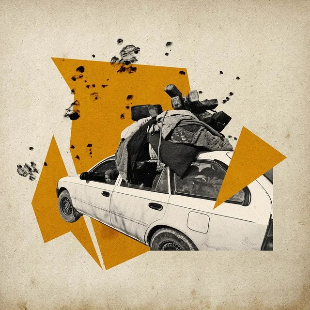

# D543 Hiding books, buying burqas: Kandahar prepares for Taliban rule

1 When the fighting got so near that the walls of his house shook, Abdul, a retired teacher in Kandahar, decided it was time to hide his books. Reading has been a **respite** for Abdul since the Taliban began their extraordinary advance on **Kandahar**, Afghanistan’s second city, a few months ago. Until recently, Kandahar hosted one of the largest American military bases in Afghanistan; Abdul fears that **insurgents** will take revenge now they are in control of the city.
“I have not slept all night,” he says. “The government has failed our country.”

> **respite**：暂缓 [正式]
>
> **Kandahar['kændəhɑ:]**：坎大哈
>
> **insurgents** ：叛乱分子
>

2 Abdul is part of a book club that allows people to swap titles with each other: Kandahar has no libraries. Self-help books, many of them by foreign authors, have helped him manage his anxiety. He also reads essays on politics and terrorism.

3 But even such simple pleasures are now under threat. The author of one of his books about **fundamentalism** was assassinated in Kabul a few weeks ago. Abdul owns a collection by Kandahar’s most famous poet, Abdul Bari Jahani, who now lives in America. Last time the Taliban were in charge they banned his books.

> **fundamentalism**：原教旨主义
>

4 Abdul decided that hiding his library was the safest option. “I don’t want to take any chances if the Taliban take over Kandahar and search my house,” he says. Whatever the group’s official policy on owning such titles, Abdul fears that his fate will depend on the whims of whoever may raid his home. “If they do not like my books or what I have been keeping in my house, they could take my life in a moment.”

> **One shopkeeper reports** **brisk** **sales in burqas**
>
> **brisk**：(买卖、生意) 兴隆的
>

5 Over the past few days the Taliban have reached ever deeper into Kandahar; late on Thursday night, they took control of it. The fighting has been devastating. Mosques have been **boarded up**. People are stockpiling beans and rice. Some have abandoned their homes to move in with relatives in parts of the city that aren’t yet under bombardment. Others are boxing up their possessions, barricading their doors and heading down to their basements to play Ludo. Many Kandaharis are preparing for life under Taliban rule. One shopkeeper reports brisk sales in burqas.

> **boarded up**：用木板封住
>
> “They could decide to take my life in a moment”
>

6 People are **scouring** local Facebook pages to find the latest news on the Taliban’s advance. Officially the Taliban’s policy is to offer **amnesty** to anyone who surrenders to them, but there are unconfirmed reports of Taliban fighters executing government soldiers en masse, as well as rumours of journalists and community activists disappearing from areas newly controlled by the Taliban. “They are after those who are educated, those who can gather and unite people,” says Abdul. “It looks like there will be death and blood in this city.”

> **scour**：四处搜索
>
> **amnesty**：赦免
>

7 Kandahar is dominated by the same ethnic **Pushtun** group from which the Taliban emerged. The city used to be a **stronghold** of fundamentalists until American soldiers kicked them out after the 9/11 attacks, which were planned by al-Qaeda in Afghanistan. Though Afghans enjoyed the lifting of the Taliban’s harsh prohibitions, many regarded Americans with suspicion and anger. But Western aid workers and army contractors who lived in Kandahar spent money there, giving the city a **sheen** of prosperity. Restaurants opened, their neon signs glowing by night. New schools were built.

> **Pushtun**：普什图人
>
> **al-Qaeda**：基地组织
>
> **stronghold**：(大多数人有共同态度或信仰的) 大本营
>
> **sheen**：光泽
>
> **“There will be death and blood in this city”**
>

8 The Taliban regrouped in Pakistan. The militants grew stronger, aided both by Afghans’ frustration with corruption in their government and the withdrawal of nato forces, which will be complete by September.

9 Even before the Taliban arrived, some members of the Kandahari elite watched the insurgents gain control of land and supply routes and started trying to establish good relationships with them through tribal connections.

10 It has become common in Kandahar to hear people publicly expressing support for the group, says Ahmed, who used to work for an ngo in the city. “When I speak to businessmen these days, they complain a lot about the government…and are quick to praise the Taliban for the security they provide.” Ahmed worries that his own work will make him a target: “In Taliban rule there is no accountability, and they can easily harm me.”

> **“They could decide to take my life in a moment”**
>

11 Despite the long build up, the speed of the Taliban’s advance in recent weeks has caught most people off guard. Some of those who hoped to flee the country ran out of time to order passports or get their affairs in order. Like Abdul, many people are assessing which of their possessions could land them in trouble: hiding tvs and deleting music and videos from phones. Some men have started to grow their beards.

12 When the Taliban withdrew from Kandahar in 2001, one of the most visible signs of change was the sight of girls in school uniform **traipsing** through the streets. Sahar was one of them: she went on to become a doctor, getting a job at the local hospital.

> **traipse**：不情愿地去
>

13 Now in her late 20s, she used to go to work each day in jeans and a long black coat, her fingernails brightly painted. As the fighting advances, her parents have ordered her to stay at home. When she visited her colleagues last week, she felt she had to cover up to avoid drawing attention to herself, borrowing her mother’s old white burqa. She struggled to see properly through its mesh panel and the tight fit gave her a headache.

14 Her female colleagues teased her at first, joking that she had already got used to the return of the Taliban. Then it **dawned on** them that they were going to have to start wearing a burqa too.“I feel very little and worthless in it when I wear it,” says Sahar. “It is really hard for me to accept what others choose for me to wear. But we have no choice other than to obey whoever rules us.”

> **dawn on**：使开始明白
>

15 Sahar studied hard to become a doctor, “to have freedom, choose for myself, live a free life, and do a service for my people.” Now she isn’t even sure she’ll be allowed to carry on working. She can’t concentrate on her medical books any more. One of her few joys is watching cooking shows on tv. “We had two televisions, we have hidden one and we use the second one to keep ourselves entertained. If the Taliban take over we will have to throw away or hide the second television as well, and then I don’t know how we will spend our day.”

16 Nobody knows if the Taliban really will persecute people for owning a tv. The situation is changing each hour, and information is scarce. But it’s clear that the order of the past 20 years is over. “Right now as I am talking to you the Taliban fighters are less than 500 metres away from my house,” says Ahmed, the ngo worker. “Pray for us.”■

