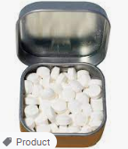

# D550 Bursting the bubble: how gum lost its cool
1.For decades, chewing gum was a symbol of rebellion, synonymous with youthful **angst**, bestowing the chewer with an aura of boldness, **bravado** and sex appeal. Rockstars **masticated** on stage. Characters in teen movies chewed with attitude: high-schoolers in “The Breakfast Club” (1985) popped gum with **defiance**; in “**Grease**” (1978) Frenchy blows big pink balloons (the cast reportedly got through 100,000 pieces of gum **on set**).

> **Angst**：焦虑；担心
>
> **bravado**: 逞能；逞强；（有时）虚张声势
>
> **masticate**：咀嚼; 嚼碎
>
> **high-schooler**：高中生
>
> **defiance**：违抗; 蔑视
>
> **Grease**：油脂
>
> **on set**：现场
>

2.Now the bubble has burst. Gum has had a bad pandemic: with mouths **cloistered** by masks, dates delayed and clubbing cancelled, sales of gum fell by 14% worldwide in 2020 over the previous year. Yet sales had been in decline even before covid struck. Why has gum **come unstuck**?

> **cloister**：使与尘世隔绝
>
> **Come unstuck**：失败 [英国英语]
>

3.Chewing for chewing’s sake has a long history. Ancient Greeks **munched** bark. For centuries the Mayans and Aztecs chewed **chicle**, a **resin** from the Mexican sapodilla tree that arrived in New York in the 19th century. It was the Americans who found a way to sell the sticky stuff. Local gum entrepreneurs began to add different flavours, using chicle as a base. In the 1950s manufacturers swapped chicle for synthetic rubber and plastic, which were cheaper. They also introduced sugar-free gum.

> **Munch**： 大声咀嚼
>
> **chicle**:口香糖;糖胶树胶
>
> **resin**:树脂；合成树脂
>

4.The cast of “Grease” reportedly got through 100,000 pieces of gum on set

5.Few products are as pointless as chewing gum, so marketers had to get creative. As William Wrigley junior, founder of the **eponymous** brand, pointed out: “Anyone can make gum. Selling it is the problem.”

> **eponymous[ɪˈpɑːnɪməs]** ： (戏剧、书中男女主角)与作品同名的
>

6.The answer was to make gum whatever you wanted it to be. The selling point of Kis-Me gum was obvious (slogan: “Far Better Than A Kiss”); Vassar, an early Wrigley’s brand named after an elite women’s college, was aimed at the female market. When gum joined the war effort via **ration** packs in the second world war, it became **patriotic** too.

> **ration**：(物资紧缺时的) 配给量，口粮
>
> **patriotic** ：爱国的
>

7.A piece of gum spat out by Britney Spears was **auction**ed on eBay

> **auction**:拍卖
>

8.But the real success of gum was when chewing it became a challenge to authority. **Stigma** was part of the appeal. Chewing was a subtle way to undermine your elders: young women were told that gum was unladylike; chewing in school became a symbol of defiance.

> **Stigma**: 耻辱；羞耻
>
> **defiance**：反抗；违抗；拒绝服从
>

9.By the 1940s Hollywood stars were making gum **hip** the world over. Youths in wartime Britain copied the chewing of American **GIs**, hoping to emulate their **swagger** and carefree attitude. Pop culture, including on-screen stars of the 1970s, consolidated that image. Celebrities chewed with pride. In 2004 a piece of gum spat out by Britney Spears was auctioned on eBay for $14,000.

> **GI**: (陆军)兵士；(发给士兵的)军用品**hip** ：时髦的
>
> **american gis**：美国大兵
>
> **swagger** ：大摇大摆
>

10.Things got **sticky** after the millennium. Though **splodges** of white still **splattered** pavements (apart from in Singapore, which outlawed gum in 1992), sales started declining a decade ago and have kept on falling. Some reckon smartphones are responsible: people had something else to distract them at the supermarket checkout (many people buy gum on impulse). A surge in online shopping was also a factor. Others blamed the rise of alternative breath fresheners, such as mints.

> **sticky**：棘手的; 令人尴尬的
>
> **splodge**：大斑块; 大块污渍
>
> **splatter**：溅洒
>
> **mints**：
>

11. Cultural representations of gum grew less prominent too: the **trashy**, **uncynical** pop culture of the 1990s, embodied by rebellious chewers, gave way to a trend for healthy eating and organic foods. In an age when **veganism** was on the rise and sustainability became a selling point, gum seemed **anachronistic** and **retro**. Chewing on plastic, or popping it all over your face, simply doesn’t appeal to youngsters who scrutinise product labels for artificial ingredients. It used to be cool not to care. Now the opposite is true.

> **trashy**：没用的；碎屑的；垃圾似的；无价值的
>
> **uncynical** ：不愤世嫉俗的
>
> **veganism**：素食主义
>
> **anachro'nistic** ：过时的
>
> **retro**：复古风格
>

12.Chewing on plastic, or popping it all over your face, doesn’t appeal to youngsters

13.“Big Gum” now faces competition from new eco-friendly, plastic-free alternatives pitched at **disillusioned** chewers. A number of new brands, including Simply Gum, True Gum and Nuud Gum, started by millennials go back to the roots of chewing: the core ingredient in these new products is chicle. So far, the **biodegradable** brands are selling well: they’ve definitely given consumers something to chew over.

> **disillusioned：** 幻灭的
>
> **biodegradable**：可生物降解的
>

