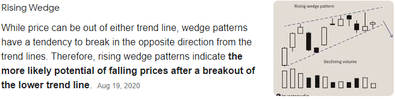

# D587 Are investors becoming warier of Chinese assets?
> **wary**: 小心的；谨慎的
 > 
> **upheaval**: 动荡；剧变；激变；动乱
 > 

1 FOR THE average investor, China is the source of all sorts of uncertainty. A regulatory crackdown on social-media and education firms has sent stocks tumbling. Companies with exposure to property are suffering as a result of the government’s clampdown on leverage and a liquidity crisis at Evergrande, a large developer. A ban on cryptocurrency transactions on September 24th knocked the price of bitcoin. And a rush by provincial authorities to meet strict national carbon-emissions targets, together with tight supplies of coal, is causing power shortages, which could in turn weigh on both the wider economy and asset prices.

> **leverage**：杠杆，杠杆作用，影响力
>
> **liquidity**：资产流动性；资产变现能力
>
> **weigh on**:重压于；压在心上；压在肩上
>

2 If investors expect Chinese policy to continue to be volatile, then they could start to demand an additional risk premium for holding a swathe of assets. “The intensity of policy change has caught investors off guard,” says Chetan Ahya of Morgan Stanley, a bank. “It’s not clear to investors what the end game is for each sector, so there’s a lot of uncertainty, and it’s this uncertainty that adds to the risk.” Indeed, a risk premium may already be becoming apparent for some assets.

> **volatile**:易变的；无定性的；无常性的
>
> **a swathe of**：一系列，一大片
>
> **off guard**: 不警惕；不备；没有防备的
>
> **end game** :终局;最后阶段；尾声
>

3 Over the past six months the MSCI China Index, an index of stocks listed on the mainland and in Hong Kong, has underperformed global equities by the most in over 20 years. Yields on offshore Chinese high-yield dollar bonds, at around 14.5%, are higher than they were during the covid-induced market panic of March 2020.

> **dollar bond**：美元债券
>

4 Analysts at Goldman Sachs, a bank, have attempted to work out what a change in the treatment of so-called socially important sectors—such as education, media and entertainment—might entail for private firms. Although privately owned companies have always had higher returns on equity than state-owned enterprises (SOEs), recent policy changes will act to curtail some of their profits. The range of potential outcomes is huge, depending in part on how much of the private sector will see SOE-like returns. In the most optimistic case, the MSCI China index might already be undervalued by a double-digit percentage. In a more pessimistic scenario, it could be overvalued by a similar amount.

5 Working out which case is more likely is a question more of politics than finance. The policies of any government have a bearing on investment outcomes, and are tracked closely by asset managers around the world. But monitoring and predicting the machinations of the Chinese Communist Party is no simple task for experts, let alone the average Western financier. “For an offshore bond investor, why play this game? Policy could change, and they’re just not cut out for that,” says Alex Turnbull of Keshik Capital, a Singapore-based investment fund.

> **bearing**:影响；关系
>
> **Machination**：阴谋；诡计
>
> **cut out for**：合适的 if you are not **cut out** **for** a particular type of work, you do not have the qualities that are needed to be able to do it well.
>

6 Sure enough, investors in offshore assets have cooled towards China. One way to gauge this is to compare the stock prices of Chinese companies that are listed both on the mainland and in Hong Kong. Equities are typically more expensive at home, as China’s capital controls leave domestic punters with few alternatives. But the gap has widened substantially, with onshore investors paying a premium of more than 45% for identical shares (see chart). The gulf is roughly as wide as it was for much of 2015, when domestic stocks enjoyed a frenetic rally driven by margin debt. So far this year, however, mainland-listed stocks have been roughly flat. The growing wedge reflects the pessimism of international investors not constrained by China’s capital controls, rather than the optimism of mainland punters.

> **gauge**:估计；判定；估算；（用仪器）测量
>
> **punter**：下赌注者
>
> **gulf** :n.分歧；鸿沟；隔阂; 深渊；海湾地区；漩涡  v.吞没
>
> **identical** :完全同样的；相同的；同一的
>
> **rally**：价格回升
>
> **margin debt**：保证金负债量
>
> **Growing wedge**：上升楔型
>

7 Not all assets have a higher risk premium attached to them, though. Interbank-lending markets have been quiescent so far (perhaps aided by liquidity support from the People’s Bank of China). Safe, state-run companies at the heart of the financial system have shown no signs of turmoil. On September 17th Industrial and Commercial Bank of China, a state-owned lender and by some estimates Evergrande’s largest bank creditor, issued $6.16bn in contingent convertible bonds, with the lowest coupon for such a sale for a Chinese company on record. There have been no visible wobbles in sovereign-bond and foreign-exchange markets. That suggests investors seem not to think that the current troubles will shake China’s system of capital controls.

> **Interbank-lending**：同业拆借
>
> **qui'escent**： 静态的 [文学性]
>
> **turmoil**: 混乱；骚动；动乱；焦虑
>
> **creditor**：贷方
>
> **contingent convertible bond**：应急可转债
>
> **wobble**:摇晃；(失去信心带来的)犹豫；犹豫不决
>
> **sovereign-bond**：主权债券
>
> **coupon**: 息票
>

8 What does a higher premium on some assets usually held by foreigners mean for China? For now the economic effect is limited. Although overseas ownership of government bonds has risen in recent years, corporate borrowing is still very much a domestic affair. Foreign institutions own just 1.5% of the roughly 7.6trn yuan ($1.2trn) in medium-term notes in the Chinese corporate-bond market. Some economists argue that China’s ageing population will mean that it starts to run sustained current-account deficits instead of surpluses, which would need to be funded through greater inflows of foreign capital. But those expectations have yet to be realised. The current-account surplus declined to a 25-year low of 0.2% of GDP in 2018, but picked up again in 2019 and 2020.

> **corporate borrowing**：企业借贷
>
> **medium-term notes :** 中期票据
>
> **corporate-bond**：企业债券
>
> **deficit**:赤字；逆差
>
> **current-account** ：活期存款账户 [英国英语]
>

9 A broad risk premium, though the result of various government initiatives, would defeat another policy objective, however. In recent years regulators have tried to encourage investors to be more discriminating about risk; they have, for instance, permitted more company-bond defaults, in order to dispel the idea that the state will always bail out troubled firms. Those efforts had some clear successes. The spread between the yields of AAA- and AA-rated onshore corporate bonds has risen from 1.7 percentage points two years ago to 2.3 percentage points today. Investors paid more attention to the credit fundamentals of Chinese companies.

> **discriminating**：有鉴别能力的
>
> **default**：拖欠
>

10 Now those efforts have been undone. Investors are instead guessing where government policy might go next, and a blanket risk premium is in place, particularly on assets most accessible to foreign investors. Instead of helping investors differentiate risks, the recent barrage of shocks has forced them to apply a broad brush again, with Chinese companies the biggest losers from the shift.

> **blanket**：适用于全体的
>
> **barrage**：一连串 (问题，抱怨等)
>
> **broad brush**：粗线条, an approach characterized by a lack of detail or subtlety.
>
> **broad brush**: 粗枝大叶的手法
>

