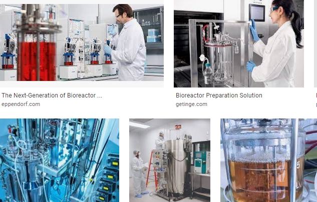

# D595 Future food The new Anthropocene diet
> **Anthropocene**:人类纪
 > 

1 "Tell me what kind of food you eat, and I will tell you what kind of man you are," wrote Jean Anthelme Brillat-Savarin, a French lawyer and epicure, in the early 19th century.  The epigram opens “The Physiology of Taste,” one of those delightfully dilatory, observational works at which his age excelled.

> **epicure**:讲究饮食的人；美食家
>
> **epigram**:警句；诙谐短诗；隽语
>
> **dilatory**:拖拉的；拖延的；延误的 ：Characterized by or given to delay or slowness
>

2  The food that most people eat—especially in rich countries, but increasingly in poor­ and middle­income ones, too—reveals them to be inhabitants of a highly globalised economy, spectacularly rich in choices. Peruse the shelves of a rich­world supermarket and you will find salmon from Norway, prawns from Vietnam, mangoes from India, strawberries from Turkey, cured meats from Italy and cheeses from France. Meat, a luxury for most people through much of history, is available in such affordable abundance that, in the rich world, most who do not eat it regularly forgo it as a matter of choice, not necessity. Much of it is laced with chemical additives that reduce spoilage, enhance flavour or serve some other need on the part of the producer.

> **abundance**：丰度；丰富；大量
>
> **cured meat**：腌肉
>
> **peruse**: 细读
>
> **spoilage**： (通常指食物)腐坏
>

3  Such a diet has only become possible in a very particular world, one in which a large proportion of the planet’s surface is given over to farms and pasture, food production is energy-intensive, pesticides abundant, intercontinental shipping cheap and food processing an advanced industrial undertaking. It is only possible, that is to say, at a time when human desires, and the economies built around them, rank among the planet-­shaping forces of nature: a period that has come to be known as the Anthropocene.

> **pasture**：牧场
>

4 The Anthropocene diet that the world's well-off inhabitants enjoy would amaze all previous generations. But like most remarkable modernities, it is not without its costs. Meat is cheap because it is produced with great cruelty. Billions of animals spend brief, miserable and often pain-­racked lives crammed together in airless sheds. They are ripped from their mothers; pumped with drugs; castrated without anaesthetic; eviscerated while alive; or all of the above.

> **crammed**:塞满的；挤满的；拥挤不堪
>
> **rack**:折磨
>
> **castrate**:阉割
>
> **eviscerate**: 切除内脏；切除…的内部器官
>

5  Picking berries and lettuce is backbreaking labour; the people who do it often lack health insurance, job protections and a living wage. Many of the world’s fisheries run on slave labour. Depleted soils are chemically tarted up into a fecund semblance of health with nutrients straight from the factory. Fertiliser and animal-waste runoff create algal blooms that strip the oxygen from ever more, ever larger dead zones in littoral seas. Few human activities emit more greenhouse gases than raising animals—particularly cattle, for which ranchers cut down vast swathes of forest. The processing that serves to make food cheap, tasty and addictive strips out nutrients while adding fats, sugars and salt.

> **living wage**:基本生活工资
>
> **backbreaking**:非常辛劳的；费力的
>
> **depleted**:耗尽的、贫化的
>
> **tart up**：打扮得花花绿绿; 打扮得艳俗一般
>
> **fecund**:  肥沃的；丰饶的；肥沃的，丰饶的
>
> **semblance** ：表象
>
> **runoff**：径流、流失
>
> **strip**：剥离
>
> **littoral sea**：沿岸海域
>
> **rancher**：农场主
>
> **algal** :海藻的；藻类的
>
> **swathes of**: 大块的
>

6   It would be easy to conclude, per Brillat­Savarin’s maxim, that the Anthropocene diet’s consumers are cruel to animals and indifferent to both their planet’s future and their own—because the Anthropocene diet is all of those things. That would be far too harsh. Taking a moral inventory of every food’s inputs is a lot to ask of, say, a mother on a tight budget, on her way home from work, who just wants a dinner that makes her children happy. That does not mean she does not care, or would not prefer a system that does better by her family and the world.

> **maxim**:格言；箴言；座右铭
>
> **inventory** :存货；详细目录；存货清单
>

7  **** Many have begun to alter their dining choices to help bring about such a system. The amount of meat eaten in the world is growing, but less so in richer countries than poorer ones. The share of people who identify as vegetarian, vegan or “flexitarian”—meaning their diet is centred on plants but that they do not entirely eschew the eating of animals—is rising. In Britain, the number of vegans more than quadrupled from 2014 to 2019.

> **eschew**:避免
>
> **flexitarian**：弹性素食者
>

8  In America, sales of organic food— which people take to be better both for themselves and for the environment—rose from $13.3bn in 2005 to $56.4bn in 2020; Europe saw a similar rise. Restaurant menus often name the farms that supply their food, giving diners a greater sense of connection to what they are eating. The word “locavore”, coined in 2005, was an American dictionary’s “word of the year” by 2007.

> **locavore**:土食者”（也称“本土膳食主义者”）
>

9  There is a performative aspect to much of this. People want what they eat to say good things about them—both to others and to themselves. This is neither an ignoble desire nor a new one. The dietary restrictions set down in Leviticus and Deuteronomy, as the late Hayim Halevy Donin, a rabbi, explained in his book “To Be a Jew”, offer “a good example of how Judaism raises even the most mundane acts...into a religious experience.” Eating, common to all people, becomes an act of Jewish self­-definition.

> **performative**：表述行为的
>
> **ignoble**:卑鄙可耻的; 不光彩的
>
> **Leviticus**:利未记
>
> **Deuteronomy**: 申命记
>
> **late**: 已故的
>
> **mundane**:单调的；平凡的;世俗的
>
> **rabbi**：拉比
>
> **Judaism**：犹太教
>

10  Flexitarian, locavorous and organic eating are not religious. But they make a moral statement: the belief that participating in the hyper­rationalised, hyper-­calorific, hyper-­processed industrial first-­world food system is wrong. What they do not in themselves provide is a way to set that system right, in part because they do not properly assess its flaws. The raising of organic food, for example, typically requires more land than other methods, and can often produce greater greenhouse­-gas emissions. A personal devotion to the legume over the nugget or the aubergine over the burger may save you from direct complicity in the suffering of chicken and cow; but it does not stop the suffering.

> **aubergine**:茄子
>
> **nugget**:（某些食品的）小圆块
>
> **legume**:豆科作物
>
> **complicity**:共犯；同谋；勾结
>

11  But what if the system itself could be changed? What if people who shared the distaste for today’s food system could encourage the building, seed by seed and cell by cell, of ways to provide a delicious, healthy, diverse array of foods with markedly less cruelty and environmental damage?

> **distaste**：厌恶; 反感
>
> **an array of**：大量
>
> **12 Anthroprotein and other food groups**
>
> This report will survey an array of technologies being touted as ways of transforming the world’s food­-production system not by doing old forms of agriculture in a less cruel and more sustainable way, but by doing things that have never been done before.
>
> **tout**：兜售; 吹嘘 [表不满]
>

13  Heretofore niche proteins, such as insects and seaweeds, are being explored not just for their gourmet potential—which is higher than most might believe—but also as ways to refashion food chains. Yeasts are being programmed to grow proteins that make a soy­protein patty cook and bleed in the way a minced cow does. Inland saline aquaculture promises to provide fresh seafood to people thousands of miles from an ocean. Crops are being grown in soil­free shipping containers just blocks from the city dwellers who will eventually eat them, rather than half a world away. Cells taken from a living animal in a simple biopsy are being used to grow meat in bioreactors, providing familiar sources of protein without the need for slaughter or industrial­-scale farming and the cruelty and health hazards those things entail.

> **heretofore**：迄今为止
>
> **niche protein**：利基蛋白
>
> **refashion**：重制
>
> **yeast**：酵母
>
> **patty**：肉饼
>
> **mince**: 肉末，剁碎n&v
>
> **saline**：含盐的
>
> **aquaculture**：水产养殖（业）
>
> **dweller**:居民；居住者；栖身者
>
> **biopsy**：活组织检查、活检；切片检查；活体组织检查
>
> **bioreactor**：生物反应器、细胞培养罐
>

14  Immense hurdles remain. It is one thing to grow a hamburger in a tank, another to get people to eat it, and a third to provide competitively priced tankburgers by the billion. Growing vegetables in skyscrapers might be environmentally beneficial, but field-­based agriculture remains much cheaper. Practical and necessary improvements to today’s farms, such as regenerative farming techniques, could be sidelined in favour of incoherent and unsustainable Utopian neophilia that offers niche feel-good foods for a few, but little if anything for the many—or for the suffering animals. Some technologies which currently seem beneficial will turn out to incur unforeseen costs and harms, just as cheap meat has.

> **sideline**:冷落，边缘化，阻止
>
> **neophilia**:喜新成癖；对新事物的喜欢；新鲜事物
>
> **niche** ：（产品的）商机；市场定位
>
> **incur**:招致；遭受；引起；引致
>

15 Yet there is something undeniably inspiring about this attempt to turn Brillat-Savarin on his head: deciding first what sort of person you want to be, and what sort of planetary settlement you want to embody, and then changing the world so that the kind of food it provides for you to eat fits that self­-conception.

> **self-conception**：自我概念
>
> **turn (something) on its head**：
>
> To **misinterpret** or misrepresent something so that it is completely incorrect or the opposite of what it should be.
>
> To **innovate** or alter something, such as a field or activity, in an unexpected or unprecedented way改变
>

16  The movement has a recognisable, hard-­to-­resist ferment: a hype­heady nose and feel redolent of the terroir in which California raises its new technology. One starry­-eyed Californian faux-meat scientist enthuses that the field feels like working in Silicon Valley in the 1970s: optimistic, dynamic and buzzy. The quest to change the world’s food system, though, begins in a grungy town at the other end of the state. And the story starts with a pea.

> **ferment**：骚动
>
> **hype­heady**：令人陶醉的
>
> **redolent**：芳香的；有…的强烈气味
>
> **starry­-eyed**：充满幻想的
>
> **terroir**:风土条件-the combination of factors including soil, climate, and sunlight that gives wine grapes their distinctive character
>
> **faux-meat**：人造肉
>
> **starry­-eyed**：充满热情的
>
> **grungy** ：低劣的；丑的；蹩脚的；脏的
>

