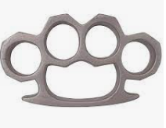
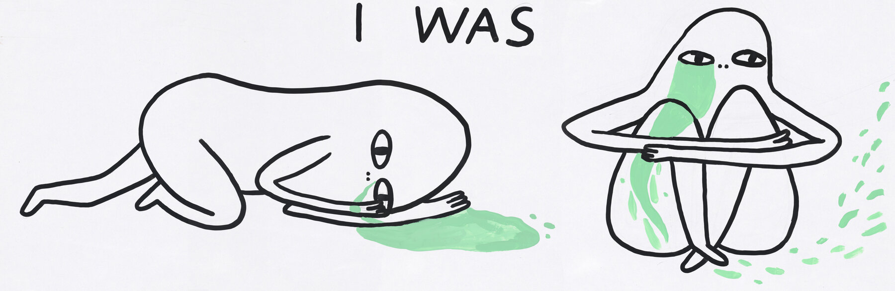
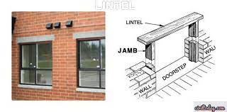
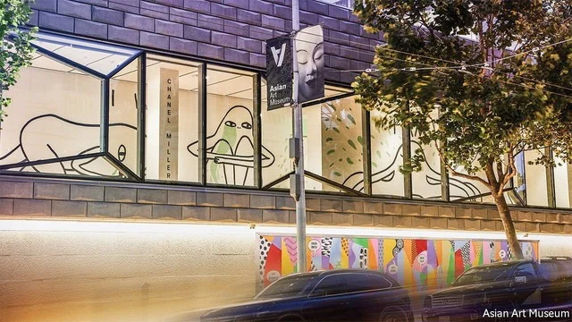

# D704 (重读D535) The Asian Art Museum in San Francisco reassesses its past
> **curation**: 策展
 > 
> **reassess**：重新评价
 > 

1 AN INDIAN WOMAN peers over a **parapet**, her skin hot pink, her **bindi** red. Gold jewellery decorates her forehead and fist, where a golden **knuckle-buster** spells out “BOOM”. The **mural** by Jas Charanjiva, called “Don’t Mess With Me” (pictured), is one of three works by contemporary artists installed in a new **pavilion** at the Asian Art Museum in San Francisco. At street level, a colourful geometric **panel** by Jenifer Wofford lists the names of Asian-American artists who have long been overlooked, while in a **vitrine** above, Chanel Miller has produced a **triptych** of **rotund** creatures representing the healing process in the aftermath of a sexual assault she suffered in 2015 (both pictured below).

> **peer**：凝视
>
> **hot pink**：桃红色
>
> **parapet**：护墙
>
> **bindi** ：(印度女性)点绘的眉心痣
>
> **knuckle-buster**：指虎拳环
>
> **mural** [ˈmjʊrəl]：壁画
>
> **pavilion** ：展示馆
>
> **vitrine** ：(陈列艺术品、古玩等的)
>
> **panel**: 镶板（用木或玻璃板等镶嵌或装饰）玻璃橱窗
>
> **triptych[ˈtrɪptɪk]** ： 三拼画; 三拼浮雕
>
> **rotund**[roʊˈtʌnd] ： 圆滚滚的
>

2 Taken together, the murals by these three young Asian-American women represent a bold change of direction for America’s largest public museum devoted solely to Asian art. The title of Ms Miller’s piece, “I was, I am, I will be”, seems particularly **apt**, as the museum unveils a $103m expansion and **grapples** with its own history and Orientalist roots. It opened in 1966, a gift to the city from Avery Brundage, an American industrialist and collector. He donated almost 8,000 Asian artworks, a number that has expanded over the decades to 18,000 objects, some of which date back 6,000 years. Yet as president of the International Olympic Committee, Brundage **espoused** racist and anti-Semitic views. The historic collection is at once exceptional and problematic.

> **apt**：恰当的
>
> **unveil**：揭幕; 揭开…上的覆盖物; 拉开…的帷幔; (首次)展示; 介绍; 推出; 将…公之于众
>
> **grapple**：努力解决 (问题)
>
> **espouse**：拥护; 支持 [正式]
>

3 The museum has also come under scrutiny for the way it has historically portrayed Asian art through a Western lens. Some years ago a show about Japanese **geishas** was loudly parodied by Scott Tadashi Tsuchitani, a local Japanese-American artist. More recently Chiraag Bhakta, an Indian-American artist, **denounce**d the museum for **balking at** the word “white” in #WhitePeopleDoingYoga, his **acerbic** installation about the **commercialisation** of the pursuit. (The museum went ahead with the installation, but merchandise with the tag line was withdrawn.) Tensions **came to a head** during the racial-justice protests of 2020, when the museum was heavily criticised for continuing to display **a bust of** Brundage at its entry.

> **geisha**：艺妓
>
> **parody**:滑稽/拙劣的模仿
>
> **denounce**:谴责
>
> **balking at**: 回避，畏缩
>
> **acerbic** ： 尖刻的 [正式]
>
> **commercialisation**:商业化；商业化阶段
>
> **came to a head**：达到紧急关头；成熟；出脓
>
> **a bust of**：一尊
>
> https://www.motherjones.com/media/2019/10/white-people-yoga-sf-asian-art-museum/
>

4 The museum’s management swiftly packed the statue off to storage. Curators had in fact been **mulling** what to do with it for some time, says the museum’s director, Jay Xu, a specialist in ancient Chinese bronzes. A **reckoning** with the institution’s “troubling legacy” was already under way as part of a strategic review aimed at “bringing the museum into the 21st century”. That review, which began in 2015, culminated in a decision to vastly expand its exhibition space and commitment to contemporary artists, and connect more deeply to Asian communities both abroad and at home. The museum has said it will also scrutinise the **provenance** of the items in its care and assess any claims to **restitution**. In September 2020 it announced that it would return two ancient Thai **lintels** donated by Brundage (the museum does not believe the items were **looted** but was “unable to locate copies of the export documents that the laws of that time required”).

> **mulling** ：斟酌 [美国英语]
>
> **reckon**:清算
>
> **culminate**：以…告终; 结果成为
>
> **provenance** ：出处 [正式]
>
> **restitution**：归还; 赔偿[正式]
>
> **lintel** ：过梁
>
> **loot** ： (战争或暴乱时) 抢劫 (商店或房屋)
>

5 The “transformation project”, as the name suggests, aims to change the museum inside and out. The expansion adds 28,000 square feet (2,600 square metres) of exhibition space, including the new pavilion and a **terrace** dedicated to contemporary sculpture. The interior of the museum’s Beaux Arts **edifice** has been **reconfigure**d, with 15 masterpieces singled out from the various cultural regions represented in the collection: a 15th-century **inscribed** cup represents West Asia and the Persian world, for example, and an 18th-century statue of Simhavaktra, a Buddhist **deity**, is a treasure from the Himalayas and the Tibetan Buddhist world.

> **terrace** ： (房屋旁的) 露台; 草坪
>
> **edifice** ：大厦 [正式]
>
> **reconfigure**:重新配置
>
> **inscribed** ：题写; 刻
>
> **deity**: 神；上帝；女神；天主
>
> Simhavaktra Dakini:狮面空行母原始法身为般若佛身，报身为金刚亥母，而化身即是狮面空行母，为宁玛巴之殊胜本尊，亦是莲花生大士之护法，可遮止一切邪魔，具大威神力。
>

6 The changes extend to the museum’s administrators, too. The board was once exclusively white and male, but now women and Asian-Americans occupy 50% of the positions, says Mr Xu, who was appointed in 2008 as the museum’s first Chinese-born director. Mr Xu created a new department for contemporary art in 2018 and hired a local curator, Abby Chen, to lead it. For Ms Chen, previously artistic director at the nearby Chinese Cultural Centre (CCC) in San Francisco, the appointment shows that the museum is “ready to change the **canon**”. Her **inaugural** exhibitions feature work by artists never before shown in North American museums, such as Jayashree Chakravarty and Lam Tung Pang, from Kolkata and Hong Kong respectively. A **splashy** digital **installation** by teamLab, a collective based in Tokyo, is sure to draw new visitors in.

> **splashy** ：引人注目的
>
> **canon**: 教规；〈正式〉规则；标准；原则
>
> **inaugural** :就职的；开幕的；成立的；创始的
>
> **Kolkata**:印度加尔各答
>
> **installation**:现代雕塑装置（除物体外用声、光等元素）a piece of modern sculpture that is made using sound, light, etc. as well as objects
>

7 The museum, which is publicly owned and run, has pledged to engage more deeply with Asian-American artists from the San Francisco Bay Area, many of whom have long felt “huge frustration” at the institution’s lack of interest or representation, says Ms Chen. At the same time, hate crimes against Asian-Americans have risen during the coronavirus pandemic; in March six women of East Asian **descent** (and two other victims) were shot at a spa in Atlanta. In the wake of that tragedy, the Asian Art Museum joined the CCC and others **in holding** “Art Against Anti-Asian Violence” events, and took out a full-page advertisement in the San Francisco Chronicle featuring Ms Wofford’s **mural** and the headline: “WE ARE AMERICA, KNOW OUR NAMES”.

> **descent** ：下降; 下倾; 斜坡; 坡道; 血统; 祖籍; 祖先; 出身
>
> **mural** :壁画
>

8 That commitment is being noticed. “They’re trying to listen,” says Marci Kwon, who teaches art history at Stanford University and co-founded its Asian American Art Initiative. “The Asian American Museum seems to really be thinking about Asia as not just a singular geographic entity, but as something that is embedded in the lives and histories of people in the Bay Area.”

9 California is a state with a long history of anti-Asian discrimination, from the Chinese Exclusion Act of 1882 (introduced by a Californian senator) to the **internment** of Japanese-Americans during the second world war. It is also “the east coast of the Pacific,” Ms Chen notes: as such, a museum here can play a major role in supporting the broad Asian **diaspora**. “The Asian Art Museum cannot **sit by the sidelines**,” she says. “We need to be a loud voice, connected to public life, **propelled** by these artists and their voices, because the best way to speak is not with statements and blogs, but through the art.”

> **internment** :拘留；收容
>
> **diaspora**[daɪˈæspərə]：大移居
>
> **sit by the sidelines**：袖手旁观
>
> **propel**：推进
>

