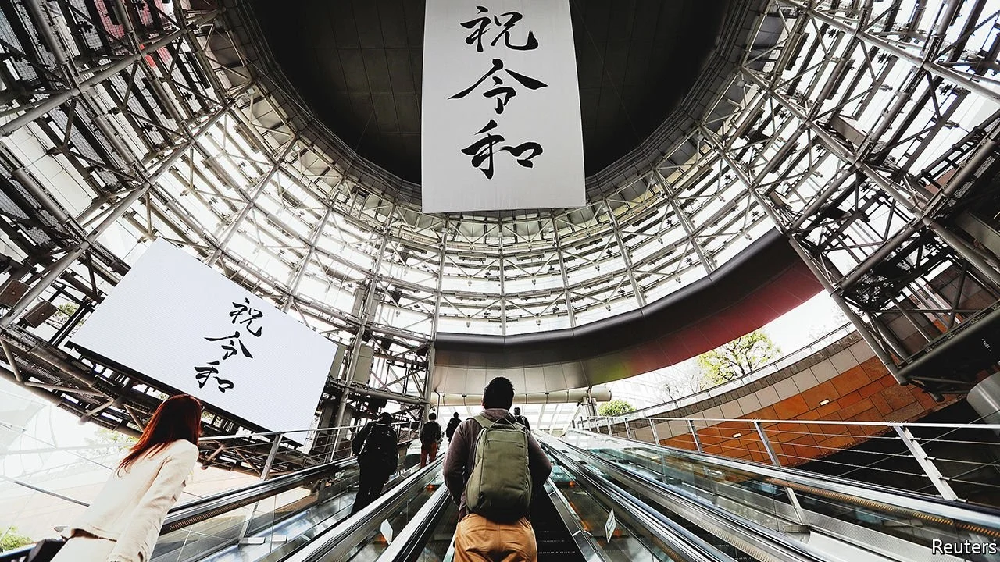

# D709 (重读D664) A country that is on the front line

1 Japan’s new imperial era began in spring 2019, when a nondescript man in a dark suit revealed its name: Reiwa. The first character, rei, means “auspicious” or “orderly”; wa means “harmony” or “peace” (officials chose “beautiful harmony” as the English rendering). For the first time the name came not from classical Chinese literature, but from Japan’s Manyoshu poetry anthology, compiled over a millennium ago: “In this auspicious (rei) month of early spring, the weather is fine and the wind gentle (wa).”

> **nondescript**:无特征的; 平庸的; 毫无个性的
>
> **auspicious**:吉利的; 吉祥的
>
> **render**:提供; 给予; 提交; 翻译
>
> **Manyoshu**:万叶集
>

2 The early months of Reiwa were hardly **auspicious**, nor the winds gentle. In early 2020 covid-19 blew in. Japanese donned masks and stayed at home, fuming at politicians who continued to dine out. China, Japan’s biggest trade partner, flexed its muscles and suppressed Hong Kong that summer. In the autumn the president of the United States, Japan’s chief ally, refused to accept his defeat at the ballot box. The pandemic postponed the 2020 Olympics, which Abe Shinzo had hoped to be the crowning achievement of his record-long tenure as prime minister. Ever fewer babies were born. Mr Abe’s intestinal illness led him to step down. The nondescript man in the dark suit, Suga Yoshihide, took over, but after a year he too was gone.

> **auspicious**:吉利的；吉祥的
>
> **don**:戴上
>
> **intestinal**：肠道的
>
> **crown**：加冕; 为…加冕; 形成…顶部; 给…加顶; (尤指通过增添成就、成功等)使圆满; 使完美
>
> **Flex** (one's) **muscle **: （透過軍事、政治或經濟實力的展示向對手）顯示實力，顯示力量
>

3 Yet amid all the turbulence, Japan has fared rather well. The Olympics went off in the summer of 2021, with few spectators and little fanfare, but without the epidemiological disaster that detractors had predicted. The ruling Liberal Democratic Party (ldp) chose a new leader, Kishida Fumio, another inoffensive figure. On October 31st voters gave the party a healthy majority in the Diet’s powerful lower house. No populist rabble-rousers hijacked the debates and no pseudo-authoritarians **impugned** the outcome. Average life expectancy in Japan hit new highs of 88 years for women and 82 for men. Excess mortality actually fell; only 18,000 have died of covid-19, in a country of 126m. Masks have stayed on and double-vaccination rates have risen to around 80%.

> **turbulence**：动荡
>
> **fare well**:过得好，顺利，走运
>
> **fanfare**：大张旗鼓; 号角花彩，号角齐鸣(欢迎仪式等上奏的响亮短曲); (为庆祝而在媒体上的)喧耀;
>
> **detractors**：批评者，污蔑者
>
> **rabble-rouser**：煽动者
>
> **hijack**：劫持，操纵
>
> **authoritarian**：独裁者
>
> **impugn**：质疑
>

4 The rest of Reiwa will demand more **resilience** in the face of unprecedented challenges. In the Showa era, from 1926 to 1989, Japan lost and recovered from the second world war, grew into the world’s second-largest economy and led Ezra Vogel, a Harvard historian, to write about “Japan as Number One” and to urge America to learn lessons from its former foe. Mr Abe had this in mind when he declared that “Japan is back”—his Olympics recalled those of 1964, which symbolised the post-war **revival**. Such **nostalgic bravado** exaggerates modern Japan’s successes. But the pessimism of Japan’s “lost decades”, a **hangover** from the Heisei era that followed Showa, when the bubble burst and the economy stagnated, also exaggerates its failures.

> **resilience**：恢复力; 弹力; 适应力; 快速恢复的能力; 还原能力
>
> **revival**：复苏，振兴
>
> **nostalgic** :怀旧的；令人怀念的
>
> **bravado**：虚张声势; 逞能; 逞强
>
> **hangover**：遗留的感觉，沿袭下来的风俗
>
> **Heisei**：平成
>

5 Reiwa’s **dawn** has already provoked plenty of soul-searching. “The question for the Reiwa era is what kind of Japan do we want to get back?” muses Funabashi Yoichi, a writer. Japan is in a “post-growth or post-development era”, and its values must evolve from the “faster, higher, stronger” of Showa to “diversity, **resilience** and sustainability”, argues Yoshimi Shunya of the University of Tokyo. Others hope to **reprise** past glories. “We must make Japan Number One again,” declares Amari Akira, an ldp **bigwig**.

> **dawn**：the earliest period
>
> **bigwig**:大人物；大亨；要人;
>
> **resilience**:弹性；复原力；恢复力
>
> **reprise**: 重现
>

6 At least one safe bet is that Reiwa will be a time of demographic decline. On current trends the population will shrink by a fifth to 100m by 2050. It is likely also to be a period defined by competition between America and China, by natural catastrophes, by ageing and by **secular** **stagnation**. This special report will explore how Japan is grappling with these issues. Once seen as the **maladies** of an **idiosyncratic** patient, they have become **endemic** for many—they simply **afflicted** Japan earlier or more intensely. A more fitting identity for Reiwa-era Japan may be what Komiyama Hiroshi, a former president of the University of Tokyo, calls kadaisenshinkoku, or an “advanced-in-challenges country”.

> **secular stagnation** ：长期性经济停滞a prolonged period in which satisfactory growth can only be achieved by unsustainable financial development
>
> **secular**:现世的；世俗的；非宗教的；教区的
>
> **stagnation**:停滞；滞止；萧条
>
> **maladies**:弊病；毛病；歪风；(葡萄酒的)酸腐
>
> **idiosyncratic**:特异体质的；特异反应的
>
> **endemic** :地方病；某地特产的植物[动物]
>
> **afflict**：折磨，使痛苦
>

7 Put another way, Reiwa will find Japan to be on the global front line. That is the result of **proximity**, not prescience. But it will nonetheless fall to Japan to demonstrate foresight in working out how to survive there. Its successes can serve as models, and its failures as cautionary tales. It is a “harbinger state”, argues Phillip Lipscy of the University of Toronto. “We treat Japan as unique at our own peril.”

> **proximity**：邻近; 接近；亲近；接近性
>
> **prescience**：先见之明; 预知; 前科学; 先知; 弹性比预见
>
> **cautionary**：劝告的，警戒的
>
> **harbinger**：先兆
>
> **at one's peril**:自担风险
>
> **An outdated image**
>

8 All too often what happens in Japan is seen as sui generis, reflecting an almost-mystical social cohesion possible only on a closed island with a relatively homogeneous **citizenry**. This cultural **essentialism** is for Japanese both a source of pride and a cover to ignore examples from outside, while giving foreigners (especially Westerners) a source of fascination and a licence to **discount** unsexy policies, from disaster drills to **zoning law**s. Culture is obviously important, but it also changes, often through cross-pollination. The behaviour that had the most impact on the course of covid-19 in Japan—mask-wearing—first came from the West, taking root during the Spanish flu of 1918. In Japanese, “face mask” is still written in katakana, the alphabet reserved for foreign words.

> **sui generis**：独有的，特有的
>
> **citizenry**:全体市民（或公民）
>
> **essentialism**: 本质先于存在论;本质主义
>
> **discount** ：低估；认为…不重要；对…不全信
>
> **zoning law**:区域法；分区使用法规；规划法
>

9 The idea that Japan never changes is an old chestnut that needs cracking. These days change is only gradual. But that does not mean it does not happen—and that it cannot accelerate, as it has at times in the past. One reason the economy has avoided the collapse that some predicted decades ago is that policies have changed. The transformation is even more pronounced in foreign affairs. Once derided for “karaoke diplomacy”, singing from American tunes, Japan now does more of its own song-writing. Diplomats speak of Asia in terms of the “Free and Open Indo-Pacific”, a coinage of Mr Abe’s. Trade negotiators discuss “Data Free Flow with Trust”, another Japanese idea. Central bankers ponder “quantitative easing”, also pioneered in Japan. Years before Joe Biden promised America would “Build Back Better”, Japan pushed to insert the phrase into the un framework for disaster-risk reduction.

10 Japanese society is changing too, though mostly from the bottom up. “It seems as if change is not happening, but the seeds for future change are there,” says Mr Komiyama. Old ideals, from the sarariman (salaryman) to shimaguni (island nation), are eroding. In Japan’s stubbornly seniority-based system, the Showa generation still runs the country. But those who follow have a different outlook and different values, reckons Hiroi Yoshinori, a philosopher at Kyoto University. “The young don’t know the period of high growth—there is a huge generational gap.”

> **outlook**：世界观，人生观
>
> **seniority-based**:论资排辈
>

11 For too many, it is an anxious time. That comes through in conservative voting patterns: young Japanese are more likely to support the **ldp** than the old. Some **retreat into** the dark realms of the netto-uyoku (far-right online extremism) or isolation as hikikomori (shut-ins)—hardly uniquely Japanese behaviour. Others, though, embrace the chance for reinvention, choosing startups or freelancing over large companies and lifetime employment. Their energies are often **channelled** not into products and services, but into cultivating the social capital that makes a society resilient, into volunteering, social entrepreneurship and socially engaged art. Their scale is local, not national or global, their **arena**s the private sector or civil society, not politics.

> **ldp**：自由民主党(Liberal Democratic Party)
>
> **retreat into**：退却到；陷入
>
> **channel**：贯注；输送；为…引资；引导；
>
> **arena**：圆形运动场；圆形剧场；斗争场所；竞争舞台
>
> **antennae**：天线；【生】触角
>

12 This is partly because politics has become **ossified** in the absence of real competition. Such stasis is a big reason why being on the front line does not mean being in the vanguard. Japan’s treatment of women is **retrograde**, its protection of minority rights weak, its government services archaic and its climate policy dirty. Many institutional frameworks are stuck in the past. Labour laws are designed for industrial-era **monogamous** employment, tax codes and family law for the Meiji-era **patriarchy**, immigration practices for a growing population. “The central government is running behind the times,” laments Yanai Tadashi, the founder and head of Fast Retailing, and Japan’s second-richest person.

> **ossify**：僵化
>
> **retrograde**：逆行; 倒退; 退步使倒退倒退地; 向后地;v& adj.
>
> **monogamous**：一夫一妻制的
>
> **patriarchy**：父权制
>

13 Those weaknesses will hamper Japan in the Reiwa era. Nonetheless, its ability to cope should not be underestimated. And the world should pay attention. Showa Japan once offered lessons in how to win the future, while Heisei Japan showed how to lose it. Reiwa Japan will offer lessons in how to survive. The place to start is on Japan’s front line with China.

