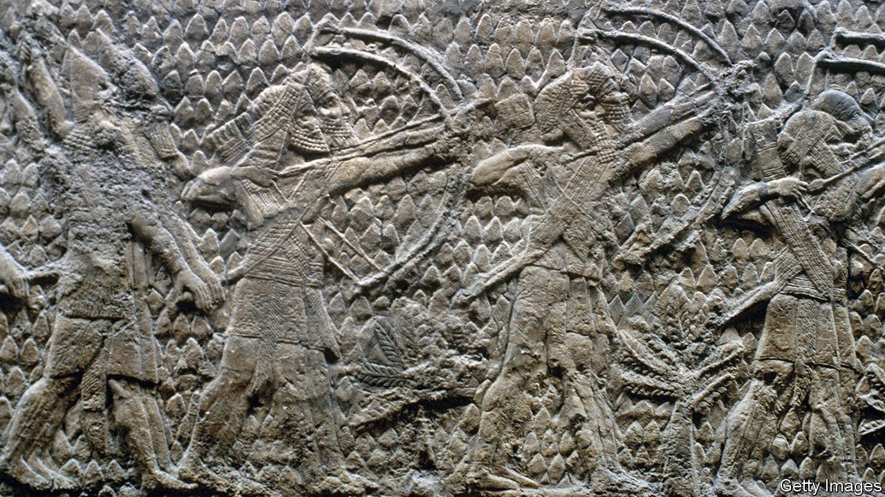

# D710 (重读D668) Earth’s magnetic field illuminates Biblical history
> **plateau**: 高原; (发展、增长后的)稳定期，停滞期
 > 
> **Hallstatt**： 后铜器时代文化的; 与后铜器时代文化有关的
 > 

1 When **sennacherib**, King of Assyria, sent his army to the kingdom of Judah in 701bc, and had it destroy the city of Lachish, 43km south-west of Jerusalem, he was doing his bit for science as well. As Yoav Vaknin of Tel Aviv University told this year’s meeting of the American Geophysical Union, held in New Orleans and online, residual magnetism in the burnt-down buildings is helping archaeologists to date other finds in the area. It also helps geophysicists to chart the ups and downs of terrestrial magnetism.

> If you **do** your **bit**, you do something that, to a small or limited extent, helps to achieve something. 尽本分
>
> Lachish:**拉吉**
>
> **sennacherib**: 西拿基立（亚述王）
>

2 Mr Vaknin’s work at Lachish is the most recent of a series of studies he has performed that were enabled by arsonous ancient kings. The first examined a building destroyed when Jerusalem was burned by Babylonian troops in 586bc. According to the biblical Book of Kings, this happened “in the fifth month, on the seventh day of the month, which was the nineteenth year of King Nebuchadnezzar, King of Babylon”.

> **arsonous**：纵火的（the **willful or malicious burning of property** (such as a building) especially with criminal or fraudulent intent Arson was determined to be the cause of the fire.）
>
> **Nebuchadnezzar**：**尼布甲尼撒二世**
>

3 Mr Vaknin says that date is considered reliable by biblical scholars. So he and his colleagues were able to pinpoint the moment when this building, the remains of which were found under a car park, was destroyed. Those remains included pieces of the polished upper floor and the burnt wooden **beams** that once supported it.

> A **beam** is a long thick bar of wood, metal, or concrete, especially one used to support the roof of a building. 梁
>
> **Upper floor**:上层楼面
>

4 The fire’s heat would have erased any **magnetism** in the minerals of this floor. Earth’s magnetic field then left its mark as those minerals cooled, magnetising them anew. Assuming the fragments have not moved since then, the alignments of their magnetic fields will point in the direction of Earth’s field as it was on that fateful day.

> **magnetism**：磁性，魅力
>
> **anew**：adv.重新，再
>
> **alignment**：结盟，对齐
>
> N-UNCOUNT不可数名词The **alignment** of something is its position in relation to something else or to its correct position. 位置
>

5 Looking for magnetic alignments in this way was well understood when Mr Vaknin began his investigation. But he and his colleagues also did an experiment. They heated samples of the fallen floor in their laboratory and exposed them to a magnetic field as they cooled down, thus repeating what had happened when the **edifice** was destroyed. By comparing the resultant magnetisation with the original one, and knowing the strength of the field they had themselves applied, they were able to estimate the strength of Earth's magnetic field on the day of the sack.

> **edifice**：大厦; 宏伟建筑
>

6 They have now repeated this approach at other sites, leading to well-dated reconstructions of the magnetic fields connected with the sackings of Gath, Kinneret, Bethsaida and Ekronin, as well as Lachish and Jerusalem, **courtesy of** military campaigns by Aramean, Assyrian and Babylonian kings. The dates range from about 830bc to exactly 586bc.

> **sacking**：解雇，炒鱿鱼；(尤指旧时军队等)破坏，劫掠;
>
> Gath, Kinneret, Bethsaida and Ekronin, as well as Lachish and Jerusalem：迦特（基督教《圣经》中腓力斯五大城市之一），加里利海，贝特赛达（以色列北部古城），拉基士，
>
> **courtesy of**：蒙…的好意
>
> **Aramean**：阿拉姆的，
>
> **Assyrian**：亚述的
>

7 That is more or less the maximum span for which this approach is feasible. Written accounts of earlier invasions, in the Bible and other texts, are thought insufficiently reliable. And after the Babylonians came the Persians, who were, as Mr Vaknin observes, “kind enough not to destroy cities”.

> **span**：跨度; 范围; 持续时间; 包括的种类; (桥或拱的)墩距; 跨距;
>

8 It is, though, an extremely useful span, for it coincides with a hiatus in the archaeological record called the Hallstatt plateau. This “plateau” is a flat stretch of the calibration curve used for a technique called radiocarbon dating. It is a period, from 400-800bc, when, for reasons not entirely clear, radiocarbon dating breaks down.

> **hiatus[haɪˈeɪtəs]**：间歇; 间断; 空隙; 停滞; (尤指文章或说话中的)缺漏，漏字，漏句
>
> **radiocarbon**：放射性碳(碳的放射性同位素，用以测定物体的年代)
>
> **calibration curve**：[计量] 校正曲线，[自] 校准曲线
>

9 Samples from the time of the plateau have hitherto been undatable within that four-century span. This might now change. Radiocarbon dating relies on measuring the amount of 14C, an unstable **isotope** of carbon, in organic materials such as wood. Thanks to the ingenuity of Mr Vaknin and his colleagues, and the ruthlessness of ancient kings, the magnetisation of inorganic materials that have been exposed to heat, such as **shards** of pottery from cooking vessels, offers an alternative.

> **hitherto**：迄今为止; 迄今; 直到某时 adv.
>
> **Isotopes** are atoms that have the same number of protons and electrons but different numbers of neutrons and therefore have different physical properties. 同位素
>
> **Shards** are pieces of broken glass, pottery, or metal. (玻璃、陶瓷或金属的)碎片
>

10 Mr Vaknin’s data points are also valuable for geophysicists who want to understand how movements in Earth’s core change the planet’s magnetic field. The period Mr Vaknin studies was one in which this field was usually about 50% stronger than it is today, and for short periods was double today’s strength.

11 As to Lachish, history did not forget it. Sennacherib celebrated victory by ordering huge alabaster reliefs of his victory (one of which is depicted above) to decorate his palace in Assyria’s capital, Nineveh. They are now in the British Museum.

> **alabaster**：雪花石膏(常用于雕塑和装饰品) n&adj.
>
> **relief**：浮雕sculpture consisting of shapes carved on a surface so as to stand out from the surrounding background
>
> **Nineveh**：尼尼微（古代亚述的首都）
>

