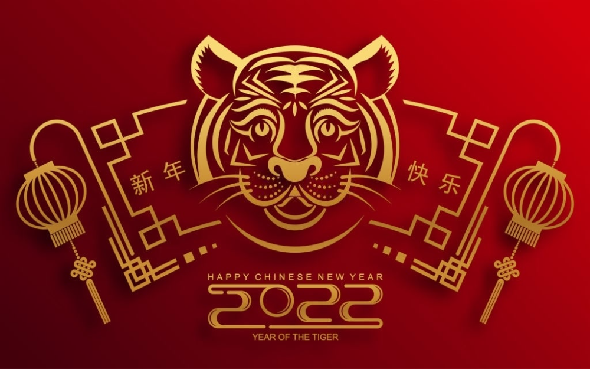

# D713 Quirky Traditions That Mark New Year
1 One of the world's oldest shared traditions, New Year's celebrations take many forms, but most cultures have one thing in common — **letting one's hair down** after a long, hard year.

> **letting one's hair down**：放松
>

2 For much of the globe this involves sipping bubbly with friends until the sun comes up, seeing out the old year with bonfires and flares and **off-key** **renditions** of **Auld Lang Syne**. But others have rather more curious habits, often **steeped in** superstition.

> **rendition**：表演
>
> **off-key**：不着调
>
> **steep in**：浸泡于
>
> **Auld Lang Syne**：友谊地久天长
>

3 In Finland, say tour guides, people pour molten **lead** into cold water to divine the year ahead from the shape the metal sets in. If the blob represents a ship it is said to foretell travel, if it's a ball, good luck.

> **lead**：铅
>

4 In Denmark, people stand on chairs and jump off **in unison** as the clock strikes midnight, literally leaping into the new year.

> **in unison**：一起
>

5 The **Danes** also throw plates at their friends' homes during the night -- the more shards you find outside your door in the morning the more popular you are said to be.

> **Danes**：丹麦人
>

6 The Dutch build massive bonfires with their Christmas trees and eat sugary donuts -- one of many cultures to consume round New Year's foods traditionally believed to represent good fortune.

7 Spaniards, in turn, gobble a dozen grapes before the stroke of midnight, each fruit representing a month that will either be sweet or sour.

8 In the Philippines, revellers wear polka dots for good luck, while in some countries of South America people don brightly coloured underwear to attract fortune -- red for love and yellow for financial success.

> **reveller/ ˈrevələr /** ：酒狂欢者；摆设酒宴者
>
> **polka dot**：圆点
>

9 Despite regional and cultural differences, for most the New Year's festivities are a chance to let off steam before the annual cycle starts all over again. This is a holiday that is about relaxation and letting go.

> **let off steam**：掉多余的精力；发泄强烈的感情
>

