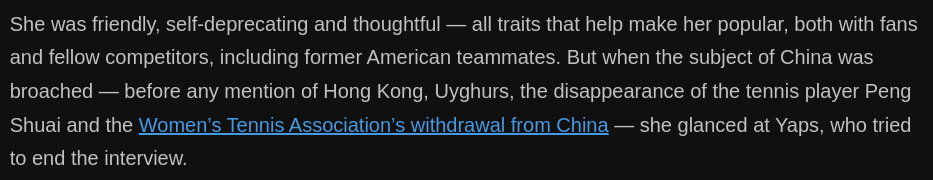

# D720+D721  Eileen Gu Is Trying to Soar Over the Geopolitical Divide
1 SAAS-FEE, Switzerland — Day after October day, run after run, on a glacier high above town, the freestyle skier Eileen Gu spent hours perfecting her tricks in the halfpipe, then on the giant ramps of the slopestyle course next to it. The Winter Olympics in Beijing, where Gu will be one of the biggest stars, win or lose, were still a few months away.
Fly, flip, twist, land; fly, flip, twist, land. Again and again, forging confidence and burning the **corkscrewed** aerial movements into muscle memory. Then it was straight to the T-bar that dragged her back to the top. The quiet monotony repeated, for weeks through the fall.

> **corkscrewed**: 作螺旋状移
>
> **burn…into muscle memory**
>

2 Gu, an 18-year-old born and raised in San Francisco, decided in 2019 to compete for China, her mother’s home country. She is well known there, as Gu Ailing, a dominant skier and a budding supermodel.
She flits into the Olympics with realistic hopes of winning three gold medals. But her most difficult trick might be flying above the geopolitical fray of these Olympics — over diplomatic boycotts, accusations of human rights abuses and vigorous debate over the future of the world — and coming down safely, straddling the growing rift of two superpowers.

3 “I do corks in an icy, 22-foot, U-shaped snow structure,” Gu said. “That’s not political. It’s pushing the human limit and it’s connecting people.”
In Switzerland, each trick, each run, was watched closely by a middle-aged woman on skis — Gu’s mother, Yan, who emigrated from China about 30 years ago and raised Eileen as a single parent. Yan Gu, a former ski instructor at a resort near Lake Tahoe, the daughter of a government official (“the most decorated chief electrical engineer of Ministry of Housing and Urban-Rural Development of China,” his 2014 obituary read), is never far from her daughter, wherever the world takes them.

4 Watching from the top of the halfpipe, Yan Gu **contorted** her body in rhythm with her daughter’s acrobatics, mumbled urgings and pumped her fists, then raced after Eileen down the mountain and back to the top.
The only interruption in the training schedule came from fashion events and shoots. Gu is an IMG model. From Switzerland, a private jet **whisked** her to Paris, landing her in the front row for a Louis Vuitton event at the Louvre. It came a few weeks after Gu left training in Austria to take part in New York Fashion Week and the Met Gala.

> **contort**:扭动
>
> **whisk**:迅速移动
>

5 Her major sponsors are not just ski brands and Red Bull, but the likes of Tiffany & Company, Victoria’s Secret, the IWC watch company and a slew of Chinese companies. Throughout the summer and fall, her face graced the covers of Chinese versions of Elle, Marie Claire and Vogue.
On her birthday, in September, a day spent on a yacht in Dubai, Gu announced partnerships with Cadillac in China and Luckin Coffee, a Starbucks competitor. The deals made news in the Chinese media, which follows her movements closely.

> **A curated persona**
>

6 Eileen Gu was born in San Francisco in 2003. Chinese media often refers to her as the daughter of a Chinese mother and an American father, sometimes with a mention that he was a Harvard graduate. But there is no public record of Gu’s father. She declined to comment when asked if she knew anything about him.
Yan Gu studied chemistry and biochemistry at Peking University in the 1980s, then came to the United States to earn a master’s degree in biochemistry and molecular biology from Auburn. She continued her education at New York’s Rockefeller University, then headed west to the Stanford Graduate School of Business.

7 She spent years working as a venture capitalist with specific interests in China. Since 2013, her LinkedIn profile reads, she has owned her own company as a “private investor and expert in China investment.”
Eileen was raised in San Francisco’s exclusive Sea Cliff neighborhood, with a bedroom view of the Golden Gate Bridge, in a house that she shares with her mother and grandmother.

8 Gu is fluent in Mandarin Chinese and has visited relatives and friends in Beijing most summers of her life. Her grandmother Feng Guozhen often co-stars in Gu’s social media posts, even short documentaries directed toward Chinese audiences.
Theirs would seem a multigenerational, multicultural story of three strong women, but the family is not interested in sharing it with Western audiences without control over how it is told.

9 Yan Gu, 58, said she would talk about her daughter on the record only if The New York Times avoided political questions about China and allowed her to review the article before it was published. The Times declined conditions, and there was no **on-the-record** interview.
Yan Gu and Eileen’s sports agent, Tom Yaps, admitted that the concern was over how the story would be interpreted in China.

> **on-the-record**:记录在案；正式发言；公开发布
>
> **Off the record **: not made as an official or attributable statement.
>

10 There is much to lose by **jeopardizing** a curated persona. That is especially true in China, where rising nationalism empowers citizens to **pounce** on any **whiff** of dissent or disloyalty.
The recent case of Chloé Zhao, who won the Oscar for directing for the film “Nomadland,” illustrates the point. Zhao faced fierce backlash in China when old quotations of hers emerged and were deemed unpatriotic by some Chinese. Censors shut down mentions of Zhao and her work. “Nomadland” and Zhao’s next film, the big-budget superhero movie “The Eternals,” have not been released in China.

> **jeopardize**: 危害, 危及, 冒…的危险, 损害
>
> Pounce : 抓，猛扑，攻击
>
> whiff: 一点儿气味，一股气味，轻微的迹象（或感觉）
>

11 It is the kind of commercial backlash feared by those who do business in China, including in the sports world. The International Olympic Committee is contorting itself to pretend that there is no controversy with China hosting these Games, despite several countries, including the United States, imposing diplomatic boycotts as a form of protest.
Gu hopes to maintain a neutral duality. “When I’m in the U.S., I’m American, but when I’m in China, I’m Chinese,” she has often said.

12 After winning the prestigious Dew Tour halfpipe contest in Copper Mountain, Colo., in December, Gu agreed to a short slopeside interview. (She was one of about 40 other Olympic hopefuls who had previously spoken with The Times for a video series on the subject of “fear.”)

13 “I’ll pass,” Gu said. “There’s no need to be divisive. I think everything I do, it’s all about inclusivity. And it’s all about making everybody feel as connected as possible.”
The question is whether she can maintain that posture, being a public figure without public opinions, representing rival countries that have a devolving relationship.

14  “She has to be concerned about the way she handles the Chinese media scrutiny — how she comments on American politics, how she comments on U.S.-China relations,” Ma said. “The other challenge is the **repercussions** from the U.S. side. I don’t think she’s ready to give up everything she has in the United States.”
Gu declined to comment when asked about her citizenship status. China does not allow dual citizenship, but there is no official record that she has given up her American citizenship.

> Repercussion: 反响
>
> D720截止处
>
> **‘Eileen’s got something’**
>

---

15 Gu was 3 when her mother first took her skiing. Since they lived several hours from the slopes around Lake Tahoe, the sport was little more than a weekend pursuit. Yan Gu spent a couple of years as a part-time ski instructor at Northstar and bought a condo nearby. The number of days that Eileen spent on the snow each season could be counted in the dozens, not the hundreds, an unusual route to Olympic stardom.
She had plenty of other interests. She is a talented pianist and a stellar student. Her favorite sport as a girl might have been distance running; she dreamed of running her way onto the Stanford cross-country team.

16 She attended San Francisco University High School, a private school with an annual tuition this year of $54,130. The Chinese news media often reports that Gu scored 1,580 (out of 1,600) on her SAT. In December 2020, she posted an Instagram video of the moment she learned she got into Stanford. (“It’s the only dream I’ve had for longer than my dream of going to the Olympics,” she said.) She deferred admission, with plans to begin this fall.
A professional ski career began to take shape only once she became a teenager. A key moment came when a big cross-country meet coincided with an international ski event. Gu chose the ski event. She has been a rising force since.

17 Dave Euler, the U.S. head coach of competitive freeskiing, first spent time with Gu at the junior world ski championships in New Zealand in 2018. He saw that she would practice hardest after competitions, working to smooth every little bobble in her run.
“It was not only her talent, but her ambition and drive to improve herself,” Euler said. “It was, like, ‘OK, Eileen’s got something.’”

18 She began mostly as a slopestyle skier, where athletes navigate a course of rails and obstacles before launching off a series of jumps. She was an adept rail rider at a young age, and soon grew increasingly comfortable in the air, carrying that talent to the halfpipe.
In January 2019, still just 15 and representing the United States, Gu won a World Cup event in Italy in slopestyle. American coaches knew that she could be a breakout star at the 2022 Beijing Olympics.

19 But she was already deeply rooted in China. Gu and her mother spent parts of each summer in Beijing. Yan Gu told the Chinese news media in 2015 that Eileen was sponsored by Beijing Nanshan ski resort (her current biography with the international ski federation lists it as her home resort) and that they were friends with Lu Jian, the resort’s founder and a pioneer in the fledgling Chinese ski industry.
By then she was referred to in China as “the frog princess,” a nickname derived from a green, frog-theme helmet she wore as a girl.

20 Gu was in Beijing in 2015 when the city was chosen to host the 2022 Winter Games, a memory that helped begin Gu’s Olympic ambitions. In February 2019, she was in the front row of Chinese athletes posing with Xi Jinping.
Months later, she announced she would compete for China rather than the United States, explaining that she wanted to help grow the sport. “I hope that through my pursuit of the extreme sport, I could enhance interaction, understanding and friendship between the Chinese and American people,” Gu wrote in Chinese on Weibo, a social media site popular in China.

21 The news disappointed American coaches who helped groom her and saw raw talent, rare discipline and unlimited potential. Still, the U.S. ski federation released a short statement expressing support for her decision. It mentioned her mother twice.
“We’re very grateful to Eileen for thanking U.S. Ski & Snowboard for the role we played in helping her dream come true,” it read, in part.

22 When Gu made the decision to compete for China, it was still unclear how dominant she would become in skiing. Then she went to the 2021 X Games in Aspen and won two gold medals and a bronze, the best showing ever by an X Games rookie. She followed that with three more medals, including two golds, at the world championships.
This season, she swept every halfpipe contest on the world circuit, won her sole **big air** competition and finished no worse than second in any slopestyle event.

> **Big air :** 大跳台
>

23 China has never won more than five gold medals at a Winter Olympics; at the 2018 Pyeongchang Games, it won one. Beyond boosting the medal count, Gu is helping the country’s ambitions of growing its winter sports market.
By the end of 2021, she had nearly seven times as many followers to her personal Chinese-language Weibo account (1.23 million) as to her English-language Instagram page (169,000).

24 She is the frequent subject of doting stories in Chinese state media. She was the subject of a 24-minute documentary on CCTV, the state-owned broadcasting company, in 2018.
She has sponsorship deals in China with, among others, Estée Lauder, Mengniu Dairy (promoting a milk brand that targets high school students preparing for university entrance exams), the People’s Insurance Company of China, Kohler, Bank of China, China Mobile and China Unicom.

25 Gu has impressed Chinese fans with her successes, charmed them with her knowledge of Chinese culture and endeared herself with her strong Beijing accent.
Rumors have percolated that she might carry the Olympic torch. She did so in a Chinese promotional short film that reportedly had 100 million views in two days. At the end, Gu and a popular Chinese actor ran with the Olympic torch on the Great Wall.

> **The ability to spin**
>

26 A few days after Gu jetted back to Switzerland from October’s Paris fashion event at the Louvre, she was at the glacial training camp above Saas-Fee, honing her freeskiing tricks.
Gu is one of the few skiers or snowboarders who compete at the highest level in both the halfpipe and slopestyle. (At the Olympics, those who qualify for slopestyle will also enter the big air competition, a single massive artificial jump that has been erected in urban Beijing.)

27 On the glacier, Gu stood out. She is tall (5 feet 9 inches) and lanky, in a sport where many athletes are small and muscular, more like gymnasts than models. She wore a hip-length jacket — some days black, some days red — with a large dragon on the back. Her hair, with a hint of blond, was teased out of the front of her Red Bull helmet.
Athletically, what mostly separates Gu from her competitors is an ability to adeptly spin in four different directions — left or right while skiing forward or backward. Another is that she is relentless about training.
Fly, flip, twist, land; fly, flip, twist, land. Catch the T-bar. Repeat.

28 Weeks later, in December, Gu won the major halfpipe competition in Colorado. After the awards ceremony, and after photographs and hugs with those she beat again, Gu was on her way to practice on the slopestyle course.
She had time for a few questions. But not all of them. Like her mother, she was not eager to discuss her family roots, the cultural bonds with her mother and grandmother, despite that story line being a popular one in China.

29 “With my grandma being really competitive and kind of giving me that winning mind-set, and then my mom giving me the work ethic, I think I honor them by doing my best and by putting my all into it,” Gu said.
Soon she skied off, a cheery “Thank you!” trailing behind her. She had tricks to practice, another competition waiting, all building toward the Winter Olympics.

30 In mid-January, about three weeks before she was scheduled to compete, Gu and her mother arrived in Beijing, marked by reports in Chinese media. Gu posted photos of herself on Weibo, at the airport and in front of a plate of 20 dumplings.
“Beijing dumplings, finished eating all of them,” Gu wrote in Chinese.
“Welcome home,” one fan replied. “This is your home forever.”

