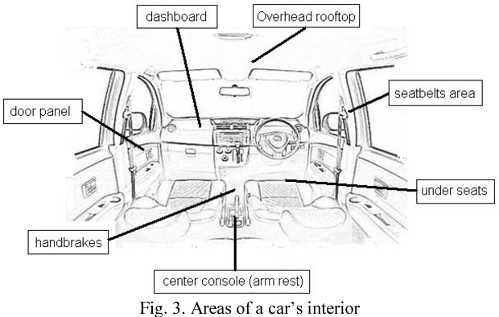

# D738 John Hare devoted his life to saving the Gobi’s wild camels
> **gobi**：戈壁沙漠
 > 

1 Like many other folk, John Hare found camels difficult to love on first acquaintance. They could be surly beasts, **obstinate** as mules and with a kick hard as a horse. They could batter you with their long necks, smelt awful and had an unpleasant habit of **regurgitating** their breakfast over you. Really, the last thing he meant to be was the camel obsessive he became—the man who tracked down the fast-vanishing wild Bactrian camels of the Gobi desert and made sure they survived.

> **obstinate**：固执的
>
> **regurgitate**：反刍
>

2 But there was another side to camels, which he saw when he was posted to northern Nigeria. He went there in 1957 for the Colonial Administrative Service, the last man in, as he saw himself, to act for Britain on the eve of independence. His area was Mambilla, a remote mountain region without roads, where he oversaw 83,000 tribesmen on horseback or on foot. On one expedition, south of **Lake Chad**, he used camels and was impressed.

> **Lake Chad**:查德湖：位于西非撒哈拉沙漠边缘，周围环接着四个国家：尼日利亚、 尼日尔、查德及喀麦隆
>

3 His **porters** were admirable. But they also grumbled about hours and pay, got roaring drunk on payday and had to be sprayed daily with **ddt** to stop **jiggers** digging under their toenails. Camels, by contrast, were strangely content with life. When they were hungry, a thorn bush sufficed. Going through soft sand, where he **floundered**, they would glide along **serenely** at three miles an hour. Later, when he was making regular trips to the Gobi desert, he even found himself on freezing nights snuggling up to a camel, having first sluiced himself with kerosene to keep its ticks away.

> **porter**：搬运工
>
> **jigger**: 非洲沙蚤
>
> **ddt**：旧时尤用作农业杀虫剂
>
> **serenely**：安详地、宁静地
>
> **flounder**： (在水或泥浆中) 挣扎
>
> **sluice**：冲洗
>

4 He went to the Gobi because, transferred to Kenya as a UN bureaucrat, he hated sitting at a desk. He wanted to be an explorer. He was 12 when he announced that, and his father told him to be sensible, but he really, really meant it. His head was full of the gripping adventures of Colonel Percy Fawcett in the Brazilian jungle, searching for the Matto Grosso and **Inca** gold. He too wanted to “look behind the Ranges”, as Rudyard Kipling wrote, and go where no one else had been.

> **Inca**：印加
>

5 By a chain of amazingly **fortuitous** events, camels took him there. At a **reception** in Moscow in 1992, where he had gone to **curate** a UN exhibition, a man in an **ill-fitting** brown suit and with a Stalin-style moustache turned out to be the leader of a Russian expedition to the Mongolian Gobi. They could not take this eager Englishman unless he had scientific qualifications or technical skill, and he had neither. But they were going with camels, and he knew a bit about them, he said; and he could also provide the team with $2,000 in foreign exchange. So he was in. A year later, presenting the results of that expedition in **Ulan Bator**, he met by chance a man whose brother, a general in the Chinese army, could get his team into the **Lop Nur** nuclear test site in Xinjiang, long barred to visitors, where many of the wild camels were.

> **fortuitous**：幸运的
>
> **reception**：招待会
>
> **Ulan Bator**：乌兰巴托（蒙古人民共和国首都）
>
> **Lop Nur**：罗布泊
>
> **curate**：管理
>
> **ill-fitting**：不合适的
>

6 Both expeditions were alternately wonderful and chaotic. The teams travelled through some of the most **hostile** territory on Earth, where temperatures ranged between -40°c and 55°c, where most water was salt, and much of the going was over **razor-sharp** rock-salt that shredded the tyres of their trucks. Sandstorms could **obliterate** everything, including their tracks when they ventured away from camp. The Russian expedition was **soused** in vodka and melancholy songs, and they found no wild camels. The Chinese one featured universal **chain-smoking**, a driver who kept a pigeon, for luck, in the **glove compartment** and a guide who itched to shoot any wildlife he saw, camels excepted. He himself cut a Victorian figure, with his canvas **holdalls** and **battered tweed** jacket and lack of almost any devices, except a compass and a copy of Kipling’s “Kim” for tough times. But the desert also sparkled with breathtaking colours, each **oasis** was a paradise, and when on a later trip their **tame** camels fled in a sandstorm, carrying most of their supplies, he was assured they would return by a lone **stray** **swallow** that touched him, magically, with the tip of its wing.

> **razor-sharp** :非常锋利very sharp
>
> **hostile** ：不适宜生存的very unfavorable to life or growth
>
> **obliterate**：摧毁
>
> **souse**：(使某人、某物等)陷入(水中或其它液体中)
>
> **chain-smoking**：一支接一支地吸(烟)
>
> **glove compartment**：小储备箱
>
> **cut a figure**：崭露头角，出风头present oneself or appear in a particular way.
>
> **holdall**：大旅行袋
>
> **tweed**：粗花呢
>
> **tame**: 驯服的; 温顺的; 养驯的; 平淡无奇的; 枯燥乏味的; 听使唤的;
>
> **swallow**：燕子
>
> **stray**：离群者；走散者
>

7 He also found his wild camels at last. They were notably different from domesticated Bactrians, extremely shy, with flatter heads, hairier kneecaps and humps set wider apart. They could also drink water that was saltier than the sea’s, and had survived 43 nuclear tests with no ill effects. Perhaps 1,000 were left in all, and their numbers had plunged in a decade. Their chief enemies now were hunters and miners illegally prospecting for gold.

8 At once he began to devise a plan to save them. He gathered enough material for scientists to prove in 2008 that they were a separate species, descendants of the original **wild stock**. This brought **Camelus ferus** world attention. He also co-founded the Wild Camel Protection Foundation to campaign for a reserve, sometimes with camel races across the English countryside, and this drew money even from the World Bank. Because his relations with the Chinese were so good, he was eventually granted a piece of the Gobi, at Lop Nur, around half the size of Poland. With Australian help, he then set up a breeding centre in Mongolia with 12 wild camels. By 2021 he had 45.

> **Wild stock**：野生族群
>
> **Camelus ferus**：野骆驼
>

9 His foundation had its hq in a **shed** in his garden in Kent where in later years he lived in a Mongolian ger with an Aga in the middle, ideal for joyful dinner parties. (His baths he took, every ten days, in London at the Reform Club.) In an old **milking parlour**, full of tribal artefacts and stuffed beasts, he installed a huge billiard table. It needed only a throne to look like the tent of Genghis Khan.

> **shed**：棚屋
>
> **ger**：圆顶帐篷，蒙古包
>
> **Aga**:  取暖炉
>
> **milking parlour**：挤奶室
>

10 He was not sure, though, that he had actually been much of an explorer. Most of his wanderings had been in other people’s footsteps. But he had been the first to discover some things. One was that camels could be swum across a river (the Omo, in Ethiopia) if **towed** by a **dugout** canoe with an **outboard** motor. Another find was the support-poles of an ancient building in an outpost of the town of Lou Lan on the Middle Silk Road, abandoned in 330ad. The best was a tiny unmapped **sweetwater** valley in the Kum Tagh dunes where small herds of wild camels, sheep and **asses** had clearly never seen humans before. So the “last man in” in Nigeria was the first to look on that valley in the Gobi, where a naive young wild camel instinctively followed his saviour’s **caravan**.

> **dugout**：独木舟（中间掏空那种）
>
> **outboard**：(发动机)舷外的
>
> **tow**：拖、牵引
>
> **outpost**： (设在国内边远地区或国外的) 军事基地; 贸易基地；边远居民点
>
> **sweetwater**：淡水
>
> **ass**：驴
>
> **caravan**：旅行队
>

