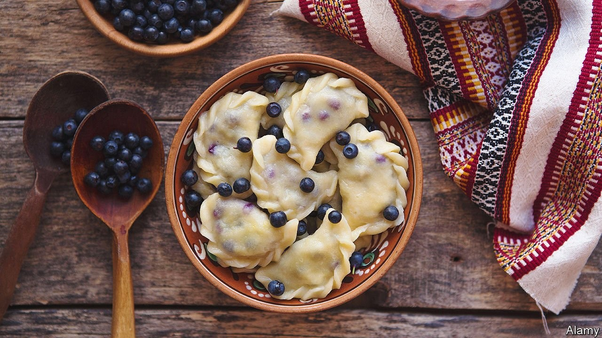
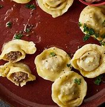

# D746 Ukraine has a glorious cuisine that is all its own
> 1 **Tortellini**, spring rolls, Cornish pasties, empanadas: nearly every cuisine in the world has a recipe in which meat or vegetables are wrapped in dough to be cooked. Ukraine’s version is vareniki.Tortellini：意大利饺子
 > 
> 康沃尔馅饼
 > 
> 肉馅卷饼
 > 
> vareniki：水果馅饺子
 > 

2 The dough, like that of Italian pasta, is a mixture of flour and eggs. The filling choices are limitless, but few can match the comforting sturdiness of cabbage cooked down for an hour with onion and first-rate bacon. The extended cooking time brings out the onion’s natural sweetness, and gives the cabbage a **velvety** lushness that balances perfectly with the bacon’s **chewy salinity.** Vareniki make a fine centrepiece of a meal, with sharp pickles on the side and a **piquant**, **sinus-clearing** salad of **beetroot** and **horseradish**.

> **velvety**：光滑柔软的；柔和的
>
> **chewy** ：有嚼劲的
>
> **salinity.**：盐分；盐浓度
>
> **piquant**: 辛辣的；开胃的；刺激的
>
> **sinus-clearing**：
>
> **beetroot** ：甜菜；甜菜根
>
> **horseradish**：辣根；辣根酱
>

3 Ukrainian cuisine is by no means simple—some of its techniques, particularly the country’s genius for **fermentation** and sweet baking, are deeply sophisticated—but it is often straightforward. Ukraine’s chernozem (black earth) soil is wildly fertile, producing delicious fruits, vegetables and grains to which wise cooks do as little as possible, instead letting their natural flavours shine.

> **fermentation** ：发酵
>

4 The country is bigger than France or Spain, with just as much culinary variation. Herbs and warm-weather crops such as tomatoes, **aubergine**s and **courgette**s thrive in the south, as wild mushrooms and berries do in the colder north. Ukrainians living far from the Black Sea coast make imaginative use of strong-tasting river fish, often cooking it with equally **robust** flavours such as those of tomatoes and sugar; residents of the port city of Odessa—in peacetime, unquestionably one of the world’s most **beguiling** places—prefer oily **sprat**s. Despite some Russian claims on it, **borscht** is originally Ukrainian, based on home-grown or market-garden vegetables that can be **simmer**ed into something memorable.

> **aubergine**：茄子
>
> **courgette**：（深绿皮）密生西葫芦
>
> **robust**：强健的；强壮的
>
> **beguiling** ：迷人的；诱人的；诱骗的；难以琢磨的
>
> **sprat**：鲱鱼
>
> **simmer**：煨；用文火炖
>
> **borscht**：甜菜汤；罗宋汤
>

5 The rich, largely flat land has proved tempting to big powers, and Ukraine’s territory has for centuries been unwilling host to a stream of invaders. In her magnificent book “Summer Kitchens”, Olia Hercules, a Ukrainian cookery writer now living in London, quotes a friend: “My grandmother was born in **Czechoslovakia**, got married in Hungary and died in Soviet Ukraine, yet she never left her village.”

> Czechoslovakia：捷克斯洛伐克
>

6 That history and geography have brought a lot of suffering to Ukrainians; tragically, they still do. The culinary upshot is a diverse, unique cuisine. Some might **carp** that **bogracz**, a meaty stew from the **Transcarpathian** region, is quite similar to Hungarian gulyas, or that **vareniki** resemble Russian pelmeni. One **rejoinder** is that the two stews are spiced differently, and vareniki tend to be made in half-moon shapes: carp , while **pelmeni** are usually round.

> **carp**: 抱怨；找茬(儿
>
> **Transcarpathian**:跨喀尔巴阡山脉
>
> **vareniki** :水果馅饺子
>
> **pelmeni**:鲑鱼或香菇饺子
>
> **rejoinder**:回答；反驳
>

7 A better answer is that foods, like countries, can be similar and intertwined, but still remain distinct. “Neighbours always enrich each other culturally,” Ukraine’s heroic president, Volodymyr Zelensky, observed on the eve of war. “But that does not make them a single whole.” Vareniki are vareniki, and not pelmeni, just as Ukraine is Ukraine, and always will be.

