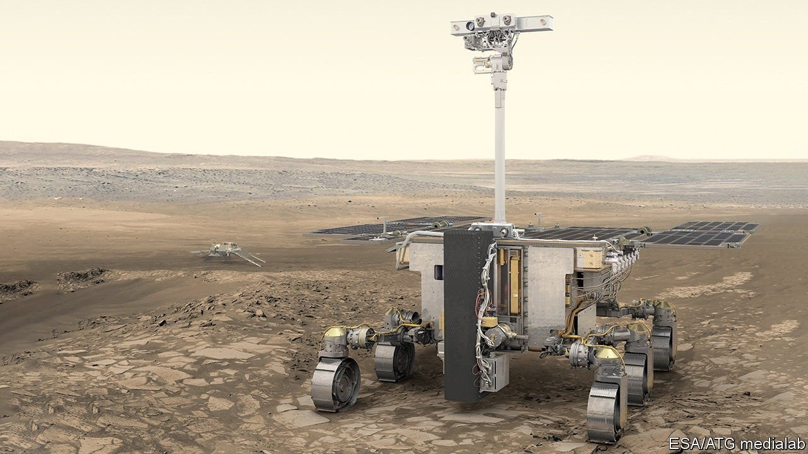

# D747 What future is there for Russia’s foreign science collaborations?

1 One non-human casualty of Russia’s invasion of Ukraine seems likely to be at least some of its scientific collaborations with other countries, starting with those involving **Roscosmos**, its state-owned space corporation. On February 25th Josef Aschbacher, head of the European Space Agency (esa), tweeted that all partnerships between his organisation and Roscosmos would continue—especially the second part of a mission called ExoMars, which is scheduled to **blast off** in September from Baikonur Cosmodrome, a site technically in Kazakhstan, but leased to Russia. That aspiration lasted until February 28th, when esa put out a statement which said, “Regarding the ExoMars programme continuation, the sanctions and the wider context make a launch in 2022 very unlikely.”

> **Roscosmos**：俄罗斯联邦航天局
>
> **blast off** ：(使)(火箭等)发火起飞
>

2 **Planetary** alignments mean that if **lift-off** does not happen in September, it will have to wait at least 26 months. But the amount of Russian hardware involved in bringing the lander that is the mission’s **payload** safely to Mars’s surface means even this is questionable unless the diplomatic climate has changed by then.

> **Planetary** ：行星的；
>
> **Planetary alignment** ：行星连珠（英语：Planetary alignment），是一个特别的天文现象。即是几个行星连成一线或者在某一区域。
>
> **lift-off**：(火箭的)发射
>
> **payload**：（飞机、船只的）商载；装载量；（炸弹、导弹的）爆炸力
>

3 esa’s announcement happened after Roscosmos itself said on February 26th that it was withdrawing its personnel from the **spaceport** at **Kourou**, in French Guiana—the biggest rocket-launching facility in the European Union. Roscosmos had had a deal since 2005 to use Kourou to launch Soyuz rockets (not to be confused with the Soyuz **space capsule**s which carry cosmonauts to the International Space Station (iss) and are launched from Baikonur). Besides harming Russia, this sudden withdrawal raises questions over Europe’s Galileo global-positioning and Copernicus Earth-observation satellite networks, both of which are launched partly by Soyuz—though esa made reassuring noises about this being no problem.

> **spaceport**：宇航[太空]站
>
> **Kourou**：法属圭亚那库鲁
>
> **cosmonaut**：宇航员=astronaut
>
> **space capsule**：航天舱
>

4 As to the iss itself, in a comment regarded by many as positively weird, Dmitry Rogozin, Roscosmos’s boss, tweeted, “If you block co-operation with us, who will save the International Space Station from an uncontrolled **deorbit** and fall into the United States or Europe?” There are not, as it happens, plans to block such co-operation. Though it is true that Joe Biden, America’s president, did say his country’s sanctions “will **degrade** their [Russia’s] aerospace industry, including their space programme”, nasa observed that, “The new export control measures will continue to allow us-Russia civil space operations”, and also said that no changes are planned to its support for “ongoing in-orbit and ground-station operations”. In any case, the International Space Station is just that: international. Different **module**s belong to different countries. Russia could not be denied access to its section.

> **deorbit**：脱离轨道
>
> **degrade**: 降解；降低；降低…身份
>
> **module**:（航天器上独立的）舱
>

5 Russia’s involvement in two other scientific collaborations, cern and iter, both based in Europe, has yet to come under **scrutiny**. **cern** is a particle-physics laboratory near Geneva, with which Russia, though not a formal member state, has had a lengthy collaboration. **iter** is an attempt to build a **fusion reactor** in the south of France, in which Russia is fully engaged.

> **iter** :国际热核聚变实验堆
>
> **scrutiny**:详细审查；细看；监视
>
> **cern**: 欧洲原子核研究委员会
>
> **fusion reactor**：聚变反应堆
>

6 cern, though a **prestigious** **outfit**, is also an **esoteric** one. It is a long time since new discoveries in particle physics affected technology, industry or warfare. iter is in dreadful shape. It is behind schedule, over budget and regulators have recently suspended a crucial operation for safety reasons. It is also increasingly irrelevant in the face of privately funded fusion-power startups. Prestige aside (and not even really that in the case of iter), Russia would lose little if its ties with these were **sever**ed.

> **outfit**:团队；小组；分队
>
> **esoteric**：深奥难懂的
>
> **prestigious**:有威望的；声誉高的
>
> **sever**:割断；断绝；切开
>

7 What really could damage Russian science is a withdrawal of academic collaboration by foreign institutions. Here, Germany has led the way. On February 24th its government ordered the country’s universities to freeze relations with Russian counterparts. The Massachusetts Institution of Technology, in America, **followed suit** on the 25th, terminating links with the Skolkovo Institute of Science and Technology in Moscow, which it helped to found a decade ago. If other academic collaborations come to similar ends, as they surely will unless a peace deal is rapidly negotiated, that will hurt a lot.

> **follow suit**: 效仿；如法炮制
>

